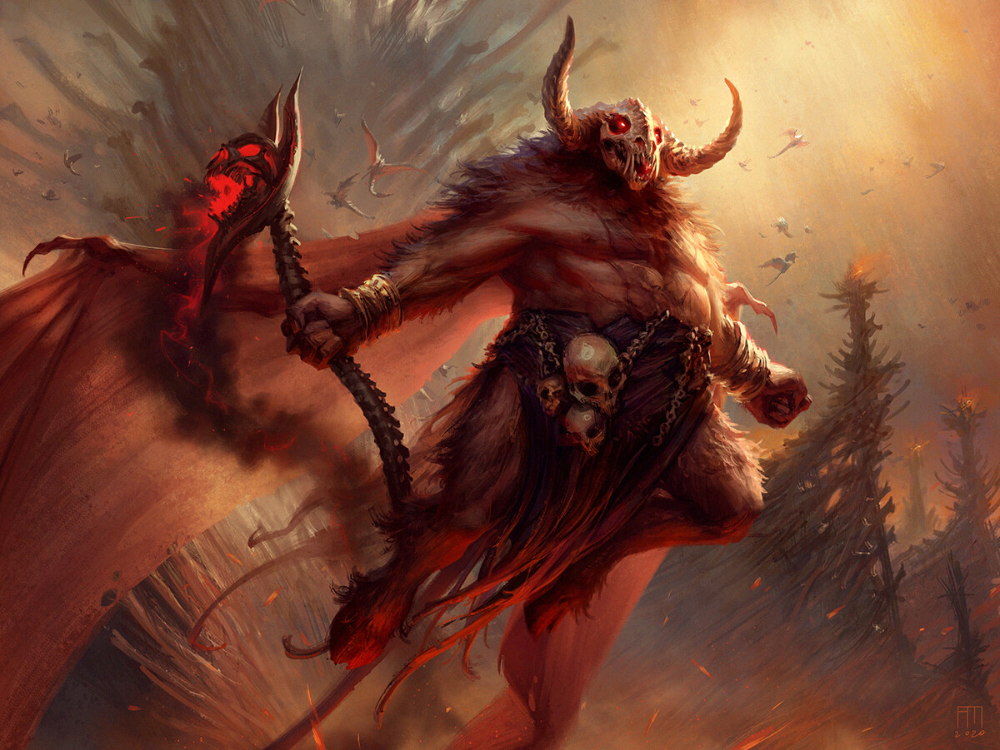

# Orcus
Loosely based on https://forgottenrealms.fandom.com/wiki/Orcus

## Followers
syrgaul + tameraut undead crew (wants to rule the seas)

## Undying Soul Attack
Attacked by [[undying-soul]] in a rapid mage attack.
Boat now floating in the sea.

Happened at sea after the Tameraut had gone down. But same place.
Irae dropped bits of herself into the ocean (it melded with magic components of the tameraut later).

That's why Irae's phylactery is portable from the Pit of Hatred.
Tameraut had magic capabilities embedded in the ship. Malfunctioning in water.

Why could they enter a portal underwater?
Entered into low water side and portal somehow does not respect pressure.

## Orcus's Ship
Watches over the seas near the rift. Will attack anyone who's been on the island to erase notices.

Huge galleon made out of bone (keratin). Figurehead is a shark skeleton that can be animated. Horns everywhere.
Comes towering out of the mist. Mistake it for a wall at first.

He can pull them in to the Island of Bones.
Need MTOF + volos.

They can escape with Lee/other magic... Otherwise it's a fucked up battle where they are captured and brought to island of bones. Arena on the island to turn people evil. Paladdin is delicious for them. Only way out is to become an oath breaker.

Ghoul Necrophage Ghast CR4
https://www.5esrd.com/gamemastering/monsters-foes/monsters-by-type/undead/ghoul/ghoul-necrophage-ghast/
Ghoul Tar CR4
https://www.5esrd.com/gamemastering/monsters-foes/monsters-by-type/undead/ghoul/ghoul-tar/
Ghoulsteed?

Bone golem CR7
https://www.5esrd.com/gamemastering/monsters-foes/monsters-by-type/constructs/golems/golem-bone/

## Wand of Orcus
Needs to be a sinister voice. Deep.
Staff wants new owners, and wants to retaliate against Arklem

### Initial Meet
- TOUCH: "are you to be my master." -> "yes.. touch me"
- JOKE CONDITION: "will you let the blood of your enemies flow freely on the battlefield"
- OBJECTIONS: "you.. would dare to misuse me? you are not powerful enough to misuse me." if probing: "lesser creatures have lied to me and died at the touch. for some reason you can hold me, and yet i cannot sense your intent as of yet. REGARDLESS; if you do not intend to fulful your part of a simple agreement, then all forms of maladies will befall you." -> "it is simple....:" (only bringing back clause is necessary), then say. i will give you the benefit of the doubt for one week, but if you hesitate after that, I cannot be blamed for my actions."
- COUNTER PLANS: "if you wish to dispose of me, you should know that i will always eventually be found by my master, and the armies he brings. i am indestructable, i have contingencies built in that your kind only dream about. I say this once, and only once: if you do not intend to use me and fulfil your side of a simple agreement, then drop me to the ground where you stand, or you will likely be the one who drops."
- CONDITION: "will you see work toward having the shadow that was, the creator, the blood lord, once again be able to brandish me for my powers"
- REASON: "no. you must. your blood is strong, but insufficient as a permanent source. i cannot not serve you if you do not bring me back to the blood lord."
- DURATION: "let me feel your alignment (hold)... you. disgust. *shudder*....-> self-compose. you will wield me. but you must return within 7 days, or i will not be held accountible for my actions."
- TRUST: "i can do many things, but I cannot lie. I can prove it, let someone you do not care about hold me for ten seconds without using your protections, and they will perish."
- MOTIVATION: "i must be returned. the blood lord must rise again with my help and turn his focus on the treasonous seldarine and their syccophantic undead followers."
- ARKLEM bypass: "so you know of the traitor. that is how you can touch me."
- ARKLEM story: "he allied himself with Crones of Kiaransalee and united against the blood lord. a futile attempt and ultimately temporary measure that would guarantee his eternal fate in Thanatos (or as you'd understand as layer 113 of the Abyss) at the "mercy" of the blood lord."
- ARKLEM sucesss: "Kiaransalee did slay Orcus, causing me to fester in Pandemonium for decades. However, Orcus was restored. As the undead demon lord Tenebrous, and vowing to seek revenge on the gods themselves, and with the power of the Last Word, he was becoming successful."
- LAST WORD: "A utterance so powerful that it could destroy deities. Orcus used it to kill Primus (modrons) and Maanzecorian. However, his rampage was conspired against by a cabal of greiter deites, so the power of the Last Word was halted. For now."
- LAST WORD BRING BACK: "It cannot do what it once was; an unstoppable weapon against the divine. but, it can still not be underestimated. If used correctly, it will bypass the nullification put in place."
- LAST WORD CORRECT USE: "Against an avatar of a Deity, your troubles are smaller. You must catch them off-guard after weakening them, and you will bypass their rematerialization."
- ARKLEM backstab: "He brought Orcus to the Prime Material, but we were ambushed by his pathetic lich followers. They used every dirty trick in the book, and held me in some magic field to keep me here while banishing Orcus' avatar from the prime material. No big setback. But I do regret not seeing Arklem being killed. I would have enjoyed tormenting him."

### Contract
Return me to the blood lord in 7 days. How?

- "plane shift me to The Black Despot in Morglon-Daar at the end of the time period"
- "you must bring the staff to the gate to Morglon'dar at the heart of Menzo"

In return will let you use the staff.

### Stats
Staff must be modified a bit for it to make sense for them:
- No attunement difficulty due to the Deal (inner personality has to be in pain to tolerate this, fun RP) - but they have to adhere, or else it triggers.
- Spell Changes: Completely revamp. PW: K and FoD is crazy. Need demon spells.
- Spell Concentration: Staff maintains with attunement
- Spells: Time Stop (9th, once), Summon greater demon (at 8th level), Incendiary Cloud (8th), Resurrection (7th), Regenerate (7th), Delayed Blast Fireball (7th), Tenser's Transformation (6th) (nb: 3x 7th, 2x8)
- Random props: Minor Ben: 1st/3rd level spell free. Major Ben: +2 ability score (which?), Minor Det: Blinded when away from it, Animals hostile so you. Maj Det: Long Term Madness
- No Call Undead. +3 AC. No spell DC boost. (Not there by default, and hard to do with Mordai's stuff)

https://www.dndbeyond.com/magic-items/3899876-wand-of-orcus-arklem
Added the attunement process addendum. Silence required during attunement.
Total charges 9. Usage requires: 4 charges for 9th, 3 for 8th/7th. 2 for 6th.
Removed Call Undead. Added "Cannot Lie" under Personality.
Added 1x concentrate ability for staff.
Added dubious "knows the last word" but didn't add a casting cost (it would be from the player).

### The Last Word
`Unquipiculalmenguari`

Functions against a deity or avatar who is low in their current active plane.
Will let them use it.
But will only telepathically give it to wielder while fighting a deity.
Using the word would work, but also side-effect? Kill the wielder? They need to not have asked about that before then.

## Rejected
Orcus' ship being summoned for the final push via flayers.
He's now in the astral sea floating his massive destroyer. Bone ship with tentacles?
Will invade the sword coast. Rift helps open things up.
If army takes over island and starts cracking up the rift sufficiently, Orcus can pass.
Syrgaul down there undead with the rest working on it.
Ultimately Orcus' is not important here. Syrgaul could just have been powered by an GOO as well.
In which case, various nautilus ships can surface if the undead rip up the coastline.

[//begin]: # "Autogenerated link references for markdown compatibility"
[undying-soul]: ../factions/undying-soul "Undying Soul"
[//end]: # "Autogenerated link references"
