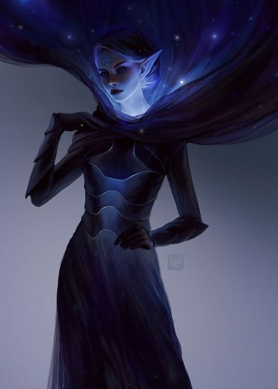

# Selune
Lives on an island of Argentil.
https://forgottenrealms.fandom.com/wiki/Gates_of_the_Moon
music: https://www.youtube.com/watch?v=hOVdjxtnsH8

Infinite staircase (transparent path) only visible during moonlight (every night in Gladsheim in [[ysgard]], follow the fjord to the end of the world - some will arc down, another island floats in the distance). Space boat, or walk across gate at night.

(they used her wishes)

## Personality
Basically Tannis from BL2. Slightly maniacal. Mad scientistu.
Silver haired, tanned lady. Ragged mithril armor
https://borderlands.fandom.com/wiki/Patricia_Tannis/Quotes
She controls "Digistruct Peak" aka. "Argentil Peak".
See digistruct peak quotes ^

Tells them about the path to return is in the Griffon eyrie in mount waterdeep at moonlight (only visible to powerful magic wielders).

### Lines
"I am going to need some dramatic effect for this transformation. These humans do not know she's a weretiger yet."
"Oh, hey! Hello! Welcome to my secret lab. Secret lair? Moon Pavilion? Yes, I like that one the best."
"Uh, you're from the prime material. You smell oddly. Who let you in here?"
"Kavaki? hurgph, that brute."
"ooh, wait someone is getting married. he's a follower so he needs a wedding night blessing."
"Oh hello, Adventurers. If you wouldn't mind taking a break from smashing creatures into goopy collections of bone marrow and sadness, I have a job for you back in Argentil. This isn't a date."

"Sometimes I put my hand on the shoulder of the nearest passer-by -- which for the record aggravates my vomit reflex -- and I say Good job! Lord Garflax of the Tardik system values your sacrifice, to mess with them! And then I burn an effigy to Lord Garflax."

## Argentil Peak
[[argentil-peak]]

[//begin]: # "Autogenerated link references for markdown compatibility"
[ysgard]: ../planar/ysgard "Ysgard"
[//end]: # "Autogenerated link references"
