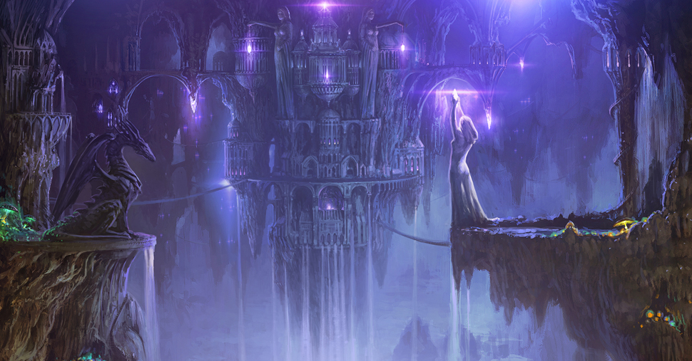

# V'elddrinnsshar
> Veldrin + shar == concealment + mind

City in the centre of the Moondeep Sea (AKA beneath Lake of Dragons in Cormyr in my setting).

They have to pass through a vortex during a storm to get to the shadowfell portal.
Other path from [[irithyll]] two way teleport to below.

https://www.pinterest.co.uk/pin/858991328908429121/

music:
- https://www.youtube.com/watch?v=E0VCNB9Ep2M prometheus studio: fortress/monastery gothic (grimdark)

## Way up
### Guards
Foreshadowing of the L4D tank and the drow favoured consort

## City
Drow style city. But with undead creatures building.
They can walk around for a while. Drow here are friendly, share a hatred for lolth and past oppression.

### Looks
Large city filled with almost spherical houses (drow dwellings), purple glow radiates from within them.
Other houses made out of bone?
Parts of the city on the ground, parts from the ceiling. Highly irregular, can only see the ceiling in certain places of the cavern.
Towards the back right of the cavern, you can see this massive stalagtite with several structures built or carved into it.
On the ground; stalagmite hollowed out; 100ft tall; (super steep colluseum)
On the center; a black tetrahedral structure with a green beam rising way up from the center of it; past fog, past as far as you can see.

Proper city; town square; big statue of kiaransalee.

PERC:
- 30 spiders crawling around the cavern edges, protrude far up
- 25 draconic creatures flying

### Inhabitants
should be clear that:
- drow have the most freedom (females)
- undead are alive, but confused and not in great shape
#### Drow
- "the corruption at Menzoberranzan is over and it's time for an age of peace/stability for us all."
- (on plans) "to free us, bring us out of this twisted negative plane, back to our home"
#### Undead
- "need to see my dear clarence again" (died in wdeep 300y ago)

### Encounters
#### Harpooning "The Lonely" which then calls in a Drider
Off the beaten path encounter (graveyard?)
The drider will lower its weapon if they are close to killing it.
#### Ceiling Spiders & Dracoliches
For an aerial approach across the ceiling.
Spider is actually Arachnomancers
Dracoliches are immune to charm/frighten/paralyze/poisoned, immune to poison.
Dracoliches have adv on saves, res to necrotic.
Adult Black (say).

#### Irae in the City
notice a half-demon drow creature + a drider

Spectacular leader style.
- "eternal greetings once again; daherow, chosen ones, champions"
- "our time of confinement is coming to an end, you will be reunited with your lost ones again"

(if they really fucked up the entrace, kill the [[skipper]] publically)
- "however, there are traitors among us"

(otherwise)
- "however, some wish to usurp our plans, and keep us here forever."
- "this must not come to pass."
- "3 creatures, a powerful infernal sorcerer, an archfaey, and an armored goliath, travel together, and was last seen in Irithyll"
- "they are powerful; capable of even injuring our Grand Extender. should they come to this place; watch out, cast the alarm, and band together."
- "but do not fear, they are too late to stop us now."
- "i am telling you this, because anyone involved in taking one or more of them down will receive a hefty splice once this is over. name your beast, and it shall be yours, in whatever form you desire"

(if they interject)
battle, bring in faldorn fron [[path-of-suffering]]

(plan monologuing)
- "lolth will regret intercede in our affairs"
- "menzo will be ours"
- "from the halls of undermountain, waterdeep will be swallowed up?"

### Tetrahedron
Obsidian. Lazer etched inners.
Center (where green acid is contains an etched triquetrus - circle with 3 overlapping venn diagrams, celtic triple corner).
Circle reprecenting the cyclical nature of time, and the three the ones needed.
Two out of three light up.

Leave walls for Acropolis?
Need to seed Larloch and Valindra, but they need book first..

### Drider bowl
mutant driders crossed with demons (champions taken from prisons in menzo)
now fight for glory. bets on the beefy ones.
winner enter draw to get to reshuffle the bones of old pip (failed medical student now undead)

### Library of the Dead
Run by Madame Eithne
- Will let you read books if you give her a scroll of Ceremony (to cast a funeral rite)
- If they agree, she'll kill herself first
- Otherwise they have to

Books about histories of famous people. Biographies, literal ghostwriter.
- Shadowmantle; book about an unseelie moon elf who rose to become the overwizard of the Tower Arcane around 800DR in [[luskan]]. The book follows her from 1100 to 1102 as she had taken residence in [[evernight]] working on creating phylacteries for dragons. (Dracoliches). Ghostwritten by Edvard Feeler (high-functioning autist demilich who made black tentacle spell)
- ~~Greeth; another ghostwritten biography of the archmage of the arcane brothehood, his rise to power, and an extraordinary ruse~~

Placed book on gaggle of drow instead.

### High End Cemetery
Big mausoleums and tombs on a hill. Where the more noble undead can rest.

### Security
Zombie tank from L4D2 (reskinned fire giant with 29str, single attacks, 8d6+9, 20AC barb, phys res, 180HP)
Drow shadowblade MTOF 187 CR11 (melee defense squads)
Drow inquisitor (to detect lies) CR14 MTOF184 (white out eyes, whispers to shadowblades)
Driders scanning unusual areas.
Arachnomancer (faerie fire, giant spider)

### Religion
#### Temple to Ilhares Alur and Kiaranslee.
Temple entrance shaped like two grasping hands, top hand with silver ringed fingers, into a spherical chamber standing on almost a stilt in the ground. Hands above ground, req levitate.
Matron Shi'nayne Mizzrym
Looks: big stiff leather black cloak that contains these bent flaps that form an outline around her ears and joining at her forhead) where there's a purple gemstone embedded. Long, super thick white mane of hair, pulled back, and two thin long horns protrude behind the leather face rectangle. (or just silk weave dress as in book...)
Has a retriever (large construct spider CR14)
High perception. Likely to detect them if undercover.
Will fight for Kiaransalee, and accept her fate as part of Kiaransalee's chosen.

### Economy
War. Undead has no food needs. Drow has magic. Undead wants to reunite. Drow wants to conquer.
Theocracy masquerading as Noocracy.

### Philosophy
Drow there for a kinder society after the tyranny of Lolth. Worshippers of Eilistraee there even.
Also Menzo got pretty wrecked by demon lords (portal right there).

#### Motivations
Power
- Being spliced with demons
Domination
- Getting demons as pets
- Having demons as a party meal
Knowledge
- All time in the world to learn everything (incl. left overs from Irithyll and neth soc)
Eternal Friendship
- Being reunited with their past loved ones

### NPC: Madame Clementine; Elegant Night Hag of the Avarie
https://www.reddit.com/r/DnD/comments/nvosx6/art_madame_cl%C3%A9mentine_night_hag_of_avarie/
she runs a guild for aspiring drow mages, she's in fact a warlock patron for some of them
after riches and has a small mansion to the side.
stats: beef up a night hag. elder night hag. baba lysaga?
why?
- killing her will soften resistance
- she's respected and will have information (lore books)

## History
The Crones obtained a voidstone, and placed it within the Acropolis in order to sustain a gate to the Shadowfell, to summon an army of undead.

## Hazards / Environment

### Miniboss High AC Undead Champion
Red visor eyes, huge sword.
Enters with sword dropping from the skies first in city, then he's dropped from an undead griffin. Make him fly glide above ground as to unnaturally move.

### Sorcer Relics
Spider familiar tracking them.

### Fights
- Four Kings fight (Close combat darkness fight ala DS1)

#### Enemies
- Flying Polyp CR11 CC162
- ~~Ghost Dragon CR11 CC170~~ went for shadow dragon instead
- Skull Lord MTF 230 CR15

## Inspiration
### Floating Netherese City; Thultanthar
https://www.youtube.com/watch?v=WX3Mj5kkuuI
Ulrant's Guide to the planes of the Shadowfell - 25$
Flying fortress, raining rocks as foreshadowing (flies above you)

### Ashes of Ariandel; Acropolios in Shadowfell
-  Tower with bowman; Siege weapon like bowman causing havoc.
-  Millwood knights (proper fighters from the past - revived by [[arklem]] over centuries

In the past? Initially, where they can meet young Irae? Not really the past, but a painted world / demiplane.
They can get clues about backstory, and then guardians of time stopping them from fucking up the past?

Really don't ahve to base it so hard on that look though, just the geeral idea.

### Auril's Temple trials
P208 rime of frostmaiden
Blessing of Kiaransalee; Immunity to Necrotic on DC22 CON SAVE.

[//begin]: # "Autogenerated link references for markdown compatibility"
[irithyll]: irithyll "Irithyll"
[skipper]: ../npcs/skipper "The Skipper"
[path-of-suffering]: path-of-suffering "Path of Suffering"
[luskan]: ../north/luskan "Luskan"
[evernight]: ../north/evernight "Evernight"
[arklem]: ../npcs/arklem "Arklem Greeth"
[//end]: # "Autogenerated link references"
