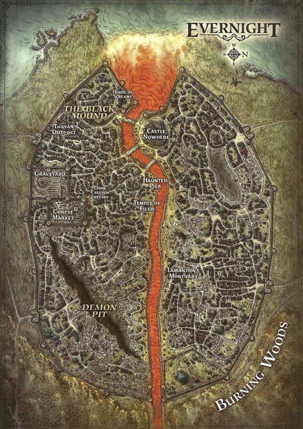

# Evernight
Shadowfell version of [[neverwinter]].

Only single spire left of Castle Nowhere.

Dark mist everywhere, you'd struggle to see anything if it wasn't for the bright orange light emanating from the river; all lava pouring down from the mountain.

Mordai's mansion lights blue (vampire manor).
Home of [[valindra]].

## Contains
- [[castle-nowhere]] (mirror of Castle Never)
- The Black Mount (mirror of protector's enclave)
- Demon Pit (mirror of chasm)
- Corpse Market (where shadow [[iz]] and [[zed]] helped)

## The Black Mound
> Black Mound is a small rise in one corner of the city and also the name of the neighborhood that stands atop it. The houses and manors here are larger, though no less dilapidated and filthy, than others in Evernight. The most powerful undead dwell here, and most of them are ghouls. In disputes with other citizens, residents of Black Mound are assumed to be in the right more often than not. Outsiders and lesser undead that spend too much time in the neighborhood are confronted and questioned.

### House of Screams
Dark version of the Halls of Justice.

> The tribunal assembles in the manor’s upper level to moderate disputes. The doors are reinforced with rusty portcullises that are lowered during assemblies, ensuring that the loser of an argument cannot easily flee the ghouls’ judgment. (The tribunal finds vampires, with their ability to transform into a gaseous state and slip through the bars, to be a real pain in the neck.)
> The large, open cellar of the House of Screams serves as an arena where citizens can formally work out their problems—that is, attempt to kill each other—without involving the tribunal. Bored ghouls, wights, and vampires hang around the cellar constantly, hoping for entertainment. They can act as witnesses to a conflict and confirm that the participants observed all the rules of engagement (such as they are).

### Temple of Filth
Temple to Bhaal/Myrkul. Whatever. Now dedicated to [[orcus]] and his seneschal Doresain, the Ghoul King.

> The undead  gather here, chanting unholy litanies and consuming specially profaned flesh. They sometimes ask the temple priests to settle arguments when they do not want to risk involving the tribunal. The priests do not destroy the losers in such disputes; instead, they demand that both parties perform a service—such as gathering victims or doing physical labor—in return for their judgment.

> The temple’s holy symbols are constructed of bone. The altar is built of corpses sewn together on their hands and knees, which are frequently replaced as they become too rotten to support their own weight. The windows are paned with flesh and tissue stretched so tightly that light shines through in shades of crimson. In all, the Temple of Filth is a place of true horror.

> The Grand Disciple (high priest) of the temple is Ursuntos, an adept of Orcus (Monster Manual 3). The ghoul and vampire underpriests jump at his every whim, and his power in the city is second only to the ghouls on the tribunal.

[//begin]: # "Autogenerated link references for markdown compatibility"
[neverwinter]: neverwinter "Neverwinter"
[valindra]: ../npcs/valindra "Valindra"
[castle-nowhere]: castle-nowhere "Castle Nowhere"
[iz]: ../pcs/iz "Iz"
[zed]: ../pcs/zed "Zed"
[orcus]: ../deities/orcus "Orcus"
[//end]: # "Autogenerated link references"
