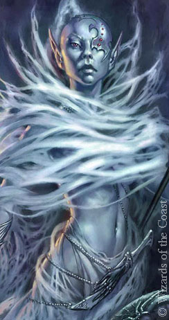

# Irae T'sarran
Drow high priestess of [[kiaransalee]] (turned champion). Lived in [[maerimydra]] but took over the city, once she became a Lich, exterminated everyone, and moved it into a pocket dimension where she built her fortress.

Convinced by Kiaransalee's plight to follow up with her work. She learned the secrets from [[arklem]] to becoming a lich, and arose in the Acropolis of Vanathos.
She also learned new techniques from [[koth]] through the Shadowfell in [[evernight]]. Also tested the mechanism (small scale) on a few high level restless souls in their crypt.

Unleashed the demon lords upon the world to start the great `Osteogenesis`; converting the armies of entire cities.
Set the Storm Giants up to protect the summoning circle. Summoning ritual ended in [[81-fracto-nimbuli]] (causing weakness in demon lords - resistances are down).

ilharess alur (matron superior) is her new introductory title.

Summoned everyone in Luskan, but did it before she had the blade. Thus, the undead in Bone City will deteriorate faster than all the others. They have one month.

## Motivation
She wants to be the true autocrat of the world. Undeath / lichdom gets rid of suffering of people. "What is one generation? in the face of endless happiness?"
"end justifies the means, surely not a philosophy you are unfamiliar with?"
She saw [[kiaransalee]]'s potential, but have not gone insane about it. She wants her propechy to become true, but on her own terms.
She's in it for socio-economic means, through revolutionary means.
She'll want to use undead mechanisms of the shadowfell to make it more efficient than Kiaransalee. Complete re-use of the _supply chain_. Fetch bones from distant cities via potent necromancy and have the skeletons _Gate_ across, or simply _walk_ across if they don't require sustenance.

She sees the drow + Lolth's rule as a hindrance to their success. Why she became a lich in the first place. Too much infighting, that in the end only serves the queen of spiders. The undead became a clean slate for her. Menzo could not stand up for themselves in Menzo anyway (failed to attack through Gilgrin again and again).

The undead sentience ability of her completed scythe lets her create a self-fueling religion around her (though she keeps this secret for now, but Arklem will know). This can be seen in the dungeons of [[irithyll]].

[[celerom]]'s sustainability plan is perfectly in line with her goal, but it's not her main target.

In the mean time she and Arklem is trying to complete an ascension ritual in [[velddrinnsshar]]. Guards planted. They will need to defeat her there, and then probably in her phylactery.

Cultists in [[irithyll]] are used to to recreate control over Demon Lords.

## Encounters
- [[36-grundsgryn]] found [[andariel]] in a `Chrono: Indefinite Presevation`
- [[58-hill-giant-hotel]] (initial mind control of Hans)
- [[62-hazy-bracers]] (murder of Petros) in [[rimehaze]]
- [[63-rime-turtles]] (battle aid; chrono mancy, delayed blast fireball, mass suggestion)
- [[72-prince-of-demons]] (time stop, stole bag of holding) in [[wd-demogorgon]]
- [[115-velddrinnsshark]] fought party with Furlinastis and killed mordai
- [[120-liches]] fought party and resurrected [[kiaransalee]]

## Motivation CHange
After the party destroyes Bone City (actually killing her the Luskanites in her book), she becomes polarised, and wants revenge on the party and put an end to them.
She rushes to complete the ascension by herself to crush the adventurers.
Has NPCs to seed confusion in Irithyll rather than warning them in [[path-of-suffering]] (warning no longer applies).

## Lines
"Do you like the scythe? I feel it goes well with the undead look."
"With this, the undead are re-united, once again."

NB: SHE WON'T ACTIVELY TAKE CREDIT FOR DEMON LORDS OR MASS SLAUGHTER TO FURTHER THE MEANS.

## Encounter East
Either in [[path-of-suffering]] or in [[dragonlake-pier]].

Irae (all cases): It's time we had a chat together. You have caused quite the disruption at Halos.
Irae (plea): Please cease your interference with our undead settlements. We will take care of Lolth and her followers, but instead you have to leave Irithyll alone if you have your own best interests at heart.

Irae (on Irithylls significance): It's the most established undead settlement, sustained by energies from both the shadowfell, and past miseries from previous battles.

Irae (plans): Building a safe and sustainable empire for followers of the Banshee. At this point there is no need for further violence. Our betrayers have been overthrown, and our plan has been set into motion.

 Irae (artifacts): You see, it's with all the artifacts of Kiaransalee combined that the raised dead retain their souls and sentience.

Irae (on Kiaransalee): Lolth's betrayal of Kiaransalee and her proficiency for necromancy made her vengeful. Their society of constant competition is a deeply unhealthy one, that she opposed, and she had many followers. Ultimately, she went insane, and focused too heavily on simple conquest and revenge, her powers and ideology had potential. In the long term, however, there's no need for that type of barbarism.
Irae (on drow soc expanded): To properly construct an empire, it requires giving the followers adequate rest and food, training, and equipment. If you treat them like enemies, they will not help you. The church of Lolth and its ideological hatred of their weaker made this type of cooperation impossible. Humiliating people who speak up by converting them into hideous monstrosities is a dead (weight) loss.

"It won't matter much now that [[menzo]] lies in ruin."

Irae (on Menzo): All clerics sympathetic to Kiaransalee were evacuated before the portal to the abyss cracked open underneath their pathetic metropolis.

Irae (demon lord defense): We needed to unite the dark seldarine once again under the banner of Kiaransalee. Doing this required a small amount of destruction. We ultimately spared the lives of everyone in Luskan, while we got all the pieces together.

Irae (on sarcasm): I would like to remind you, that this is not a peace negotiation. I am stating our intent; a united, and prosperous seldarine, not built out of hatred, not based upon a society of constant exploitation and humilation. Do with that as you wish, but be aware, that no exchange of power, ever went without an initial violent conflict.

Irae (on her position in the new society): I know what systems do not work for drow and undead, monarchs or rulers notwithstanding; and am all in favour of putting power into the hands of the people, if the people can be held accountable by the processes we instrument. As of where we stand, I would guess we are both largely disinterested in discussing various styles of government right now.

Irae (undead sentience defense): You fail to understand the true significance of this event. It's all undead raised from this point by me, or anyone I have raised. This is an infectious proprety. Souls are no longer sent off to hell in eternal torment to serve as infernal currency, nor are a small percentage sent to elysium, where they can enjoy this.. distinct position of privilege. They are free. They are immortal. All it took was an economic crash in the currency of souls.
Irae (on Bone City): It is unfortunate that you had to interfere, but you were not the only ones with the city in its crosshairs. From what I understand you obtained a better afterlife for those poor souls, and for that I thank you, but you also robbed them of their chances of immortality.

Irae (on being a lich): Voluntary immortality is the highest form of existence that any creature should strive towards. Why should our mortal bodies' gradual decay, rob us of our cognitive abilities? Sure, at one point, I too will be nothing but a floating skull; using empty or temporary vessels to give some physical manifestation to my ideas and work.

Irae (giant mind control defense): I offered Umnos power, and he took it. I'm sure he's not the only one who's learning to read the fine print.
Irae (giant justification): Chaos was a necessary agent to get at 3 very protected pieces. Society was either too un-budging, or too brutish to be able to deal with my proposal. Some plans are so great, that you can only effectively argue for it once it's already been placed into effect.

Irae (Kiaransalee):
Extraplanar: Sure, there is going to be resistance.

## Mannerisms
Draws out her vowels in every other word.

## Mind Control
- True Polymorphed visit to isolated adventurers. Use 8th level Modify Memory to downplay bad necromancy scenes.
- When someone is figuring it out; Time Stop + Modify Memory (stops time stop AFTER it's hit)

Continued use makes it really hard for even seasoned magic users to realize they have been fucked with. Can narrate it as a break. Clearly at some point, they will notice something (can do it in the style of Fantasy High when the trail runs cold over summer).

## Protections
- Mindblank every morning (immune to mind control type + divination spells)
- Contingency (10 day) to do X (5th level spell that uses one action) if BAD CONDITION
- Mage Armor
- Scrying Ball

When in lair; other crones concentrate on her protections:
- Invulnerability (if liches present)
- Globe of Invulnerability (makes counterspell hard) - will try to counterspell it
- Stoneskin

## Stats
Rolled her as a Fey conjuration wizard turned [Lich](https://roll20.net/compendium/dnd5e/Lich):
https://www.dndbeyond.com/profile/sszynrae/characters/37451385

NB: she revealed twinning (so she must have this)
NB: she must have flight + truesight passively + stun/charm immunity
NB: she must know how to cast Chronomancy (just don't need to have it active, she knows better)

- ADV: save vs turn undead, cold, lightning, necrotic
- Immunity; Poison, {Bludgeoning, Piercing, Slashing} (from non-magical)
- Rejuvenation in 1d10 days
- Spellcasting based on INT

Either War Magic or Necromancy
Necromancy makes sense for summoning, but that makes her items OP.
So make her a War Mage and justify summoning with items.
This gives her Initiative bonus based on INT, and +2 AC and SAVES while concentrating + deflecting shroud

Extra immunities;
- from lich (some undead general?); Exhaustion, Frightened, Poisoned, Paralyzed
- from fey ancestry: Charmed
- lightning res.

she still needs a damage reduction here... Shield Guardian.
Stone Skin. Half DMG to physical.
=> optimal fight, take out guardian (150), then her (300)

Ring of Kiaransalee (ish)
- Lightning Resistance
- Once per day, twin infuse a spell (a la sorcerer metamagic).

## Actions
- Cast spell DC21 (maybe Twin)
- Fly up and use 4 Motes from Crown
- Teleport away (when near death)
- Scythe attacks: 2 straight attacks, one wave
  * Straight attack: +17 hit, 30-40 dmg each most necro
  * Wave attack: fan out nova, 20 ft cylinder, ditto, but costs overchannel or 2 straight attacks
- Reactions (2 per round, via the Eye):
  * Counterspell (she knows what spell is cast due to the eye)
  * Shield
  * Misty Step
  * Deflect Ranged Attack (scythe splits and parries)
- Bonus Actions:
  * Crown of Stars

NB: the deflect is a combo of her war magic deflection. technically it should have used her reaction as well, but she needs some high level action economy. Have put it on the scythe.

## Magic Items
NB: These COULD drop. Don't overdo it. Although campaign end, so...

### The Banshee's Spectral Veil
Passive ability; Cast greater invisibily on self as bonus action
Passive ability; Cast flight on self as bonus action
Both concentrations can be maintained by item
Grants immunity to Stunned/Restrained conditions
Passive ability: true resurrection auto cast on self on death once every 10 days.

### Eye of Vengeance
Passive Truesight 60ft
Lets the wielder automatically see what type of spell being cast (for counterspell purposes).
~~Lets the wielder Twin spells (like sorceres's Twinned Spells metamagic) twice per day.~~
Lets the wielder have two reactions
Contains spells to be cast (using a pool of 8 charges, 1d4+4 recharged):
- Crown of Stars (2 charges)
- Mindblank (2 charges)
- Clairvoyance (1 charge)

https://www.dndbeyond.com/magic-items/2391736-eye-of-vengeance

### Scythe of the Revenancer
~~+2 CHA/INT (ABOVE 20)~~
+4d8 necrotic damage on hit
- two attacks (outlined in actions)
- deflect missle attempt as reaction

Passive effect; undead raised by her, (or by her transitively gain the sentient undead feat).
Passive effect; Cast Create Undead at 9th level (provided enemies need to be present)

Special: (At most one attack then): Need to DEX SAVE behind someone with the scythe.

- https://www.dndbeyond.com/magic-items/2391663-scythe-of-the-revenancer

## Spell Combos
- Forcecage 20ft + Cloudkill/Incendiary Cloud/Wall of Fire (blocks line of sight, and slowly kills them)
- Timestop + Forcecage + Cloudkill (to ensure it all gets off)
- Primsmatic Wall dome around her + Dominate Monster outside.

## Dying
When in Lich form, she Self-Destructs.
6th level Bonus Action; 12d10 FIRE damage on DEX SAVE. 30ft radius.

## OMEGA PLANS
https://old.reddit.com/r/DnDBehindTheScreen/comments/g8pogt/session_omega_ending_the_campaign/

her arc mirrors omega:
arrogant steal, tranform to take kiaransalee's powers, rip through cities, but gets too arrogant, transform as she has to revive later (giving party time to clean out)

### STAGE 1: ARROGANCE
They think they're just going to get the last piece of the relic. Sends demon lords at Waterdeep in an epic battle.
Demogorgon on her side.
Party + Felgolos + Diana and mages guild on other side.
Sacrifice: Demogorgon, biggest demon lord.
Arrogance at this point is leaving Halos undefended.
Piece of her cloak drops to the ground (to scry on).

Stole all the parts so now super confident.

### STAGE 2: TRANSFORMATION
She gets the last relic and start absorbing the powers of Kiaransalee, perhaps even transform into her. She will rip through cities using this.
Alternatively; Kiaransalee takes over as the main scythe wielder (as before time). More powerful. Good if Irae dies.

### STAGE 3: DESPERATION
Players use their final abilities to somehow take her down in a multi-stage fight. (Minor format of arrogance, transformation, blowback). Dark Souls fight. They get some of her items?

### STAGE 4: BLOWBACK
Chase her back into her phylactery based on previous knowledge.
USE PLAYER PLANNING TO STEAL GOOD IDEAS.

### Phylactery Battle
Glyph of wardings everywhere
Clerics to help concentrate on protection
hallucinatory terrain, mirage arcana going all the time
Force Cage + Cloudkill
Simulacrum
Celerum + Arklem there serving her.

### Fighting her in her lair
She is like Friede. https://www.youtube.com/watch?v=wvZTBG7UMqU
Which means she protects the creator/Kiaransalee Baby in real life. She is an avatar of The Banshee.

Dex Save to evade her scythe attack. Disadv. when she's attacking out of invisibility, unless they use audio cues well (PERC20).
360 AOE range on scythe, huge damage.
If she hits you, she will always get in a combo. Either by lifting you with a scythe, or showving an ice blast to your face, stunning you.

Stage 2.
Dying => Early birthed Kiaransalee joins the fight, necrosing all around with her gaze and hands (huge AOE necro+cold damage) and half destroying the place (all obstacles around), and they will fight together with necro and ice.
Note that kiaransalee baby has super high perception and will opportunity attack legendary action. Cold everywhere to mess with concentration?

Stage 3 ?
If they both die, all energy is left used to resurrect her one final time; blackflame friede. Higher damage / range scythe / scythe fractal split for double attacks, she can now fly charge attack.
Necrotic waves (higher AOE range) instead of cold now.
https://www.youtube.com/watch?v=wvZTBG7UMqU

If phylactery is dead, then with every hit, she releases souls that creep out and damage with necromantic red energy.

## Fighting Servants in the Acropolis
Music: https://www.youtube.com/watch?v=1sVCmeiAacE (aldia scholar first sin)
why go to the acropolis? where she'll ascend (so she can cast more than one ninth level spell)
more acropolis: https://www.youtube.com/watch?v=mArRG9aV9cY (grey wolf ds3)
trudging through east: https://www.youtube.com/watch?v=d69AvVj4FkE (abysswalker artorias)

## Super Past
500 years old. (She has to be just a little over 200, due to Felgolos notes)
Has a painting that takes you to her lair (which does contain her phylactery now).

## Past
Freed Silth from Magnificent Matriarch and infiltrated it within the storm giants lair.
Had storm giants cause trouble below, cut off trading routes.
Extracted mind-control powers from a necroified aboleth; Koth
Extracted lightning powers from a necroified storm giant; Umnos
Had Giants coordinatedly open portal to the abyss to let demon lords through.
Uses the magic divices there to steer one demon lord at a time, so she can infiltrate and grab the most powerful artifacts.

She gives some to her servants as they help steer the demon lords.
She stole the diamond from Luskan after the raid.

### Connection to party
She stasise'd [[andariel]] in [[grundsgryn]] to learn [[chronomancy]].
She was continually one step ahead on her quest.

Weaknesses (beyond the phylactery). She must recharge spells or have a shield guardian / spells to survive.

## Drow History -> Dark Seldarine
Ilythiri (old elven race that became the drow)
dhaerow (traited) -> corrupted into drow
Araushnee -> Lolth (the mother)
Corellon (The Protector/Father of the Seldarine)
They had twins: Vhaeraun (Masked Lord/Mage / Lord of Shadow) + Eilistraee (Masked Lady / Dark Dancer)

Kiaransalee was part of the Dark Seldarine. She ascended to become a demigod.
Belly of Blood (Orcus clashed with Kiaransalee - she killed him!).

Cleric of Ghaunadaur might be a drow thing now after Ghaunadaur took Juiblex's powers. Rogues of Vhaeraun (Braegan), or surface dwellers under Eilistraee.

## Past Goals
Wants to grab the diamond in the tower arcane after getting Yeenoghu to destroy the defenses and cause a weakening in its defenses. Then can become powerful enough to cast high level spells.

Will then want to raid Waterdeep of its most powerful artifacts. By sending Demogorgon down. If that fails. Baphomet is next (with whatever mages survived).

But needs to keep Halos under her control to steer the Demon Lords, they are fickle.

## Servants
### Koth M'gog Mindgorger - Nihileth
Has the powers of Whelm + the amulet of Mordai
Silth. Has a lair in the underdark
(Took out 2 players; Zed + Iz)

### Silth the Infestor - Ancient Viridian Dragon
Has the power of a green and blue dragon. Can poison the minds of people and lower their intelligence. Truesight. PP30. Symptoms; paranoia + coughing.
Dropped. Was a Menzo hook.

### Celerum - Mage
Persuaded to join their "cause" by keeping the people of Luskan alive and have them "retain their humanity". Deceptive plot. Required Modify Memory. Stopped responding to messages as a result of his new work.

### Umnos / Fracto Nimbuli - Storm Giant Elite
Can cast storm spear: https://www.reddit.com/r/UnearthedArcana/comments/f7a6xj/storm_spear_two_variants_strike_your_enemies_down/ . Same as Lightning strike, but a withering bone spear attack instead that has CON save vs Necrotic DMG.
On failed save DC17, creature is paralyzed+restrained for up to a minute (Concentration).

Umnos is a Storm Giant with champion capabilities. Legendary resists.
18 AC. More HP. CON: 24 (+12 save). Immunity to charm/stun (partial)/polymorph.
Resists Cold + Lightning.
Wields Bracers of Defense + Greatsword on his back (+16 to hit 10ft reach).
The greatsword is a +3 iridium greatsword that can be used to?

Can also cast Storm of Vengeance.

### Sentient Undead feat
Undead, have their sentience, through their original souls

## SOURCES
https://forgottenrealms.fandom.com/wiki/Irae_T%27sarran
https://forgottenrealms.fandom.com/wiki/Crones_of_Thanatos
https://forgottenrealms.fandom.com/wiki/Kiaransalee
https://forgottenrealms.fandom.com/wiki/V%27elddrinnsshar
https://forgottenrealms.fandom.com/wiki/Promenade_of_the_Dark_Maiden
https://forgottenrealms.fandom.com/wiki/Claw_of_the_revenancer
https://forgottenrealms.fandom.com/wiki/Rod_of_the_twisted_Weave
https://forgottenrealms.fandom.com/wiki/Eyes_of_the_spider
https://5e.tools/items/hand-of-vecna-dmg.html
https://forgottenrealms.fandom.com/wiki/Silveraith
https://old.reddit.com/r/UnearthedArcana/comments/i6vimu/rope_dart_new_nonmagical_weapon/

## Rejected
### Divinity 2 Aeterna Encounter
Could also have the source of Irae's setting was them digging too deep and finding relics from an ancient civilization?
https://divinityoriginalsin2.wiki.fextralife.com/Ancient+Temple

[//begin]: # "Autogenerated link references for markdown compatibility"
[kiaransalee]: ../deities/kiaransalee "Kiaransalee"
[maerimydra]: ../planar/maerimydra "Maerimydra"
[arklem]: arklem "Arklem Greeth"
[koth]: koth "Koth M'gog"
[evernight]: ../north/evernight "Evernight"
[81-fracto-nimbuli]: ../recaps/81-fracto-nimbuli "81-fracto-nimbuli"
[irithyll]: ../east/irithyll "Irithyll"
[celerom]: celerom "Celerum"
[velddrinnsshar]: ../east/velddrinnsshar "V'elddrinnsshar"
[36-grundsgryn]: ../recaps/36-grundsgryn "36-grundsgryn"
[andariel]: andariel "Andariel"
[58-hill-giant-hotel]: ../recaps/58-hill-giant-hotel "58-hill-giant-hotel"
[62-hazy-bracers]: ../recaps/62-hazy-bracers "62-hazy-bracers"
[rimehaze]: ../spine/rimehaze "Rimehaze"
[63-rime-turtles]: ../recaps/63-rime-turtles "63-rime-turtles"
[72-prince-of-demons]: ../recaps/72-prince-of-demons "72-prince-of-demons"
[wd-demogorgon]: ../waterdeep/wd-demogorgon "Waterdeep Siege"
[115-velddrinnsshark]: ../recaps/115-velddrinnsshark "115-velddrinnsshark"
[120-liches]: ../recaps/120-liches "120-liches"
[path-of-suffering]: ../east/path-of-suffering "Path of Suffering"
[dragonlake-pier]: ../east/dragonlake-pier "Dragonlake Pier"
[menzo]: ../underdark/menzo "Menzoberranzan"
[grundsgryn]: ../seaofbones/grundsgryn "Grundsgryn"
[chronomancy]: ../rules/chronomancy "Chronomancy"
[//end]: # "Autogenerated link references"
