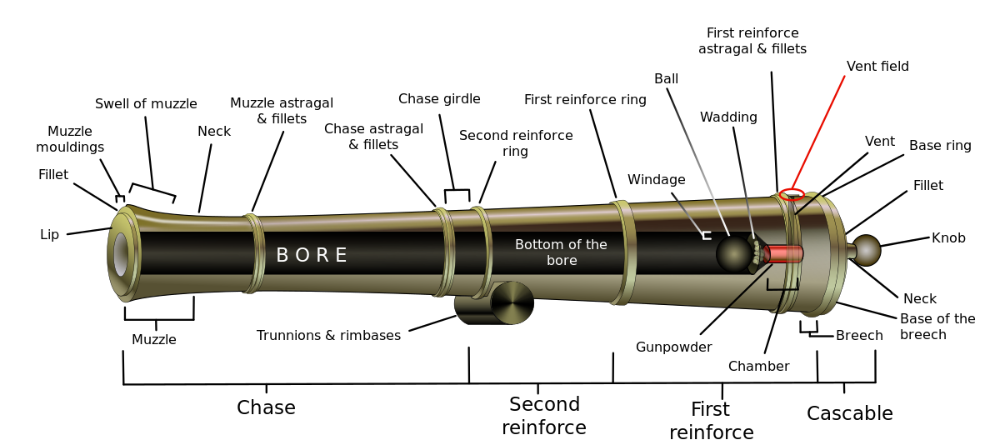

# Kenny
Cannon salesboy in [[waterdeep]] working with his mother.

## Post-game Fanfic
This is now cannonical.

### Story of Kenny
Rottingham is Kenny’s good-for-nothing father who left his mother for the high seas.

While his mother has mostly lapsed into mute depression, the cannon shop is Kenny’s way of fighting back against his father (and maybe acquiring child support), hence the fact that he only accepts pirate booty as payment.

Clearly the mother is suffering from depression due to the internal conflict between wanting Rottingham to return and be a father/partner, and the desire for revenge. She satisfies revenge by installing increasingly effective cannons in the ships of those going to fight Rottingham, but still desires to see him safely return.

As she laboriously lugs the heavy weaponry aboard ship after ship, she revels in the fear they may strike in Rottingham’s icy heart.  As she returns to her home with chests of gold and jewels, she rejoices in the fact that René, too, may have held them close.

While the mother's true motivations are yet to be determined, you wonder how deep Kenny's capitalistic form of vengeance goes. With an entire sea worth of pirate treasure in his possession, perhaps it's not the child that needs support.

And the greatest mystery of all yet remains: who is Bob?

## Cannon shop
Sells cannons. Here's a fully loaded one:

Standard cannons (that's one weak looking cannon)

- **Buccaneer's Buddy** (desc: it's kind of pathetic [better aiming guidance on top – stabilizer + scope])
- **Ouch-Master**: Not a bad little cannon [extra shit around the chamber opening – protective/more power/auto sealing vent field]
- **Holemaker Deluxe**: A sporty model with a good stop power. [better wheels can sustain more force]
- **Paingiver2000**: That's a powerful cannon. [propane-like tanks for pressurisation]
- **Mr. Massacre**
- **Destructomatic T-47** armor-piercing Carnage Delivery System with auto-loading and fax-modem [satelite dish and a metal box next to it, joystick interface – earthshattering boom]

## Sales pitches
- "Can I interest you in some shrapnelizing ammunition designed to bring exquisit pain and unreasonable suffering to all your enemies?"
- "You're not a Fearsome Pirate unless your ship is equipped with the latest in offensive weaponry."
- "From Bob's Big Bore Boomer Brand Cannon, Inc"
- I see that you are a pirate ready to take that first step, towards becoming the ultimate Fearsome Pirate.
- Today; customer_name_here... uhh. What was your name again.
- Today mr _mispronounced_name_ I can offer you the complete line from BBBBBC
- To start with we have the entry level model, the Buccaneer's Buddy.
- We also have the following models available: (READ LIST FROM N+1)
- And finally, the cannon used by that most fearsome scoundrel Renee Rottingham himself...T47.
- Can I interest you in any of these models mister.

### Secondary pitches
Think of how much more fearsome you could be. If you upgraded your set of BBBBBC

### Failing to sell
- You've just ordered _X_with_description_ quite a fine piece of hardware if I do say so myself.
- Now will that be doubloons, jewels, captured maidens?
- (Cannons also block the way past the harbour)
- Well, the amount in your treasure hold is not enough for this model.
- Not even if I take yer old cannon and give ya credit for the trade in.
- Can I interest you in a less expensive model?

### Selling
- Let me just check my stack. *quick turn* yep, we got em.
- You shall not be disappointed my friend.
- I'll have my mom install your new cannon pronto.
- While she's at it I'll also have her pick up the appropriate amount from your hold.
- And pick up your trade in. MOM!!! *runs off*

- Second sell: Back again mister? The _X_ it is. MOM!!!
- Final sell: You're so fearsome even I can't help you. You got the absolute top of the line set of BBBBBBC.

[//begin]: # "Autogenerated link references for markdown compatibility"
[waterdeep]: ../coast/waterdeep "Waterdeep"
[//end]: # "Autogenerated link references"
