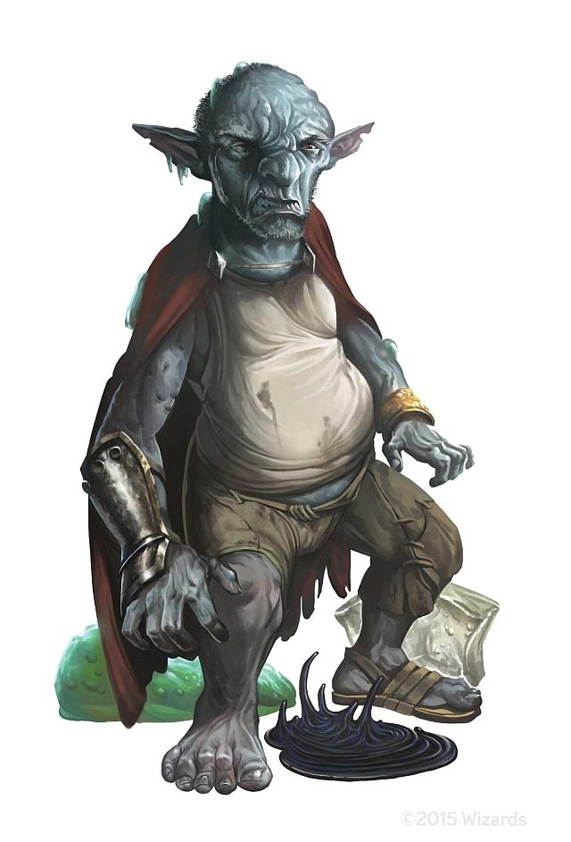

2nd Oct 2018

With `WindSorrow` running away to meditate in the middle of the session, `Hjarka` and `Mordai` went to the `Goldwhisker Warren` where they met the west country `Chipgrin Goldwhisker`, a moderately ameniable barbarian played by @spike. They were also having troubles with oozes and wanted space in `Blingdenstone`.

The gnomes being hard to convince, in general, but with some careful negotiation tactics, things somehow didn't end up with everyone shivving each other, and an uneasy truce was established. Under the protection of both the gnomes and the wererats, you were able to charge past the `Pudding Court`, where in a pool of oozes, the summoning of `Juiblex` appeared well-underway.

In a long battle with the 9th level spellcaster; the `Pudding King`, along with his black pudding `Livid` and pink psychic ooze `Princess Ebonmire`, you faced black pudding duplications, `Cloudkill` and `Blight` draining your collective HP pool beyond dangerous levels.

What happens to `Blingdenstone` and the `Goldwhiskers` now? Where's your monk gone off to? Where can you go at this point?

Players:
- April
- Guy
- Spike
