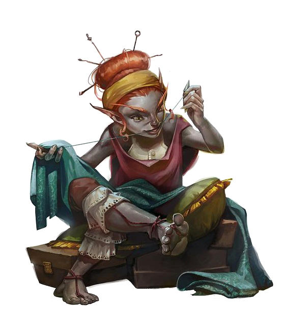

# Blingdenstone

Deep gnome city
- north of [[neverlight]]
- east of [[gracklstugh]]
- south of [[menzo]]

Run pretty much verbatim from Out of the Abyss.

## Developments
- [[11-queen-and-spiders]]: Barely made it to to the city.
- [[12-blingdenstone-taps]];
- [[13-rockblight]]: Neheedra dead. Area 21 and 22 merged. They killed 3 rows of animated drow and activated Ogremoch.
- [[14-pit-of-justice]] : Fought in pit. GW got a +1 Maul. Menhir temple cleansed by 3p party. Only a single EE. Modified its attack styles.
- [[15-battle-for-blingdenstone]] : Goldwhisker fun + 3 player pudding king battle
- [[16-puzzling-devils]]: Left for [[solas-domain]] based on [[kazook]]'s quests
- [[19-mizzrym]]: Returned and had [[gurnik]] res [[pendle]]
- [[20-surface]]: clues from Ilvara deciphered, [[kazook]] created passage up

Much later. [[hanir]] + [[zed]] visited Blingdenstone and talked to Kazook.

## Entrance
How do they get in? Difficult terrain stairs for (>=medium size)
8 gnomes guard beefy steel gate (invis spell on one)
Reasonable if they are non-threatening. Suggest Dorbo if fleeing from Drow.
Through Gates in 4 with escort (else symbol spell can incapacitate them from sockets)
Who let them in? Incompetent ones that are bored with the protocol.
(Hjarka deceptioned her way in).

## Overview
### Nearby
- Small enclaves of deep gnomes: on demand later
- **Entemoch**: ancient prince of earth elementals - remnant summoning circle and energy that suffuses his cavern. Dark blue glow. Can summon elementals, might be source of Hjarka. Basilisks remain in there (can get a pet). Maybe her hidden elememtal markings light her.
- **Ogremoch**: evil counterpart - 15m tall, eyes chipped obsidian. Just a magical sentient, transparent dust now (in Rockblight).
- **Whiteshell**:  Salt mine outside. Perigrog Scrapedust runs it (hard working, distrusting).
- **Pickshine Mines**: owned by miners guild. Garded by Galeb Duhr + 12 svirf. Much ore metal/mithral/adamantine/crystal caverns. Path out of Blingdenstone is through here!
- **Stoneheart Quarry**: Contains earth elementals aiding the city. This place creates elemental gems (earth), rings of elemental command, stones of controlling earth elementals. Led by Nomi Pathshutter. Deceptively friendly but smart and exploitative (knows of Ogremoch). Would be interested in Hjarka.

### Inside city
- **Ogremoch**: Rockblight dust. Teamed up with Medusa (Neheedra). Maybe it can lead them to Entemoch?
- **Diggermattock Hall**: Chief Dorbo and Senni ([[diggermattocks]])who came from the surface originally. Wants to fully rebuild and sends patrols to uninhabited parts of the city.
- **Miners Guild**: Led by Senni ([[diggermattocks]]). Oversees magic/enchantment/mining. Makin’ spell gems.
- **Stoneheart Enclave**: Group of spellcasters originally trained by emerald enclave (hippie commune).  Elemental magic clerics (Callardujan and Segojan). They summon earth elementals to aid blingdenstone (xorn + galeb duhr). Control entrances, widening, sealing, gems. These are high level some of them. Leader is Yantha Coaxrock.
- **Burrow Wardens**:  Svirf training under  veteran BW Jadger (ghost). Trisk Adamantelpiece Leader in training.
- **Ghosts**: still occupying many houses, varying hostility. Starting to become a problem.
- **Goldwhisker clan**: wererats led by Chipgrin. Wants truce with Diggermattocks.
- **Pudding King**: part of first settlement mission. Ooze obsessed. Serves Juiblex.

## Rockblight
[[blingdenstone-rockblight]]

## Pit of Justice
[[blingdenstone-justice-pit]]

## People
## Accents
Leading into scottish for some of them, but weakly. Cross between goblin and dwarves.
### Behaviour
- Some meek, some authoritarian. Kids are probably like Stool.
- Do not care much for time? Prefer automation / delegating menial work to lesser creatures. Serious/suspicious.
- Stone Camouflage: Deep gnomes has advantage on Dexterity (Stealth) checks made to hide in rocky terrain.
- Deep gnome spellcasting: Can cast Disguise self, Nondetection (8hour scrying/divination immunity), Blur (disadv attack rolls against you), Blindness (make have disadv on attack, using sight - and auto fail sight based saves).
- General: 16AC,STR 15, DEX 14, CON 14, INT 12, WIS 10, CHA 9. War Pick, poison dart.
- Really heavy, but only 3, 3.5 ft tall. Muscly. Big pointy ears to the side, big nose, bald.
- Often: Big nose, big ears pointing straight out. Leather clothing, armor, dark grey eyes, eyebrows curving down to the nose. Bald, beardless. Brown/grey skin. Some look very monky due to baldness, robes greyness. Prefer super salty foods.
- God: Callarduran Smoothhands (deep brother / master of stone) / Gond (lord of smiths)
- And Segojan Earthcaller (god of stone and mining - mostly Stoneheart Enclave)

### Looks
- Houses: made out of stones dug out in walls in their cavern.
- City extras: mushroom fields outside (visible from northern wall), but mines accessible from dug passages from within (cliff split at southern end?)
- Generic coridor: Concrete walls pushing up against the clay cavern walls and propped up by these wodden pillars.
- **Secret room**: Stoneshape sealed passage StalaGmites seem hollod still.
- **Abandoned mine passage:** Train tracks line the floor around this tunnel, makeshift buffer stops made out of rock placed at the end.
- **BEDROOM**: Cobblestone room full of tiny beds, beds next to the wall each have their own chest of drawer and a tiny lockable chest. The beds in the middle of the room has a long clothetheline giving a modicum of privacy. A few carpets have been draped across it. A couple of small bath mats are lined out.
- **Passageway overlooking Darklake**? Wodden path built into the edge of the wall.
- **Dual cliff passage**: Sharp cliffs littered with passages, makeshift wodden bridges erected at various points in the cliff side. Some ascending sharply along one face, then some ascending on the other side.
- **Svirf hom**e: Deceptively empty on the front entrance. Made to look spartan. Hatch downstairs to true home. Various meats hanging from the ceiling. Stone plates, pantry, gems that light up the place.

## Encounter
2 Gelatinous Cubes (Hard if: make em bigger 1d6 extra dmg dice - 30 extra hp +7 hit)
Ally: Veteran (CR3) **Mev Flintkeeper** - 10 acid dmg and is engulfed (21acid per round)
Gnome Cunning (adv on INT/WIS/CHA saves vs magic)

## NPCs
- [[kazook]] Pickshine
- [[thoggi]] Slabchest
- Chipgrin Goldwhisker (Spike's wererat)
- [[diggermattocks]] Dorbo/Senni
- Gurnik Tapfinger

### Tappy Foamstrap
Bored. Asks about lives adventures and pushes food drinks on them.

> Knows about: ghosts (getting worse), a crazy svirf back in the day, stoneheart enclave ogremoch soln (untrue), wererat division, myconids dancing near whiteshell mine (talking about wedding)
- She has a crush on Dorbo, but is getting it on with Kazook (hidden).
- Voice: old spinster crossed with monster voice. Enthusiastic.

#### Interactions
- She served them Basilisk, and tried to get it on with Hjarka and then Bron (both failed).
- They really disliked her enthusiasm, and they think she's quite old.
- She flirted quite heavily with them (particularly hjarka in the hotsprings)

### Gara Songstone
Plays on crystals (like xylophone). She’s a bard. Plays for 8 children ine area 15 (wherever).

https://www.youtube.com/watch?v=1HZOM488Fv0
Mechanics: they can listen in (stealth) or talk to the children. If they listen in she likes you more. Talking to the children; they find Driete and Zedmunk talking to them. Might steal gold from Mordai (perception). Easily intimidated.

### Nomi Pathshutter
In stoneheart quarry.
Earth elemental wrangler. Guards elemental army while Yantha is in Manthol-Derith.
Deceptively friendly but smart and exploitative (knows of Ogremoch). Would be interested in Hjarka.

### Gliphic Shroomlight
novice priest at 7 - Stoneheart member
Nervous, sells potions and elixirs, antitoxin
“Thanks for helping out, these ooze incursions are becoming more frequent.”

### Jadger
- Burrow Warden in area 8
- Ghost Svirf. Trains others for Burrow Warden.
- Wants them to kill ghost in 12a + rockblight quest Udhask.
- Perished along with most in the drow invasion.
- Normal, but light ghost voice.

#### Quest: Cleanse ghosts
- Vazuk (grief stricken specter/poltergeist in 12a (shimmering turquise, half decayed)
- Udhask (remnant in rockblight - heart attack at invasion)

#### Ghost status:
> They killed the first ghost (Vazuk), found lots of rubies worth >1k GP. He told them he'd want them to clear the spirit of Udhak. They ignored him and fought elementals instead.

#### Trisk Adamantelpiece
(Traineer of Jadger)
Planning on revealing their existance to diggermattocks.
He basically doesn't exist unless they ask.

## Foaming Mug
Inn with food and 2x hot springs. No people. Super enthusiastic female gnome. Recently reopenend. Empty when they arrive first time. Zhurkwood kegs. Some used as tables.
Apparently it looks like the Gatwick pubs :-(

### Goldwhiskers
Spike is Chipgrin. A level 6 something.
Maybe he can just fuck off by pissing off people, then surprise, he's another dude.

#### Whisker Warrren
5 Wererats (CR2) => 2250XP (4500 Adjusted) But excluding ~CR8 Barb Chipgrin.

> Multiple scruffy looking deep gnomes look up at you suspiciously.  Many of them look armed, and armoured, while many cower in the background with women and children. The, what you think is 5 main tough looking gnomes part to let you through towards the far end of the cavern where you can see an elevation. On top of this elevation you see a really beefy looking creature, not wearing any armour, but pumped like he's not dropped arm day for years. Sitting on top of a stone chair flanked by two giant rats. Draped over the chair's back is a cave badger pelt.

> <--TODO: insert rough character description of how spike rolls chipgrin-->. As you approach, he looks towards you. <--Expecting Spike to suddenly introduce himself here-->.

See [[diggermattocks]] for resulting negotiation.

#### Pool of Zhooblex
Read first paragraph. bit on p112 first

> In the pool you see multiple of them rise up from their spherical pit and coalesce into a large black and green shape that almost takes on a life of its own. One of the oozes wrap around the creature to give it a tight shape as it packs around it, forming these deep green striations. The chaotic creation is flailing around, its lower parts bound by the pit and its limbs form look primitive

#### Pudding King
Carried by shaped oozes on a throne eating pudding.
Hedonism Bot.
Watching ooze display in pool.

> At the back you a slimy looking deep gnome sitting on top a suspicious looking lifted throne or couch. Upon closer look the whole throne is alive and made out at least two intersecting oozes. One black, and one pink, wrapping around each other like candy, as these four 10ft long and quick thick living legs sway gently from side to side, holding together strangely like some type of non-Newtonian fluid.

#### Pudding Lines
- Bravo! Bravo! It's coming together beautifully!
- Ebonmire! Prepare the icing. We most look our most glistening for our lord.
- Euuh. Euuh mai, yes.

Describe smothering of pink goo atop his body.

-What's this? What's this? P112 second paragraph. "Begone!"

#### Pushing past skill challenge
Trying to push through a sea of oozes while X stand behind trying to allow you to push through.

- Skill challenge. N successes to beat it. 3 failures. One skill per character only once. Any skill you want, as long as you can justify why you would use it.
- 9-15 Easy (DC5) or
- 4-5 Moderate (DC10)
- https://critical-hits.com/blog/2016/08/16/skill-challenges-in-5th-edition-dd/
- Hazard Scene mode. Hits from acid if they fail. D6 acid dmg.
- Bonuses: temp HP for Mordai.

#### Passthrough Stockade
Place with dozens of black puddings jellies and oozes. Also a gibbering mouther in there. If within 20 ft DC10 WIS save vs gibbering (could be bad in there).
https://roll20.net/compendium/dnd5e/Gibbering%20Mouther#content

#### Pudding Court
- Black pudding Livid -
- Psychic Pink Ooze var. (Pcs. Ebonmire) - https://www.dandwiki.com/wiki/5e_SRD:Gray_Ooze
- http://chisaipete.github.io/bestiary/creatures/the-pudding-king
- Up to 72 HP w 16AC (MA) Cast mage armor immediately.
- Then Confusion -> Blight. Cloudkill if concentration fails.
- Then Ray of Sickness or Stinking Cloud repeatedly.
- Tries to hide behind oozes. Blindness against people getting too close. Then Blur to tank hits while ooze deals.

- **Blight** solid damage, but maybe not against barb and warrior..
- Summon Green Slime (hazard) if they kite. Black pudding has huge damage if they go in close.

#### King gets hit
- Aauuuu!? You're not allowed to do this? Ebonmire, punish him.
- Hihihi. You think I'm smelly?
- Owweee!? You can't do that. Zhooblex won't like it.

#### Loot
- Potion of Heroism
- 500GP Obsidian gem (wis save if Spike picks it up).

#### Epilogue
- Read Pudding King cries from P115.
- Oozes still abound, most wererats are alive. Tougher than most svirf.
- 4 left + Chip.
- 2 Veteran Gnomes + Dorbo left.
- They are calling on you to get out while you can.
- Dorbo will discuss a treaty "tomorrow".
- Party with him at the council.
- Kazook will be there.

### Follow-ups
- destroy the whisker warren (1000gp reward + free passage + ?)
- 1000GP for medusa head (Thoggi) (-1500 for armor)

#### Whisker Temptation
If Spike hasn't been tempted by Oozes. Voice and a DC15 Wis save on seeing his low numbers. On a low roll, he'll stay behind to be granted power to save your kin. Voice of Juiblex

- Your betrayal is imminent
- Why let yourself be annihilated by these lesser creatures
- You've seen the power of slime... This city can be yours.

#### Mount
Spider mounts from Goldwhiskers
https://www.reddit.com/r/DnDBehindTheScreen/comments/9j3kmt/quit_horsing_around_5_dd_5e_vermin_mounts_steal/

#### Celebration
- Shots made out of Ochre Jelly
- Some really fucking salty and gelatinous meat
- See [[diggermattocks]] for grattitude/rumors
- See [[kazook]] for grattitude/rumors

#### EBA
If they don't go to anywhere or just lounge towards gracklstugh...

- 6 gnolls + 2 gnoll pack lords travelling out of a tunnel near gracklstugh.
- 2 gnolls leading a hill giant (possessed, sedentary looking)

#### Names
- Schnulschic Zincgrinder
- Fracni Diamondmoulder
- Gitun Flintsealer
- Schaltha Claysmelter
- Freggut Alloyrinser
- Driete Metalforger
- Zedmunk Agateswitcher
- Frockenk Boulderdesigner
- Thokthull Seamsearcher
- Urifyx Marblefinger - legendary gnome?

- **Male Given Names**: Belwar, Durthmeck, Kronthud, Schneltheck, Thulwar, Walschud
- **Female Given Names**: Beliss, Durthee, Ivridda, Lulthiss, Schnella, Thulmarra
- **Surnames**: Gemcutter, Ironfoot, Rockhewer, Seamfinder, Stonecutter

[//begin]: # "Autogenerated link references for markdown compatibility"
[neverlight]: neverlight "Neverlight Grove"
[gracklstugh]: gracklstugh "Gracklstugh"
[menzo]: menzo "Menzoberranzan"
[11-queen-and-spiders]: ../recaps/11-queen-and-spiders "11-queen-and-spiders"
[12-blingdenstone-taps]: ../recaps/12-blingdenstone-taps "12-blingdenstone-taps"
[13-rockblight]: ../recaps/13-rockblight "13-rockblight"
[14-pit-of-justice]: ../recaps/14-pit-of-justice "14-pit-of-justice"
[15-battle-for-blingdenstone]: ../recaps/15-battle-for-blingdenstone "15-battle-for-blingdenstone"
[16-puzzling-devils]: ../recaps/16-puzzling-devils "16-puzzling-devils"
[solas-domain]: solas-domain "Solas' Domain"
[kazook]: ../npcs/kazook "Kazook"
[19-mizzrym]: ../recaps/19-mizzrym "19-mizzrym"
[gurnik]: ../npcs/gurnik "Gurnik"
[pendle]: ../pcs/pendle "Pendleblip"
[20-surface]: ../recaps/20-surface "20-surface"
[hanir]: ../pcs/hanir "Hanir"
[zed]: ../pcs/zed "Zed"
[diggermattocks]: ../npcs/diggermattocks "Dorbo"
[blingdenstone-rockblight]: blingdenstone-rockblight "Rockblight"
[blingdenstone-justice-pit]: blingdenstone-justice-pit "Pit of Justice"
[thoggi]: ../npcs/thoggi "Thoggi"
[//end]: # "Autogenerated link references"
