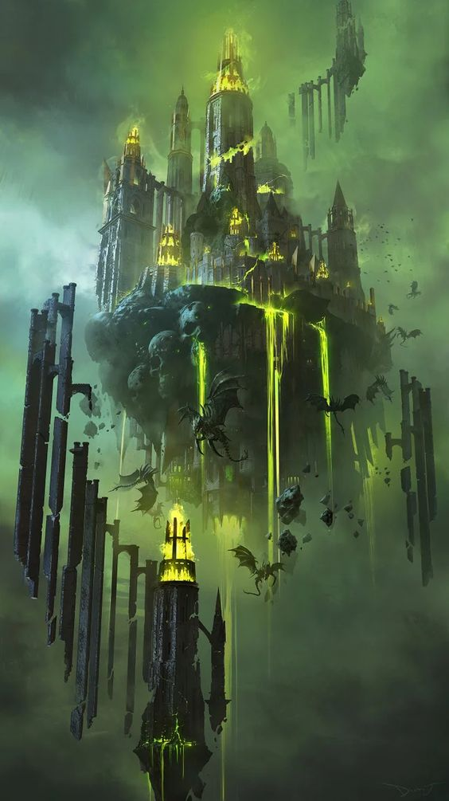
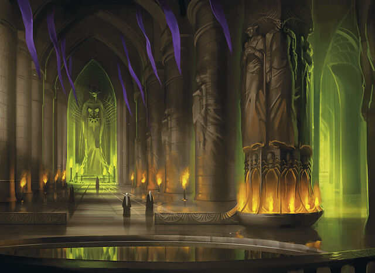
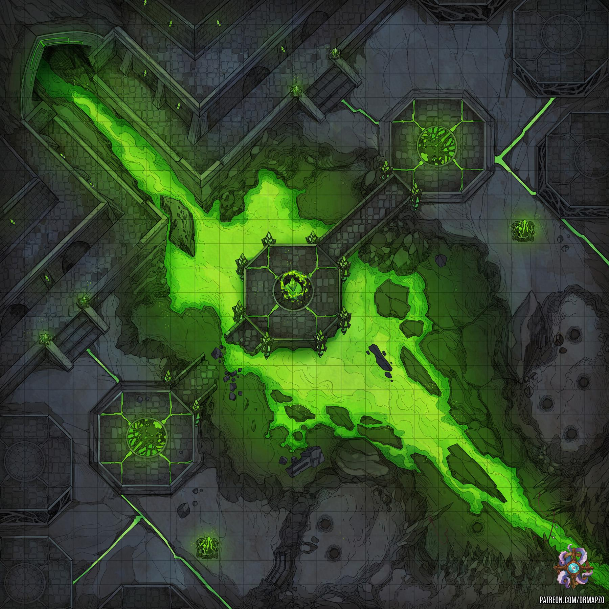
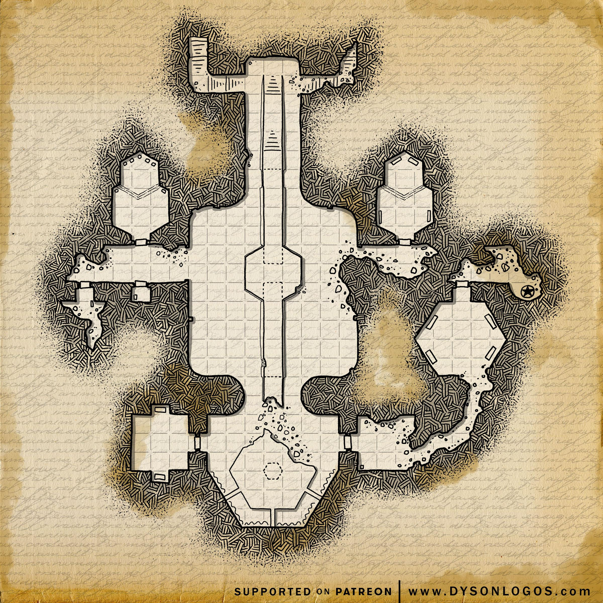

## Acropolis
~~A black marble temple; 3 sided pyramid.~~
A temple devoted to the worship of the [[kiaransalee]].

500ft above [[velddrinnsshar]]

Stood in a lake-filled cavern with its ceiling covered with thousands of skulls, atop a spire of white stone that held a set of spiraling stairs guarded by boneclaws.

A brooding block of black marble veined with red, filled with misshapen corridors, windows, and gaping doorways. Many of the stairs trickled with what seemed to be rancid fat and many of the rooms had their walls covered in murals depicting gruesome scenes painted with dried blood.

Take some inspiration from Arach-Tinilith.
https://forgottenrealms.fandom.com/wiki/Arach-Tinilith

Pyramid like paths. Green flame water ways.

TODO:
- ~~spell recharge area~~
- something cool connecting these (doesn't need to feel big, just evocative)
- rest spell for them?

### Protection
Necrotic Tempest raging around path to [[acropolis]]. DC15 CON save every minute vs 3d6 necro dmg.
~~Shadow Dragon~~
Vrock

## Looks
Catacomb like walls. Bones everywhere. But different styles.
Outside, towers with two blood giants trying to snipe down intruders. Immobile sentries.
Spires outside for protection (250m tall). Dungeon inside the big rock. Big. 400m wide.

## Regional Effects
The growing presence of [[kiaransalee]] causes necromantic effects everywhere.

- Chance of being grappled by a wall when within 5ft, DC15
- If sleeping herein, assaulted by `n x Dream Wraiths` CC135 CR5
- Locals suffers from healing magic herein.

### Conciousness of Kiaransalee Manifests
- through skulls; "welcome. welcome. welcome"
- "more living, yes. so hungry."
- skulls rearranging
- ground vibrating (2hz, small amplitude, but enough to make it difficult to walk)

### Entrance (lower end)
Leads downward from entrance. They can peak outside to see the defensive Towers.

Stairs down. Chamber of deactivated portals. They lead to various chambers and require keys.
Teleports:
- circular <-> cylon room
- singular ones <-> top room (require activation, librarian can help)

#### Circular teleport room
Spinning triquetrus symbol. Two parts of it light up green, one red.

#### Central Room
Skulls. Reforming as they venture past. Form rubiks cube like art.
Doesn't talk.

#### Misc Top Rooms
**Murray Skull NPC**
A little better mentally than the rest. Happy to join party for a walk and talk.
Provided they do the talking. Stuck here. Kiwi.
Can cast speak with dead. Just does this for a living.

Can tell of the betrayal of Valindra.
- she was making non-humanoids immortl, studying dragons in evernight
And some of Kiransalley.
- she was the deefinition of an undefeatable maig
- wings, scythe, huge, absolutely inormous.
- any enemies that fell, snap (cant click fingers anymore), her side

#### River
Green Acid. Flows with remarkable perturbation given that this appears looks like a small pond.
Actually connected to the chamber below (which ultimately drains out of acropolis).

#### Right Room; Valindra's chamber and Necro Guarden
Books in there. Note book from Valindra. 500gp diamond.
Book on necrotic gardening. Grows in acidic soil provided enough perturbations for it to only fleetingly touch the acid.

#### Necro Garden (below Valindra)
Gloom flowers. 3ft tall. Enormous black tulip with these feeling tendrils.
Influence on necrotic energy. Black bed, where occasionally acid splashes up on it.
Can make necrotic energy more powerful, and (parenthesised also protect you against its effects).
But have to get through first room (where perturbations start acid geysir).

Grows on outpost
Gloomflowers CC188 CR3 (Valindra's garden, can be used for necro res potion)

#### Top left bits
Entrance path to lower area.
Blood giant (Eddy) + drow favoured consort (Risreth Zaphrune) (MTOF183) patrols here.
Will reverse gravity on the acid if anyone comes close. Blood giant will snipe.

## Lore TODO
temple built to summon a god
lore on walls; statues of kiaransalee

- can speak with dead
- murray

## Enemies
- Doom Golem CC197 CR10 (bone based construct from Valindra's past)
- Blood Giants CR8 CC180 (great snipers + obscurers - tactical + they know them)
- Revenants

TODO: environmental effects to help them?

### Basement
Big ass sylinder that powers some things. Treadmill in the bottom with 200 zombies around a flywheel.
Slave driver Revenant with L4D2 zombie tank watches over things.

### Central Chamber

Where Irae tries to revive [[kiaransalee]] using the second egg of [[felgolos]].
It floats in the center, 20m wide, expanded. Pulsating.
Stream of green energy spinning around it, like 2/3 electrons forging a trail.
Triquetrus attachments like a tetrahedron.

Center can mimic https://forgottenrealms.fandom.com/wiki/Undying_Temple

Classified as Irae's Lair. Initiative 20 Actions.
> Spell Regen: d8 roll, recover that level of spell.
> Tether: The lich targets one creature it can see within 30 feet of it. A crackling cord of negative energy tethers the lich to the target. Whenever the lich takes damage, the target must make a DC 18 Constitution saving throw. On a failed save, the lich takes half the damage (rounded down), and the target takes the remaining damage. This tether lasts until initiative count 20 on the next round or until the lich or the target is no longer in the lich’s lair.
> Necrophos Ult: The lich calls forth the spirits of creatures that died in its lair. These apparitions materialize and attack one creature that the lich can see within 60 feet of it. The target must succeed on a DC 18 Constitution saving throw, taking 52 (15d6) necrotic damage on a failed save, or half as much damage on a success. The apparitions then disappear.
> Summon a Revenant with Great Reveance. Revenants explode.

### Her chamber
At the top. Room with info on plans.
Also got a teleport circle, can go to Maerimydra.
Arklem can port there.

The bag of holding she took is there. Shario's amulet will be used by her if necessary (if they take her on alone), but will otherwise be in her chambers in a locked safe.

### Felgolos chamber
[[felgolos]] on brink of becoming a full ancient dracolich. See his doc.

He will try to contact them when they are on the same plane of existence? Or Irae intercepts.
Large Green Gem is the phylactery. Encased in some protection magic in left altar.
Prismatic Wall? Too slow. Then how does she get it?
Maybe just indigo layer.

Imprisonment Scene. Nah. He's ready. Weeks have passed!
They just need to switch him on. Grab his phylactery and dimension door to the central chamber.
Battle will start. They might be hesitant to kill him - it matters little.
However, if they leave him, they technically have an adult dracolich which remains loyal until Kiaransalee awakens.

## Hazards
### Ward Spell
`Guards and Wards` spell (vs non-undead / all with password: vertebrazen).
Fog filled corridors, strong illusion towards wrong directions (hard to interpret).
Stairs with Web everywhere.
Arcane Lock on all doors.
Then:
2x Stinking Clouds or 2x Magic Mouth (invitations to doom rooms)

[//begin]: # "Autogenerated link references for markdown compatibility"
[kiaransalee]: ../deities/kiaransalee "Kiaransalee"
[velddrinnsshar]: velddrinnsshar "V'elddrinnsshar"
[acropolis]: acropolis "acropolis"
[felgolos]: ../npcs/felgolos "Felgolos"
[//end]: # "Autogenerated link references"
