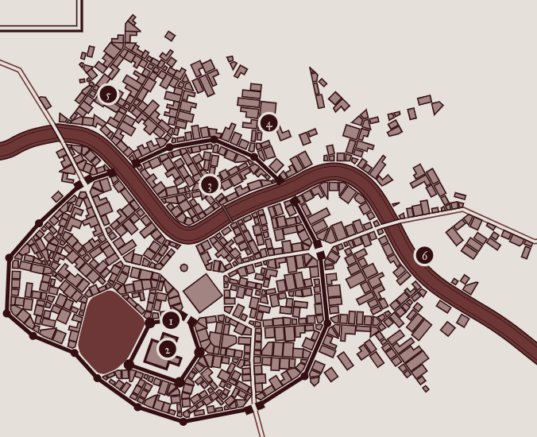

# Bone City
Fresh city off the Cormyr coast.
Abandoned and now quickly filled with undead from Luskan with help of the Herald
City of self-sustaining undead run by [[celerom]] and Erevain.

## Intro
Day of the Dead style intro.
Festival really. Stereotypical depictions of undeath. Make-up. Grey artificial hair color on vampires (who don't have to have it.)
They interrupt, combat, then [[celerom]] threads in and pardons them with an item. NB: if such an item exists, it can only be manufactured by Liches.

## Purpose
- Show players that the undead are being repurposed
- Reintroduce Celerom and allow players to debate good and evil with him

## Look
City is MADE out of bones. They can grow bones themselves. Part of Celerom's research.
take inspiration of orcus's ship.
Nice blue river runs through. Fewer people at day. Rusalka there though.

1. is an inner castle wall containing an inner court (main court outside)
2. Is celerom's experiment chamber. BONE FORTRESS. (it's a little much, isn't it, but a consistent aesthetic is so rare these days...)
LEFT OF THE CASTLE IS THE BONE DOME

## Encounter
While entering the city.
- Constructs; Bone Golem CC195 CR7 - x2
- 50 Zombies
- 50 Skeletons

In the middle of it, Celerom interrups with the Herald.
Casts Nystul's Magic Aura on each of them (if they accept).

## Town Cries - Headless Horsemelon
- "The arch mage is still here to support you. Do not be alarmed. Things will feel normal again."
- "Feeling post-death stress?" (PDSD) "Please report at the BONE DOME and we will grant you a lesser restoration."

- Grim Jester TOB240 CR11 (stats for horseman?) (like the DMC3 joker, but skeletal, needs jokes!)

## Bone Fort
Celerom's lab. Tons of flasks and alchemical experiments happening here.
- Bone bed (some cartilage to keep it connected).
- Skin stretches across tables (peeking underneath it's made of ribcages)
- Bone chair (went a little nuts on the look)

## Undead hospital; Bone Dome
Dealing in bone fractures. Bones/blood from conjure woodland animals.
Helps fix wounds (Gentle Repose / Life Transference) and resurrect skeletons (Danse Macabre), make constructs (Animate Dead modified at higher level) make them more loyal (Sympathy).
Can resurrect pretty much anything as long as it died recently, of lacking that, the soul is in a secure location. The soul is really the key that separates
Devil bones used as decoration.

## NPCs
Captain of the Guards. Fierstjerren; CR5 CC157

## Undead intelligence
- Skeletons quite dumb (cow like)
- Zombie
- Ghouls bouncers
- EVERY ANIMAL, DRAGONS
- Vampires (smart)
- Liches (highest leadership, need a soul farm, angers devils)

Vampires are a bit more of a fan of fresh blood. Philosophiclaly dull to live a perfect live.
This lich is a nice guy, but spending eternity together kind of guy?

- Deathwisp (silvan heritage skeleton) CR7 TOB72
- Rusalka in river (will kiss and reveal love, but only a weird desire to pull you under the water and drown you) TOB331
- Skeleton Vine Troll (CR9 TOB351) - could be a funny troll toll take

## Chief Herald
Herald of Undeath CC218 CR11.
Taking orders from Irae. Giving orders to puppet cities. This is one of those.
He's the main cemetary raiser who brought most of Luskan to a nearby skeleton puppet city.
He's not necessarily around.

## Religion
Priestess of Kiaransalee https://www.pinterest.co.uk/pin/594756694514707123/ ?
Leading into it is a Spirit Lamp CC349 (soulless lamb holder, illuminating the path)

## Helper Heme-pire
Erevain Redleaf. Elven heme-vampire. Doesn't need oxygen to breathe. Can walk to the bottom of Dragon Lake with a backpack of rocks on. Fully on board with Celerom's plan. He's seen empires come and go for too long.
https://www.pinterest.co.uk/pin/351843789641889247/

Sells vampire adrenaline. Injection as a bonus action (if primed). Grants one extra action immediately but must make a DC20 CON save or take 1d2 levels of exhaustion. Repeat use increases DC by 5. DC resets to 20 after long night.

## Attacks on Cities
Celestials attacking? Need Gate summoning with true name?
Fallen angel might know the name of a celestial (faey knows hans)

## Sources
https://old.reddit.com/r/dndmaps/comments/igdcfo/saint_vol_city_of_the_vampire_lord/

[//begin]: # "Autogenerated link references for markdown compatibility"
[celerom]: ../npcs/celerom "Celerum"
[//end]: # "Autogenerated link references"
