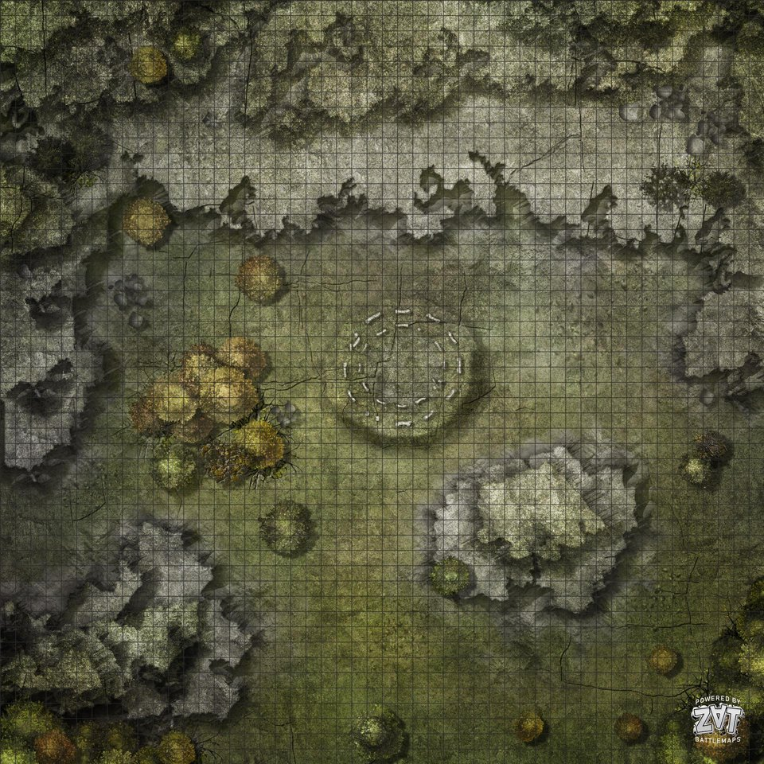

# Bone City
Fresh city off the Cormyr coast.
Abandoned and now quickly filled with undead from Luskan with help of the Herald
City of self-sustaining undead run by [[celerom]] and Erevain.

AKA New [[luskan]].

## Intro
Day of the Dead style intro.
Festival really. Stereotypical depictions of undeath. Make-up. Grey artificial hair color on vampires (who don't have to have it.)
They interrupt, combat, then [[celerom]] threads in and pardons them with an item. NB: if such an item exists, it can only be manufactured by Liches.

## Battle vs. Nekrina

### Undead Side
On one hand Celerom + Beniago. 100 Skeletons, 100 zombies.
Bone Golem. Bone Ballistas.

### Devil Side
Zaehesh (erinye)

Sasha (Auril cleric) - frost damage mace + summon celestial (Battleforce Angel CR5).
Togren Fistroar (ffist + kavaki convert) - sword fighter. Strong.
Salrius (thiefling ffist) - Magic Circle (blood of killed humanoid 24h) + Gate + Planar Binding on `Nurval` Blue Abishai.
Talindra - Warlock Thiefling (EB; Burning Hands, Rebuke)
Lyeneru: Sorcerer: Fireball, 3d6 Acid Splash, Mage Armor, Shield, Hold
Zhan: 2d6 Hammer. +10. Cure Wounds. Spiritual Weapons.
Izak: Sorcerer: 3d10 Fire Bolt, Mage Armor, Misty Step, Scorching Ray, Enlarge, Blur, Haste, Ice Storm

## Purpose
- Show players that the undead are being repurposed
- Reintroduce Celerom and allow players to debate good and evil with him

## Look
City is MADE out of bones. They can grow bones themselves. Part of Celerom's research.
take inspiration of orcus's ship.
Nice blue river runs through. Fewer people at day. Rusalka there though.

1. is an inner castle wall containing an inner court (main court outside)
2. Is celerom's experiment chamber. BONE FORTRESS. (it's a little much, isn't it, but a consistent aesthetic is so rare these days...)
LEFT OF THE CASTLE IS THE BONE DOME

## Encounter
While entering the city.
- Constructs; Bone Golem CC195 CR7 - x2
- 50 Zombies
- 50 Skeletons

In the middle of it, Celerom interrups with the Herald.
Casts Nystul's Magic Aura on each of them (if they accept).

## Town Cries - Headless Horsemelon
- "The arch mage is still here to support you. Do not be alarmed. Things will feel normal again."
- "Feeling post-death stress?" (PDSD) "Please report at the BONE DOME and we will grant you a lesser restoration."

- Grim Jester TOB240 CR11 (stats for horseman?) (like the DMC3 joker, but skeletal, needs jokes!)

## Bone Fort
Celerom's lab. Tons of flasks and alchemical experiments happening here.
- Bone bed (some cartilage to keep it connected).
- Skin stretches across tables (peeking underneath it's made of ribcages)
- Bone chair (went a little nuts on the look)

## Undead hospital; Bone Dome
Dealing in bone fractures. Bones/blood from conjure woodland animals.
Helps fix wounds (Gentle Repose / Life Transference) and resurrect skeletons (Danse Macabre), make constructs (Animate Dead modified at higher level) make them more loyal (Sympathy).
Can resurrect pretty much anything as long as it died recently, of lacking that, the soul is in a secure location. The soul is really the key that separates
Devil bones used as decoration.

Beniago, there with his skeletal parrot.

## KAvaki VAriety KIll
Bone dome partially taken apart. About 50 houses razed for a rock-concert style arena.
Start with [[90-undead-diplomacy]] recap.

ADVERTISING:
ASK ABOUT ADVERTISING? Get them to spread the word?
Celerom prepares Mirage Arcane; as he casts, the ground beneath him start forming cobblestones on the streets (spherical spread), lanterns pop up and appear to glow dimly above the streets, boats appear in river along with shards of ice flowing around them. Sudden caws are heard from seagulls soaring above, and the smell of fish suddenly fill your nostrils. The city is taking on the form of Luskan, and everyone is staring in awe as the ten minute transformation takes place.

ASK ABOUT HOSTING. CELEROM CAN OPEN. BUT YOU SHOULD TAKE OVER AFTER THAT. ASK ABOUT THE SIGN.
Celerom hosts with lines (entering with metal modified witch bolt into sky, that lights up a neon sign - cast at 5th level for duration).

- Good afternoon Bone City. OKOKOK RELAX. You know I am not here for the fame and glory. It's not been long since all of you, well, died. We have tried our best to build a peaceful society here, and you have all been great. But our early suspicions is starting to be confirmed as true; the civilized world does not want to deal undead no matter how different we are, and even if they were, they are not willing to stand up to neither the divine nor the infernal.
- Tomorrow; the forces of hell marches upon the city, and there's no way of saying this, we are likely not going to survive. We have not had enough time, and we are outmatched both skill-wise and resource wise.
- Somber details aside, there are positive things to be found in this situation.
- Say hello to the Face Maulers; our divine agents of Ysgard (confused clapping).

CLARIFICATIONS:
- PUBLIC: my my. Goatweaver, why don't you tell them what it is that makes the Goliath's faith so special, and what saves them from eternal torment?
ACTION:
- PRIVATE: Mordai, shall we commence the pyrotechnics? Goatweaver time to appease your saviour. (Celerom ready with control weather; clear/misty, weather cools, wind instantly stops, but drops sign, al)
KAVAKI:
- if asked to show himself: A spirit of him can show himself during the heat of battle. He takes the form of the statue.
- symbolism: Weapons slam down as cornerstones / mics.

## Nekrina battle
Celerom can suggest watching it with Arcane Eye as it turns bad.

Kavaki's spectral form visible in the horde as they charge and amplify their damage and resistances.
GW eyes glow with radiant energy. (Feeling refreshed, Heroes Feast effect during battle, afterwards? level? it's been 10 sessions).

They summon devils, Narzugon with fear presence + Horned Devil. Inspired skeletons charge into battle, the ones blessed not running away. Narzugon charges through a whole column of them (100) before coming to a standstill and flailing his lance around. Then the remainders swarm him, slowly taking down the steed, he falls down, tries to heal, but is swarmed. Every strike takes out handfulls of undead, but it's not enough.

Clerics also there. Spiritual weapon, turn undead (finishes them off), as they sink to their knees you could swear you see green spectral faces become visible around their skulls and turn upwards (while skull descends) before these faces quickly fade.

Zaehesh at finish: what? no. Sasha: uh, that seemed to work?

Fighters there. The sorcerer adventurers fireballs. Bone Golem and Horned devil fight alone.

Zaehesh rage incendiary cloud over city:
- Burn it. Burn it to the ground. (Causing more fireballs from sorcerers, and horned devil to rampage)

Kavaki (if contacted):
- That was quite an event. I could feel the energy. I mean literally, your energy fed into me, and I was able to aid like never before.

## Undead intelligence
- Skeletons quite dumb (cow like)
- Zombie
- Ghouls bouncers
- EVERY ANIMAL, DRAGONS
- Vampires (smart)
- Liches (highest leadership, need a soul farm, angers devils)

Vampires are a bit more of a fan of fresh blood. Philosophiclaly dull to live a perfect live.
This lich is a nice guy, but spending eternity together kind of guy?

- Deathwisp (silvan heritage skeleton) CR7 TOB72
- Rusalka in river (will kiss and reveal love, but only a weird desire to pull you under the water and drown you) TOB331
- Skeleton Vine Troll (CR9 TOB351) - could be a funny troll toll take

Undead skeleton `Moraga` from [[kobold-lair]] is their prime defense. He was a green dragon.

## Attacks on Cities
Celestials attacking? Need Gate summoning with true name?
Fallen angel might know the name of a celestial (faey knows hans)

Thiefling from BG flaming fist summoned one devil via Zaehesh.

## Stuff that never came up

### Undead Rave
Golem shaking leg. Skeleton playing tambourine.

### Pet Shop
Baby skeleton dragons. CC363 CR4
Other similar baby skeleton creatures.

### NPCs
Captain of the Guards. Fierstjerren; CR5 CC157

## Chief Herald
Herald of Undeath CC218 CR11.
Taking orders from Irae. Giving orders to puppet cities. This is one of those.
He's the main cemetary raiser who brought most of Luskan to a nearby skeleton puppet city.
He's not necessarily around.

### Religion
Priestess of Kiaransalee https://www.pinterest.co.uk/pin/594756694514707123/ ?
Leading into it is a Spirit Lamp CC349 (soulless lamb holder, illuminating the path)

### Helper Heme-pire
Erevain Redleaf. Elven heme-vampire. Doesn't need oxygen to breathe. Can walk to the bottom of Dragon Lake with a backpack of rocks on. Fully on board with Celerom's plan. He's seen empires come and go for too long.
https://www.pinterest.co.uk/pin/351843789641889247/

Sells vampire adrenaline. Injection as a bonus action (if primed). Grants one extra action immediately but must make a DC20 CON save or take 1d2 levels of exhaustion. Repeat use increases DC by 5. DC resets to 20 after long night.

## Sources
https://old.reddit.com/r/dndmaps/comments/igdcfo/saint_vol_city_of_the_vampire_lord/

[//begin]: # "Autogenerated link references for markdown compatibility"
[celerom]: ../npcs/celerom "Celerum"
[luskan]: ../north/luskan "Luskan"
[90-undead-diplomacy]: ../recaps/90-undead-diplomacy "90-undead-diplomacy"
[kobold-lair]: ../whiteplume/kobold-lair "Moraga's Lair"
[//end]: # "Autogenerated link references"
