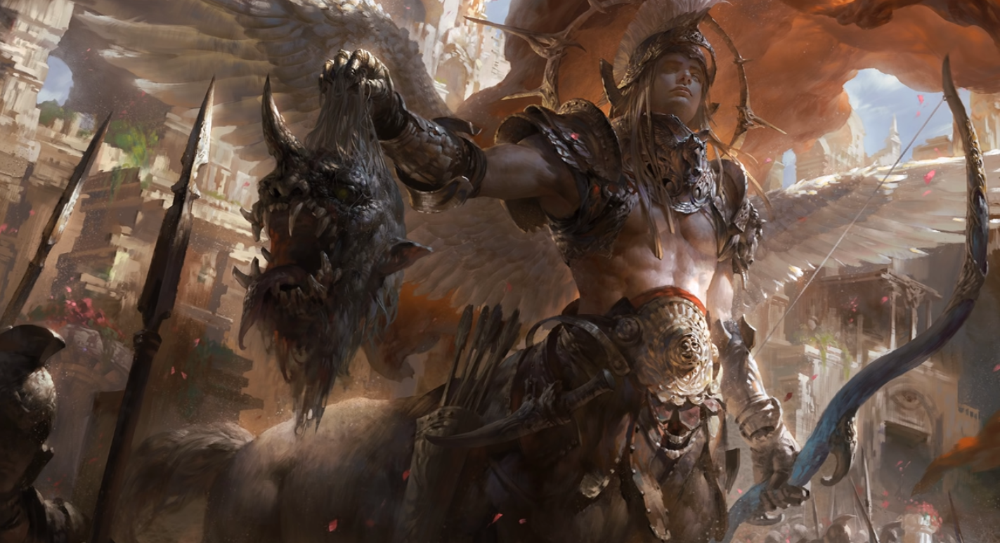

# Centuria

Legacy empire at Darkhold (on sword coast map).
Old trade route to the falled Cormyr/Sembian empire about 500 years ago.
Formerly maintained by dwarves.

Now this place is holding the line of undead towards baldurs gate.
Beefy fuckers with bows, regimented setups. Griffins. Warlocks.

## Description
Enormous sand pyramid rises up along the mountain side. Centaurs talking amongst themselves under one leader.
Multiple armored humans also helping out carrying equipment up the sand covered stairs.
Kind of in the middle of it you spot about 5 humanoids in fancier gear.
Two male humanoids (Grigor, Isaak), 1 tiefling (Dorfirith), one two elves(ish) (Muelara, Zaehesh).

The elves are both very cute looking. One with great flowing blue hair in a white robe that seems completely unsullied from the sand and mud you saw earlier. The other seems to have some kind enchantment on her large red hair (flowing wildly upwards), and metal face plates around it, and hefty metal armor.

## NPCs
### First Adventuring Group
#### Grigor + Isaak
Fighters from Baldurs gate.
https://www.pinterest.co.uk/pin/466263367664478591/ - Human Fighter
https://www.pinterest.co.uk/pin/192317846573382356/ - Genasi Sorcerer
### Talindra + Lyeneru Morren
Sisters, but Talindra is a thiefling. Great grandfather on mother's side apparently had infernal roots.
Following the standard approach, her sister has tried to do her hair up in such a way to cover her horns, but it's large and extrudes far to the side. They took this job here because only limeted combat experience was required (magic knowledge nice to have).
Lyeneru is a high elf that knows some magic. But Talindra just took a warlock pact via Zaehesh with Mephisto.
Level 3, just learning the ropes.

Talindra; https://www.pinterest.co.uk/pin/508414245430345109/

### Zaehesh Erinye
Emissary from Mephistar (they do a little more long term projects).

#### Meeting

#### Backstory
Lends her powers to the people of Centuria. Erinyes give their powers. Devils are not keen on undead takeover. Less souls on the economy, but devils have been a little beauraucratic and only focusing on short-term focused thinking.

NB: Erinyes just look like angels unless they want to reveal their origin. Glowing white eyes. GW Can detect a red shade along her body, but wings glimmer with green.
NB: Erinyes have nno interest in promotion in devil hierarchy (but work under an arch devil), as they can just leave the 9 hells at will. Others must be summoned by a mortal.
Erinyes help create faustian pacts. But now do so at a bargain.
[What They Don't Tell You About Erinyes (Fallen Angels) - D&D](https://www.youtube.com/watch?v=6fNxT_rWvSo)

They are also lawyers in hell. Fiendish codex 2. Grenpoli is erinye city. No violence. Wit + Guile only. No weapons (magic barrier). Most spell fail in city (summoning, damage). Pure politics. Haven to mortal malcontents from 1000 worlds.

### Centaur Warlord Leandas
In charge of a 50 centaur regiment responsible for keeping the growing city safe.
Dispatched from Baldur's Gate after undead started poking on the

### Dwarven Fortress
TODO: link with gilgrin vault (same clan heritage?)
If they want. They can figure out how the place fell and the powers of Kiaransalee. The weaknesses of the Acropolis from their initial failed raid. Resting place of Akkhan?
Should now have undead deep within. Underdark creatures as well. Driders? Chuuls? Umber Hulks.
