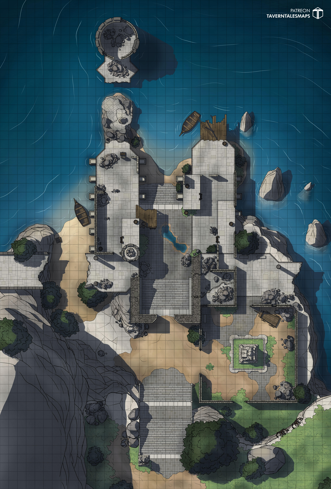

# Dragonlake Pier

Voluntary meeting with [[irae]] after [[celerom]] sends a message.

## Idea
She will meet them to test out their powers and try to sway them to her side.
She won't come alone, knowing their powers.
Contingency: Summon Narzugon + Misty Step into the air

## Battle
Artillery: 4 mid level Priestess (probably CR4)
Brute: Trex Zombie (shapechange, undead fortitude), Guardian
Boss: Brute/Artillery; Arch Druid (Stone skin passive, resistance physical)
Boss: Irae: Lich (Mind Blank Crown of Stars, invis at will, shield up, counterspell)

Actions:
Faldorn: Storm of V (c), Rev Grav (c), Sunburst, Moon Beam at 6th, CHANGECHANGE
Trex: +15hit, same dmg, con save adv. Goes in for attacks.
Irae: Maddening Darkness, Meteor Swarm (last resort), Friede Scythe, Fly attacks
Drow: 15AC, 15DC, 30HP +8 hit, Faerie Fire, Spiritual Weapons, Cure Wounds, Ray of Frost 2d8. Crossbow 2d8+4 piercing.

## Meeting
She'll port in with the druid and guardian. Out from a Plane Shift.

Celerom CAN be there, but he won't fight for party. Takes a magical oath of neutrality.
Casts a spell on the statue, and sequesters himself there as a way to signal its start.

Orbiting her head is this magical crown (bit like an Ioun stone)
She smiles upon seeing you. "So, we meet again. Almost didn't expect you'd show up."

## Wipe?
If they Wipe. Celerom can help them. 2/3 resurrected. The last needs divine intervention.
