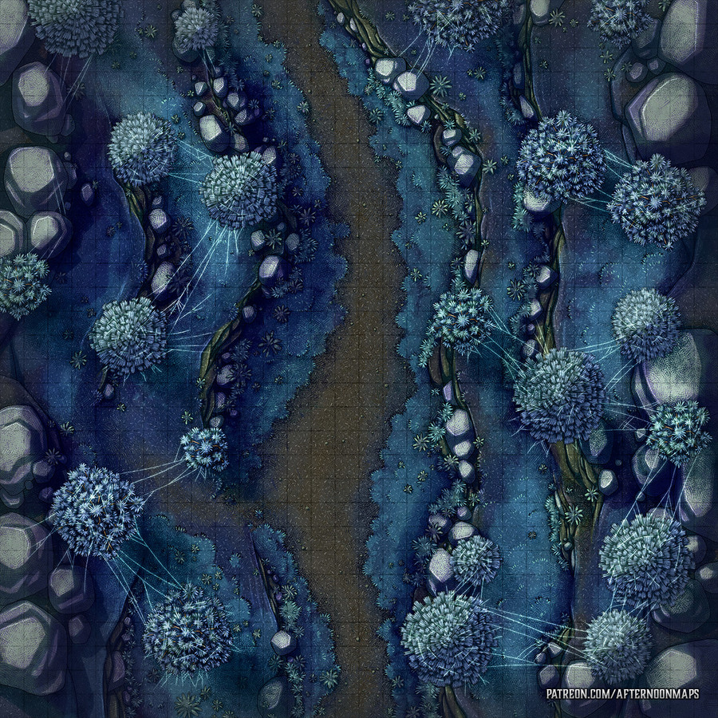

# Irithyll
Ancient city with gothic arcitecture. Dim blue light from the full moon. Eternal night here (crazy spell from vampires). DS3 inspired.
Hard to actually find, they have to pass a road of sacrifice through the shadowfell, to find it secluded in a valley.
Inhabitants are ancient undead. Vampire society in control. Hags in the sewers working for Irae as cultists.

## Geography
City situated on a hil, and there's a central path winding around the side of the hill up into a residential area.
At the top, amongst many mausoleum looking structures are a large arc leading into the cathedral area.
Many small streets between houses winding up and down (very up and down arcitecture, built organically over time).
Some small streets lead up to the less stable cliff faces of the mountain, can walk around there, to get a view of the western part of the city.
One path underneath leading to Irithyl dungeon. Huge crypt.
Paths wind around a lot. Can find paths to a swamp on the eastern cide.
Swamp leads to water (still < knee deep) which reveals - under one of the southern bridges - a sewer entrance. Undead drow. Path up to an active kitchen. Leads to a large cathedral central hall. Magnificent central furniture. Looks old. Many paintings of the city. Ghost fight, buttfucking archer.
Other side leads up cathedral walls in the east and out into eastern side, which also winds around other side of city. Eastern side has a elevator (many enemies that way).
Eastern side winds up in small bridges towards cathedral entrance.
Skull Lanterns everywhere. CC343

## Entrance
Need an item to pass the magnetosphere around the city;
- a ward cast by Celerom
- item granting free passage
- an audience granted with vampire council (via Celerom)

They can go to the dungeon if they know about the self-serving Irae cult below.

Undead here are generally not sentient yet (apart from the deacons), so they will attack on sight. Celerom has put in place a "lab".

## Magnetosphere
Some spells do not work within the city. Teleport, flight, plane shift, misty step, ethereal transit, sending across planar boundaries. There's eternal moonlight. => Ensures they have to fight their way out if the vampires do not like what they hear.

## City Style: Active Aggressive?
Cannons on fortress walls? Avoids flight entrances.
Skeletons vomitting 2d8 acid damage (but slow).
Fire archers 2d8 fire damage (with heavy crossbows) slowly firing from vantage.
Enemies deal exorbitantly heavy necrotic damage with actual weapons.

Upper city has some more sentient ones, past old church. Some are raises from Neverwinter.

River Lords CC327 swim in water drains. Sentient. Past colonial land owners in neverwinter from when

## Maps
repurpose from https://www.polygon.com/2017/1/17/14193428/dark-souls-3-maps-guide-enemies-items darksouls folder in dnd

## Old Church
Lairs a BOSS. Summoned by the liches to provide stability of Council.
Can be bypassed by walking around the city, though this will draw the attention of inhabitants. Shadow dragon?

Main powerhouse of the region - can be used against Nekrina later
Maybe they fight it on the way out, if they angered the vampires. That fight allows them to use terrain and prioritise other undead.

- Monstrosities exist within as the system doesn't work yet.
- Elophar CR4; CC149
- Kulmking CR9 CC244
- Nachzehrer CR8 CC272
- Corpse Mound TOB69 CR11

## Cathedral; Vampire Council
Undead + Zombies rule at day.
Upper cathetral at Irithyl; https://youtu.be/8ma-l-9zC3M?t=298
View down to Irithyl: https://youtu.be/8ma-l-9zC3M?t=307

### Council Members
Discussing in A. All happy to take a fight there should it happen.
Arklem in 10-X will try to prevent them from fucking with their coffins.

Guards;  Vampire Knight CC379 CR11 + Zombie Lord; CC394 CR5.
Maybe further inside.

- **Sabien** (patrician nobleman from 200yo) CC365 CR10. For sustainability. Tempted by vampirism in neverwinter. He is fine with the new artificial blood.

- **Eleanor**; Vampire Priestess CC367, CR8 who do not fully appreciate the new lifestyle, but her lust for revolution does not have a voice with the populus (mostly skeletons). erika ishii lolth voice.

- **Dorian** - Past king of Neverwinter. Skeletal Monarch CC341 CR9 (pompus voice, a bit stephen fry like when he was the servant)

S: "i keep saying this, but this is indeed a fresh start for us, to inhabit peacefully without all that judgement from the living."
E: "well it is nice being actually revered in the city"
E: "but don't you miss it; the draining from a live one, having their live force flow into you?"
P: "well, you see, the populus is not going to appreciate such draining in the long run"
P: "what you need to do is blame it on a night hag, so the population never knows who the real enemy is"
E: "why are you always using women as your goto-boogeyman?"
E: "why do you never use a goblins or trolls?"
P: "well, pardon, it was just the first that came to mind."
S: "everyone. calm down. have you not eaten in a while? we have company."

### Council surface level conflict
Vampires want to freedom and their empire to continue, and leech of nearby slaves. Irae's plans are both with and against them. Council divided. S for it, other against.
The expansion would threaten their secrecy, but also grants power.

Celerom wants to reform them into vegetarians. But they are old fashioned. One will not change at all, but the younger ones MIGHT. The king COULD betray them and destroy the charm from Celerom to force them out.

### Council actual conflict
Arklem not concerned with sustainability atm, he's a tactician (happy to let people think this is the real deal).

Arklem wants the plan to progress quickly now that demon lords have been weakened and orcus lost.
He wants any adventurers sent to koth or zug so the shadowfell army can rise and activate [[velddrinnsshar]]'s acropolis.

### On combat
S: dio style lines; "Oh you're approaching me? Instead of running away, you are coming right at me?" -> "Then come as close as you like X."

TODO: can have rings for vampires [[weapons]].

### Guards
- Tulpa spectral shapeshifter undead ; CC358 CR4
- Tveirherjar CC359 CC7 (general battle skeleton)
- Undead Phoenix. CC361 CR12
- Jiangshi CC230 CR6
- Bone Swarm TOB41 CR10
- Spectral Guardian TOB358 CR6
- Wormhearted Suffragan TOB410 CR5 (parasite caster)

## Pet Shop
Baby skeleton dragons. CC363 CR4
Other similar baby skeleton creatures.

## Dungeon
Worshippers of Irae granting her divine powers.
Normally, the deacons would worship Kiaransalee, but Irae wants the powers directly.

in swamp; Drowned Maidens CR5 TOB163 (long haired roper girls in white dresses)
could also put some Shrouds (CR1/8 TOB438) squire specters with strength drain

- Swarm of Gorgon CR5 MM171 (5x bulls) charges towards them
- Night Hag Coven MM177-178 (shared spell casting) Sitting between a bunch of non-casting night hags.

Casters shifts between them. 9 or night hags in the middle. ~100HP each.
One Hold Persons one of them. Another Polymorphs another. Then the last have to free them.
Past Crones of Thanatos.

- Nightwalker MTF216 CR20 boss.
- 2x Eidolon MTF194 CR12 temple protectors

### Underdark passage
Can spot takeover parallel by Zug. Plus [[koth]]'s domain.

## Path of Suffering
Passage through the Shadowfell. At the peak, they can meet [[dessirris]] (or maybe Kavaki?) who will advocate from the celestials to take on undead. Shadowfell might be its own can of worms, but that's normal (they can't monitor that area that well).

Path have to lead a winding path around a mountain, around ancient burial grounds. You'll know you're on the right path if you see the mist forming along the path.

Pass a few Shadar-Kai on the way out. Emissaries from Dorian, asking the Celerom to proceed with his experiment and bring forth samples.
- Surprise: "Are you here to end my path, or do you willingly wish enter the path of suffering?"
- Advice: "Stay on path, friend. The city might be gloomy, but spirits lingering outside, can be much worse. Oh, and be quiet on the bridge." (Warns of sorrowsworn in the wild MTOF231++ and a big beast under the bridge)
- Overview: "A forsaken place. Undeath and lingering spirits stand on every corner. A few of us are continually spared."
- He?: "I am one of the few entrusted by the raven queen with a mission, in doing so I can bring back food for the village."

### Irae Encounter
Path sends you through a valley, foot prints visible, mist starting to form at your feet. You are clearly high up in this mountain.

helpers: 2 vampire spawn (dim servant high schoolers), 8 will o wisps.
halucinatory terrain plus helpers undead above the valley and there's mist above uneven ground. She doesn't care for a fight here, at most a few rounds.
Protections: Mind Blank, Crown of Stars, invis at will, shield up, counterspell.
If attacked; arcane deflection reac, 19-23AC depending on conc/deflect + deals dmg.
If they attack, just add maddening darkness, fly up away while undead attacks.

Irae (all cases): It's time we had a chat together. You have caused quite the disruption at Halos.
Irae (demon lord defense): Well, that was ultimately a distraction until I got all the pieces together. You see, it's with all the artifacts of Kiaransalee combined that the raised dead retain their souls and sentience.
Irae (undead sentience defense): You fail to understand the true significance of this event? It's all undead raised from this point by me, or anyone I have raised. This is an infectious proprety. Souls are no longer sent off to hell in eternal torment to serve as infernal currency, nor are a small percentage sent to elysium, where they can enjoy this.. distinct position of privilege. They are free. They are immortal. All it took was to crash the economy of souls.
Irae (giant mind control defense): I offered Umnos power, and he took it. I'm sure he's not the only one who's learning to read the fine print.
Irae (giant justification): Chaos was a necessary agent to get at 3 very protected pieces. Society was either too un-budging, or too brutish to be able to deal with my proposal. Some plans are so great, that you can only effectively argue for it once it's been placed into effect.
Irae (in case of Bone City retreat / shadowfell escape): I think it's best you try to stop what you are doing.
Extraplanar: Sure, there is going to be resistance.

Small village of shadar-kai (closed ecosystem for vampires to harvest) Manasari, about 200 people. They know they cannot leave their land or they'll choke on the mist. They recycle souls on death. Superstitious. Raven Queen occasionally smiles on the most worthy and lets us leave this place.

[//begin]: # "Autogenerated link references for markdown compatibility"
[velddrinnsshar]: velddrinnsshar "V'elddrinnsshar"
[weapons]: ../questideas/weapons "weapons"
[koth]: ../npcs/koth "Koth M'gog"
[dessirris]: ../npcs/dessirris "Dessirris"
[//end]: # "Autogenerated link references"
