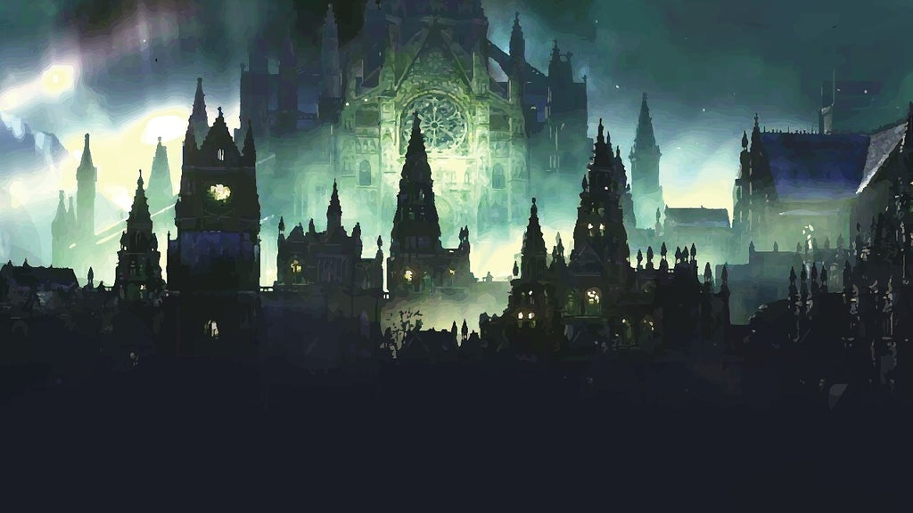
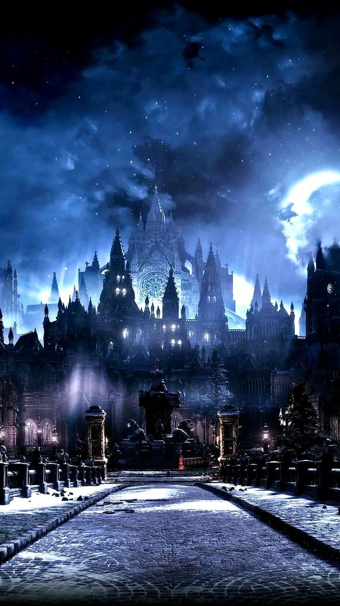
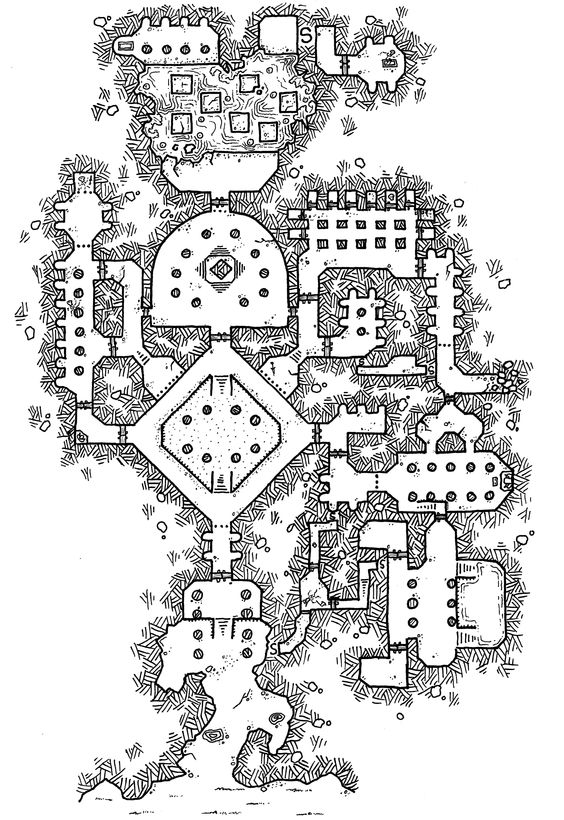

# Irithyll
Ancient city with gothic arcitecture. Dim blue light from the full moon. Eternal night here (crazy spell from vampires). DS3 inspired.
Hard to actually find, they have to pass through the shadowfell via [[path-of-suffering]], to find it secluded in a valley.
Inhabitants are ancient undead. Vampire society in control. Hags in the sewers working for Irae as cultists to flood the material plane with temporary undead.

## Scrying
Size of Irithyll is in population similar to Luskan, but more compact (vertical).
- tall zombies and grotesque skeletal mutations
- tveirherjar black armored skeleton
- anticipation: "fight arklem == fight the city"

## Geography
City situated on a hil, and there's a central path winding around the side of the hill up into a residential area.
At the top, amongst many mausoleum looking structures are a large arc leading into the cathedral area.
Many small streets between houses winding up and down (very up and down arcitecture, built organically over time).
Some small streets lead up to the less stable cliff faces of the mountain, can walk around there, to get a view of the western part of the city.
One path underneath leading to Irithyl dungeon. Huge crypt.
Paths wind around a lot. Can find paths to a swamp on the eastern cide.
Swamp leads to water (still < knee deep) which reveals - under one of the southern bridges - a sewer entrance. Undead drow. Path up to an active kitchen. Leads to a large cathedral central hall. Magnificent central furniture. Looks old. Many paintings of the city. Ghost fight, buttfucking archer.
Other side leads up cathedral walls in the east and out into eastern side, which also winds around other side of city. Eastern side has a elevator (many enemies that way).
Eastern side winds up in small bridges towards cathedral entrance.
Skull Lanterns everywhere. CC343

## Entrance
Need an item to pass the magnetosphere around the city;
- a ward cast by Celerom
- item granting free passage
- an audience granted with vampire council (via Celerom)

They can go to the dungeon if they know about the self-serving Irae cult below.

Undead here are generally not sentient yet (apart from the deacons), so they will attack on sight. Celerom has put in place a "lab".

## Magnetosphere
Some spells do not work within the city. Teleport, flight, plane shift, misty step, ethereal transit, sending across planar boundaries. There's eternal moonlight. => Ensures they have to fight their way out if the vampires do not like what they hear.

## City Style: Passive Aggressive INTO Active Aggressive
Balistas on fortress walls. Flight doesn't work anyway, but eh.
Skeletons vomitting 2d8 acid damage (but slow). Doesn't attack welcome people past church.
Fire archers 2d8 fire damage (with heavy crossbows) slowly firing from vantage.
Enemies deal exorbitantly heavy necrotic damage with actual weapons.
Shadow dragon. Ancient Blue cruises over the city.

## Maps
repurpose from https://www.polygon.com/2017/1/17/14193428/dark-souls-3-maps-guide-enemies-items darksouls folder in dnd

## Old Church
Where they actually get to make their case with the council. If they kill any undead, then the whole city revolts.
If that happens high up, they have an escape mission on their hand after potentially dealing with [[arklem]]. Such a setup allows them to use terrain and prioritise other undead.

## Old Church; Vampire Council
Undead + Zombies rule at day.
Upper cathetral at Irithyl; https://youtu.be/8ma-l-9zC3M?t=298
View down to Irithyl: https://youtu.be/8ma-l-9zC3M?t=307

### Council Members
Discussing in A. All happy to take a fight there should it happen.
[[arklem]] in 10-X will try to prevent them from fucking with their coffins.
Arklem is using Geas to make them confused about any deals from [[celerom]], and is using them to have it take as long as possible. That's why the meetings take place outside their hideout. Arklem's phylactery is in [[velddrinnsshar]].

- **Sabien** (patrician nobleman from 200yo) CC365 CR10. For sustainability. Tempted by vampirism in neverwinter. He is fine with the new artificial blood.

- **Eleanor**; Vampire Priestess CC367, CR8 who do not fully appreciate the new lifestyle, but her lust for revolution does not have a voice with the populus (mostly skeletons). erika ishii lolth voice.

- **Dorian** - Past king of Neverwinter. Skeletal Monarch CC341 CR9 (pompus voice, a bit stephen fry like when he was the servant)

S: "i keep saying this, but this is indeed a fresh start for us, to inhabit peacefully without all that judgement from the living."
E: "well it is nice being actually revered in the city"
E: "but don't you miss it; the draining from a live one, having their live force flow into you?"
P: "well, you see, the populus is not going to appreciate such draining in the long run"
P: "what you need to do is blame it on a night hag, so the population never knows who the real enemy is"
E: "why are you always using women as your goto-boogeyman?"
E: "why do you never use a goblins or trolls?"
P: "well, pardon, it was just the first that came to mind."
S: "everyone. calm down. have you not eaten in a while? we have company."

Guards;  Vampire Knight CC379 CR11 + Zombie Lord; CC394 CR5.
Maybe further inside.

### Council surface level conflict
Vampires want to freedom and their empire to continue, and leech of nearby slaves. Irae's plans are both with and against them. Council divided. S for it, other against.
The expansion would threaten their secrecy, but also grants power.

Celerom wants to reform them into vegetarians. But they are old fashioned. One will not change at all, but the younger ones MIGHT. The king COULD betray them and destroy the charm from Celerom to force them out.

### Council actual conflict
Arklem not concerned with sustainability atm, he's a tactician (happy to let people think this is the real deal).

Arklem wants the plan to progress quickly now that demon lords have been weakened and orcus lost.
He wants any adventurers sent to koth or zug so the shadowfell army can rise and activate [[velddrinnsshar]]'s acropolis.

NB: Koth' summoned high end adventurers are reasons for powerful undead arch druids et al.

## Upper City
Past old church. Harms anyone on sight.

River Lords CC327 swim in water drains. Sentient. Past colonial land owners in neverwinter from when

- Corpse Mound TOB69 CR11
- Undead Phoenix. CC361 CR12
- Jiangshi CC230 CR6
- Bone Swarm TOB41 CR10

### Cathedral
[[arklem]]'s domain.
Entrance is the royal area front.
Lower end.

### Inner Guards
- Tulpa spectral shapeshifter undead ; CC358 CR4
- Tveirherjar CC359 CC7 (general battle skeleton)
- Spectral Guardian TOB358 CR6
- Wormhearted Suffragan TOB410 CR5 (parasite caster)
- Master of the Demon Mountain CC265 CR17

## Summoning Area
Creating abyssal undead by summoning undead from the abyss and taking their powers.
Process;
- Summon Greater Demon at lvl 9 with blood circle (requires fresh killed humanoid blood)
=> CR12 Demon (slight increase homebrew) - force it to create a amulet to obey them
- Gate when it's done
- Drain its essence with Egg and unholy Lich magic

### Monstrosities

- Elophar CR4; CC149 (ritual nalfeshnee)
- Kulmking CR9 CC244 (ritual devourer)
- Nachzehrer CR8 CC272 (ritual hezrou)

## Dungeon
Two tier. Upper end is the huge lair of Arklem. Front for it is the Royal area where the useless rulers are.

Worshippers of Irae granting her divine powers on the lower end.
These covens not only grant magic stability throughout the city, they feast on anything that comes near, can tempt children in certain shadowy forests with portals into the sewers.
Normally, the deacons would worship Kiaransalee, but Irae wants the powers directly.

in swamp; Drowned Maidens CR5 TOB163 (long haired roper girls in white dresses)
could also put some Shrouds (CR1/8 TOB438) squire specters with strength drain

- Swarm of Gorgon CR5 MM171 (5x bulls) charges towards them
- Night Hag Coven MM177-178 (shared spell casting) Sitting between a bunch of non-casting night hags.

Casters shifts between them. 9 or night hags in the middle. ~100HP each.
One Hold Persons one of them. Another Polymorphs another. Then the last have to free them.
Past Crones of Thanatos.

- Nightwalker MTF216 CR20 boss.
- 2x Eidolon MTF194 CR12 temple protectors

Quest: One reclusive hag/crone immune to the magic via tattoos. Offers if they do something shady.

### Underdark passage
Can spot takeover parallel by Zuggtmoy. Plus [[koth]]'s domain.

[//begin]: # "Autogenerated link references for markdown compatibility"
[path-of-suffering]: path-of-suffering "Path of Suffering"
[arklem]: ../npcs/arklem "Arklem Greeth"
[celerom]: ../npcs/celerom "Celerum"
[velddrinnsshar]: velddrinnsshar "V'elddrinnsshar"
[koth]: ../npcs/koth "Koth M'gog"
[//end]: # "Autogenerated link references"
