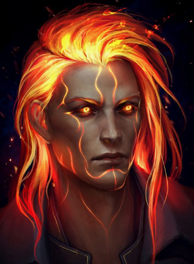
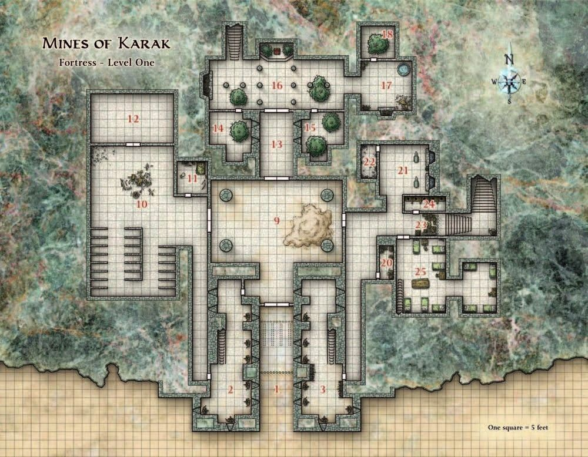
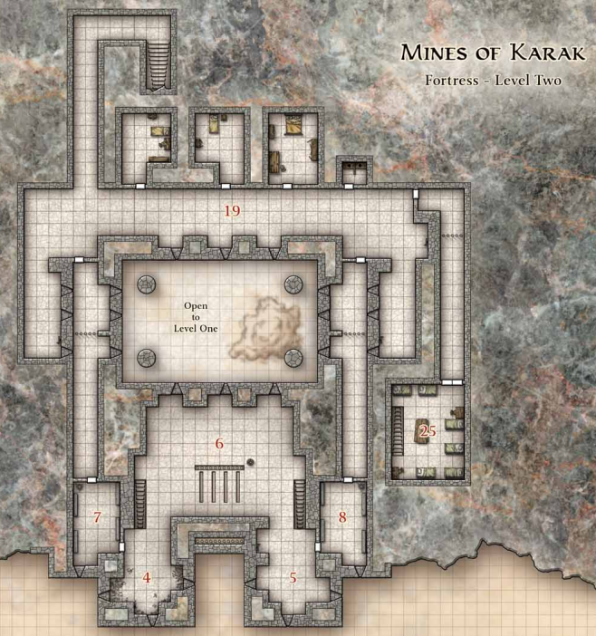
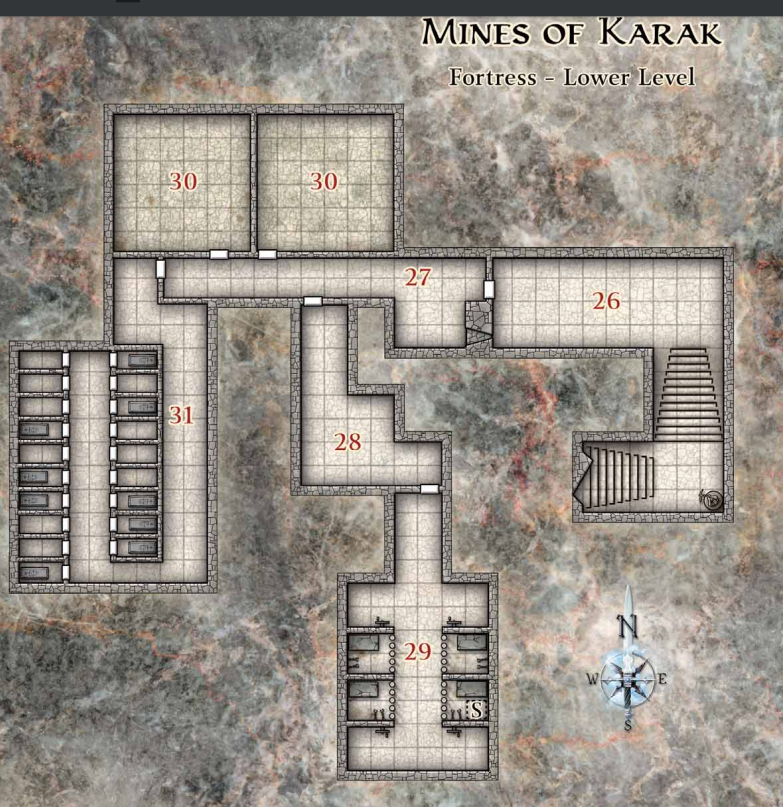

# Nekrina

Legacy empire at Darkhold (on sword coast map).

## History
Old trade route to the falled Cormyr/Sembian empire about 500 years ago.
Formerly maintained by dwarves at that time.
In recent times; mostly a settlement for centaurs/griffins, other classically magical creatures that found it difficult to fit in with major cities built for humanoids.
Currently; These powers bought by coin from Hell (whitewashed through baldur's gate), and adventuring parties have joined in.

### Dwarven Times
A powerful dwarven empire had its roots here, most connected cities disappeared with the netherese.
Now the resting place of Akkhan. Overrun with underdark creatures and driders. At the time, the city was called `Dhirn Darim`, but centaurs named it `Nekrina` much later.

## Description
Enormous sand pyramid rises up along the mountain side with beautifully carved small but plentiful steps mostly covered in sand. Centaurs talking amongst themselves under one leader (real beefy fuckers with huge bows, clearly battle trained, talking in a regimented fashion). Multiple griffins perched half way up the stairs.
Several parties of armored humans helping out carrying equipment up the sand covered stairs.

Kind of in the middle of it you spot about 5 humanoids in fancier gear.
Two male humanoids (Grigor, Isaak), 1 tiefling (Dorfirith), one two elves(ish) (Muelara, [[zaehesh]]).

The elves are both very cute looking. One with great flowing blue hair in a white robe that seems completely unsullied from the sand and mud you saw earlier. The other seems to have some kind enchantment on her large red hair (flowing wildly upwards), and metal face plates around it, and hefty metal armor.

## NPCs
### First Adventuring Group
#### Zhan + Isaak
Fighters from Baldurs gate.

Zhan is the human cleric, and Izák is the Genasi sorcerer.
https://www.pinterest.co.uk/pin/466263367:-664478591/ - Human Cleric (Retainer Cleric Exorcist SF7X)
https://www.pinterest.co.uk/pin/192317846573382356/ - Genasi Sorcerer (Retainer Knight-Sorerer SF75)

Been fighting together for a long time. Level 11. Helped clear Baldur's Gate of cultists from Baal.

##### Izák Slezák
Isaak is pretty "cool" a bit "try hard". Tosses his hair around.
- "So, you're the big shots from up north huh?"
- "I heard you tore the prince of demons a fresh one."
- "You looking for a hand on your mission? I doubt I could find a better crew than you."

Knows about them.
Studied up this place. Hard to find much about it.
But did you know that about 500 years ago a great undead assault happened here?
Apparently some drow based godess named Kiaransalee led them.

Mordai relayed all info to him. He didn't have further info at this time.
GW will send telepathic signal about.

##### Zhan Ling
Zhan is a cleric of `Bane`. The aristocracy in Baldur's Gate is a bit oppressive.
Uses a maul, very skillfully. Like an asian monk. Will greet GW respectfully. Uncle Roger accent.
- "You use ancient hammer?"
- "Ancient hammer, only for skilled warria."
- "Be one with the hammaa."
- "You beat uncle Zhan in fight to death, and uncle Zhan, join party."
- "Oh, you no kill uncle Zhan. uncle Zhan too good."
- "Oh, I won't kill you. I'll stop just before."
- "FIGHT TO THE DEATH."

Will challenge GW to Bellow/Flumph. Failed.
Knows about Akkhan, great dwarven hero. He live in this place.

### Talindra + Lyeneru Morren
Sisters, but Talindra is a thiefling. Great grandfather on mother's side apparently had infernal roots.
Following the standard approach, her sister has tried to do her hair up in such a way to cover her horns, but it's large and extrudes far to the side. They took this job here because only limeted combat experience was required (magic knowledge nice to have).
Talindra; https://www.pinterest.co.uk/pin/508414245430345109/
But Talindra just took a warlock pact via Zaehesh with Mephisto.

Lyeneru is a high elf that knows some magic. Level 3, just learning the ropes.

The thiefling could be Mordai's brother. It could be a implanted memory via Modify Memory.

One is a Retainer Healer; SF73
Other is Retainer Acolyte of Darkness SF76, or Exarch SF80
RETAINER BACKSTORY ACTUALLY UP TO PLAYERS!

both upstaris back east

#### Togren Fistroar
Fighter from the flaming fist. (downstairs under stairs east)
bearded. standard soldier. less reputable, happy with the pay.
now learning kavaki religion (they deceived him)
he is a bit dim.

#### Sasha Dreamsoar
Cleric of Auril (upstairs middle room back)
talked about the recruitment from baldurs gate
how zahesh had recruited from flaming fist and also newer areas
https://www.reddit.com/r/UnearthedArcana/comments/juolfx/frost_domain_a_divine_domain_for_clerics_that/

#### Salrius
Thiefling from flaming fist. (downstairs east alone)
He was the ambitious one. got powers from Mephisto.
He's been given the chance to summon a higher power. Chance roll to do Gate correctly.

### Next Set of Adventurers
Post Recon
Someone is Mordai's Sibling. Knows about his mother who now lives in Baldur's Gate.

### Centaur Warlord Leandas
In charge of a 50 centaur regiment responsible for keeping the growing city safe.
Centaurs want fancy shit. Golden stables. Threaded hay, no dirt, with melted cheese.
Leandas has signed a pact for this, and will leading the assault on BoneCity.
He's a bit dim, but pretty stronk.
Will reveal that lady helped get him this deal.

### Gnome Entrepeneur Jorzo
With Bellow/Flumph rules. 10gp per entry. 10gp price. DC20 STR check (-2 each subsequent attempt). Maul bonus if proficient.
https://i.redd.it/lak61ggkqgt51.jpg
GW bested the game, Mordai failed. Zhan failed. GW banned from playinga gain.
He has a tatoo master. The tattoo Djinn, who can give a tattoo at an unspecified time.

## Dwarven Fortress
Made by same dwarven clan that `Akkhan` was part of. Hints of his resting place can be found deep inside.
They can figure out how the place fell and the powers of Kiaransalee. The weaknesses of the Acropolis from their initial failed raid.

> "Eternal resting place of ancient heroes, or some shit, probably looted to death this close to civilization. besides, it's all sealed as far as we've been told."
### Main Level

- 1 entrance hall (traps deactivated)
- 2/3 arrow slits vantage points (paths up to 4/5)
- 4/5 above, same deal
- 9 huge ceiling (80 ft ceil, gathering place for adventurers)
- 10 centaur stables
- 12 Leonda's chambers
- 25 temporary sleeping chambers (way more above)
- 23 path to lower. Umber Hulks coming up. They barred it.
- 16 Path up to upper.

Some isolated people speak of dwaves below (when alone). Other speak of mist and wetness, "don't bother".

### Upper level

### Lower level

Instead run an Elder Oblex plot. Wet floor.
Hallucinatory terrain in there, red mist up to knees, feels knolly. Multiple dwarves conected to central mass in corner (eerier red light from each corner). Sulfurous smell. True sight sees the tether.
Try to separate members. "My i am so thirsty, you look like a strong one, my man, do you mind fetching me some water?"

Why are they here? Just dug themselves up from the underdark. Trapped. Can't remember the city name they came from.

Knows how to get to [[velddrinnsshar]], without getting trapped (through Shadowfell, two-way portal from [[irithyll]]) (knowledge of one of the owned dwarves some are duergar).

If they get one to leave, close the door. Bring jojo the Umber Hulk + a chuul (googol).
Can have the upper levels be extremely clean, like acid cleaned.

- 29 sleeping chambers of important people (lore info here about Akkhan)
- 31 tombs (very old, Kiaransalee lore here)

#### Lore
- The disappearance of Maerimydra. Temple to Kiaransalee at the top of the underdark city. Now it's a hole in the ground (map location to where it was). Irae was a cleric there.
- Map of it
- Akkhan was buried not far from that city up north. Boreal Diamond Mines. Pamphlet; "come make your sacrifices and pay your respects".

- TODO: ritual that can hamper Irae's powers.
- TODO: Lore about help from [[eilistraee]]?
- TODO: ritual that can trojan horse Irae's scythe egg? (cannot work if you get a dragon of opposing color)

#### Enemies
- Haugbui (mount feeder undead zombie like) CR13 TOB247
- Mummy Lord CR11

[//begin]: # "Autogenerated link references for markdown compatibility"
[zaehesh]: ../npcs/zaehesh "Zaehesh"
[velddrinnsshar]: velddrinnsshar "V'elddrinnsshar"
[irithyll]: irithyll "Irithyll"
[eilistraee]: ../deities/eilistraee "Eilistraee"
[//end]: # "Autogenerated link references"
