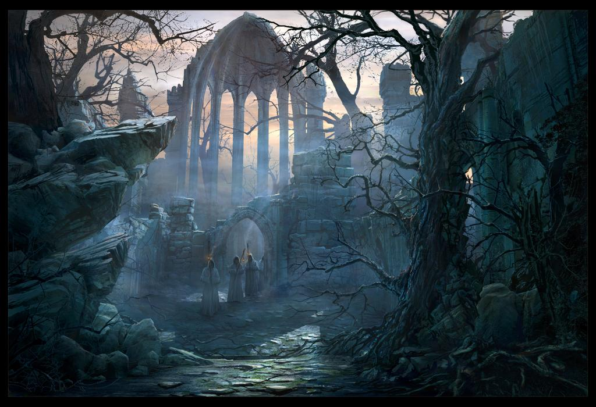

# Path of Suffering
Passage through the Shadowfell. Shadowfell might be its own can of worms, but that's normal (they can't monitor that area that well).

Path have to lead a winding path around a mountain, around ancient burial grounds. You'll know you're on the right path if you see the mist forming along the path.

Nothing there on the way in if they protect from scrying.
Otherwise, ambush.

### EBA: Manasari emissaries
Pass a few Shadar-Kai on the way out. Emissaries from Dorian, asking the Celerom to proceed with his experiment and bring forth samples.
- Surprise: "Are you here to end my path, or do you willingly wish enter the path of suffering?"
- Advice: "Stay on path, friend. The city might be gloomy, but spirits lingering outside, can be much worse. Oh, and be quiet on the bridge." (Warns of sorrowsworn in the wild MTOF231++ and a big beast under the bridge)
- Overview: "A forsaken place. Undeath and lingering spirits stand on every corner. A few of us are continually spared."
- He?: "I am one of the few entrusted by the raven queen with a mission, in doing so I can bring back food for the village."

### EBA: Celestial Guidance
At the peak, if they are lost, they can meet [[dessirris]] or talk to kavaki, who will advocate from the celestials to take on undead.
Why? Corrupts the worship. Areas populated by worshippers now owned by undead.

### Irae Encounter
Path sends you through a valley, foot prints visible, mist starting to form at your feet. It feels like you have climbed much higher up in this mountain than you feel like. Ghostly lights seem to dance across the mist.

DELIBERATELY DEADLY ENCOUNTER. They can always be prisoners in Irithyll dungeon. Fairy fire dusts everyone passively here.

Protector of the path: **Faldorn**. (Now undead druid, crazy maggot infested branches atop her head, evil aligned druid (buffs her spell DC by 2)
- Archdruid AC16, HP80, Storm of Vengeance. Passive Fairy Fire, Fire Storm
- Shape Change into T-Rex Zombie

helpers: 2 vampire spawn (dim servant high schoolers), 8 will o wisps (druid work)

Irae: crown of stars Clone (8th level duplicate), half HP, no equipment
halucinatory terrain plus helpers undead above the valley and there's mist above uneven ground. She doesn't care for a fight here, at most a few rounds.
Protections: Mind Blank, Crown of Stars, invis at will, shield up, counterspell.
If attacked; arcane deflection reac, 19-23AC depending on conc/deflect + deals dmg.
If they attack, just add maddening darkness, fly up away while undead attacks.
NB: She does not have her items here. She has cloak of invisibility.

## EBA: Shadowfell madness
Play on their weaknesses. Sins they have committed. Play on it. Dante. 1408
1408: The Philosophical Depths That Horror Can Reach
https://www.reddit.com/r/DnD/comments/8hafdw/dantes_inferno_has_it_been_done/
https://en.wikipedia.org/wiki/Divine_Comedy

Where would the Negative Versions of Yourselves lead you?
They need a NPC guide?
Maybe the amount of challenges they complete dictate results at final one?
More and more exhaustion if they fail.

**Foreshadowing encounter when resting in a hotel**:
In a window (1408), you see a creature. Dimly lit, staring at you through an opposing window. As you look towards it, it appears to look at you, and as you shift from side to side, so does it.
 If you pick up a light, you see who it is (You, staring towards you), but you also see another creature behind it charging up towards you. If reaction of them is to turn, they are NOT surprised.

## EBA: Manasari
Small village of shadar-kai (closed ecosystem for vampires to harvest) Manasari, about 200 people. They know they cannot leave their land or they'll choke on the mist. They recycle souls on death. Superstitious. Raven Queen occasionally smiles on the most worthy and lets us leave this place.

[//begin]: # "Autogenerated link references for markdown compatibility"
[dessirris]: ../npcs/dessirris "Dessirris"
[//end]: # "Autogenerated link references"
