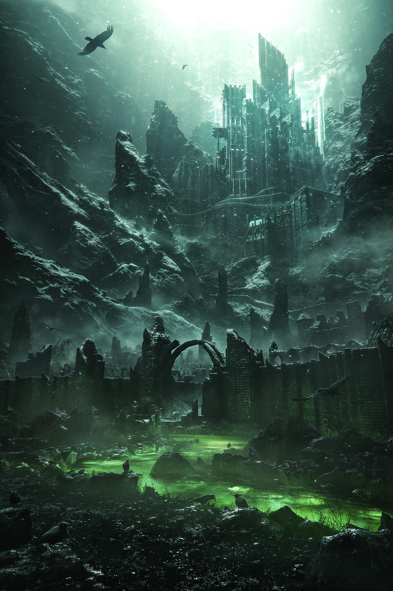

# V'elddrinnsshar
> Veldrin + shar == concealment + mind

City in the centre of the Moondeep Sea (AKA beneath Lake of Dragons in Cormyr in my setting).

They have to pass through a vortex during a storm to get to the shadowfell portal.
Other path from [[irithyll]] two way teleport to below.

https://www.pinterest.co.uk/pin/858991328908429121/

music:
- https://www.youtube.com/watch?v=E0VCNB9Ep2M prometheus studio: fortress/monastery gothic (grimdark)

## City
Irae hosts undead balls?
Drider bowl
Zombie tank from L4D2 (reskinned fire giant with 29str, single attacks)

### Library
Books about histories of famous people. Biographies, literal ghostwriter.
- Shadowmantle; book about an unseelie moon elf who rose to become the overwizard of the Tower Arcane around 800DR in [[luskan]]. The book follows her from 1100 to 1102 as she had taken residence in [[evernight]] working on creating phylacteries for dragons. (Dracoliches). Ghostwritten by Edvard Feeler (high-functioning autist demilich who made black tentacle spell)
- ~~Greeth; another ghostwritten biography of the archmage of the arcane brothehood, his rise to power, and an extraordinary ruse~~

### NPC: Elegant Hag of the Wastes
https://www.reddit.com/r/DnD/comments/nvosx6/art_madame_cl%C3%A9mentine_night_hag_of_avarie/

## History
The Crones obtained a voidstone, and placed it within the Acropolis in order to sustain a gate to the Shadowfell, to summon an army of undead.

## NPC: Antoine Lastfever
broken french accent. no h sound. uvular r (back of throat), dark l. last syllable weight.
what does he want?

## Hazards / Environment
## Protection
Necrotic Tempest raging around path to temple. DC15 CON save every minute vs 3d6 necro dmg.
Instate it along with the DS3 entrance fight to spice it up.

### Miniboss High AC Undead Champion
Red visor eyes, huge sword.
Enters with sword dropping from the skies first in city, then he's dropped from an undead griffin. Make him fly glide above ground as to unnaturally move.

### Sorcer Relics
Spider familiar tracking them.
### Sleeping
Dream Wraiths. CC135 CR5

### Fights
- Four Kings fight (Close combat darkness fight ala DS1)

#### Enemies
- Flying Polyp CR11 CC162
- Ghost Dragon CR11 CC170
- Ghost Dwarf CR6 CC171
- Many Ghoul variants in CC172...
- Bloog Giants CR8 CC180 (great snipers + obscurers - tactical + they know them)
- Gloomflowers CC188 CR3 (good for triggering visions)
- Doom Golem CC197 CR10
- Skull Lord MTF 230 CR15

## Inspiration
### Floating Netherese City; Thultanthar
https://www.youtube.com/watch?v=WX3Mj5kkuuI
Ulrant's Guide to the planes of the Shadowfell - 25$
Flying fortress, raining rocks as foreshadowing (flies above you)

### Ashes of Ariandel; Acropolios in Shadowfell
-  Tower with bowman; Siege weapon like bowman causing havoc.
-  Millwood knights (proper fighters from the past - revived by [[arklem]] over centuries

In the past? Initially, where they can meet young Irae? Not really the past, but a painted world / demiplane.
They can get clues about backstory, and then guardians of time stopping them from fucking up the past?

Really don't ahve to base it so hard on that look though, just the geeral idea.

### Auril's Temple trials
P208 rime of frostmaiden
Blessing of Kiaransalee; Immunity to Necrotic on DC22 CON SAVE.

[//begin]: # "Autogenerated link references for markdown compatibility"
[irithyll]: irithyll "Irithyll"
[luskan]: ../north/luskan "Luskan"
[evernight]: ../north/evernight "Evernight"
[arklem]: ../npcs/arklem "Arklem Greeth"
[//end]: # "Autogenerated link references"
