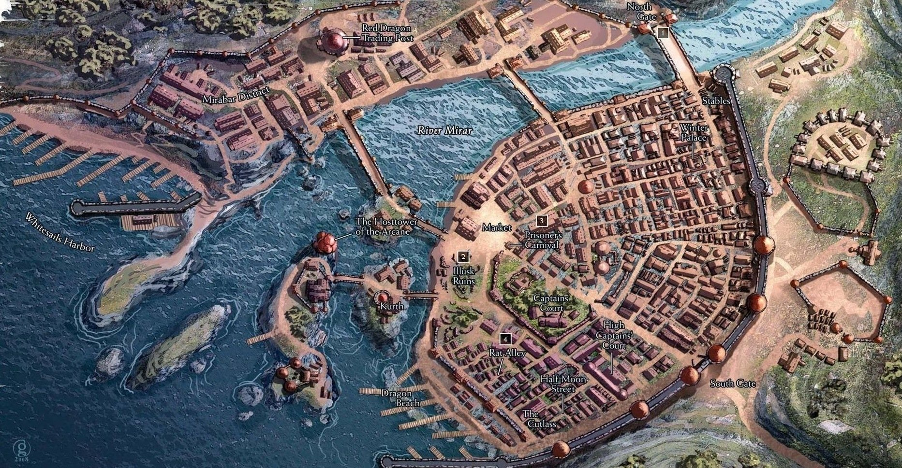

# Luskan

https://forgottenrealms.fandom.com/wiki/Luskan
https://thetimelostchronicles.com/luskan

## Connections
- Road east to [[mirabar]].
- Road South to [[neverwinter]] (via [[toll-trolls]]).

## Intro
Later tremors + cracks as they approach north (Yeenoghu).

Gnolls being fought off at the gate. 100s of them. Gate almost breaking. Gate falling without help.
"Finally, reinforcements! We had word from Waterdeep that you were on your way. Arklem got a message from Diana."
Huge group of them blasted by fireball from the castle walls.
Vlooris is the robed guy.

(Drow members definitely all know about them know because of all the rucous in Waterdeep).
Also notorious with the Greycloaks + Bragan. Bonsir leads the militia there (also with ship rethnor)

## History
City was attacked repeatedly by orcs. They took over recently, but 50y ago a mercenary army from WDeep cleared the ruins. Rebuilt it with help of Neverwinter. Then renamed to Luskan.

So we can still have Brotherhood members who refer to it as Illusk.
Now full of Thieves/Pirates and other disreputable folk...

## Post Yeenoghu
Corruption spreads. People transform. Old watchers (ghostly guard) roam the city to clear out the corruption, but they treat everything as hostile.

## Attack As It Happened
In the darkness while they were in Gilgrin..

In a new devastating wave of gnolls breaching the battlements fireballs, intense waves of arrows raining down, barely keeping the assault at bay when suddenly; an earth shattering smash sends a piece of wall 10ft wide flying towards the Inn and smashes through half the building. You see the visage of a gnoll 5 times the height of a regular gnoll. Twisted metal wrapped around its body, providing some kind of make-shift, masochistic armor (surly digging into its flesh). See the creature stomp its way through the city, with intent, heading towards the Tower Arcane at the middle of the river.
It's smashing its flail up against the tree, penetrating some magical barrier as it does so, and using it to climb up the side of it, with impossible dexterity. You see mages up at at fortifications at some of the branches shooting fireballs and lightning bolts down, but it does not seem to give a thought to it at all. It takes it maybe 12s to scale 100ft and reach the battlements, swatting a selection mages with its flail, before it enters the brotherhood.
Meanwhile gnolls rampaging through the city, it does not take long before this is a horror scene. Bodies everywhere, gnolls having their fill of guts. For the next 30 minutes you hear clashes of arcane magic from within the Tower.

Before you notice (depowering sounds). The faint humm that was ever present in this city comes to a halt. Magical defenses around the tower cease.
Fightining within the tower continues. and you fix your eyes up towards the balcony where you hear a counterspell interrupted, and after a crack, you suddenly see the familiar dark blue robes of Celerom, torn, his body flying through the air, lifeless and limp, crashing with full force down on the ground, sliding across the gravel with several large gashes and wounds across his legs neck and face.

You peer up once again to the tower; and you see a figure in a dark cloak with yellow edges ([[arklem]]). You don't see a face, you just see smoke exude from a seemingly empty hood. The creature conjures up a lighting bolt from its arms (actually no arms), aiming down towards the crash site. But before unleashing it, just lowers its hands, then teleports.

A minute later. Whoosh. The familiar sound of teleportation magic once more, but louder and more powerful. All the gnolls look to the sky, and in unison turn to face the battlements, and howl. They start stampeding out of Luskan and disappear beyond the castle walls. As their stampeding sound grow fainter, it's replaced with the remaining wails of humans slowly dying. It's a gruesome and agonizing sound.

Next day;
NO: You look up; the sky clouds separating to reveal two of toril's three moons stacked on top of each other in unison. Both are deep red (dual eclipse).
YES: You look up; the clouds show a swirling torrent of yellow energy, Corellor Borealis, an elven figure descends from the sky. Scanning the battlefield with one metal plate with 8 red dots across it. While she appears almost angelic with her entry, you recognise her. This is Irae.
She descends.
"This better work without the blade, or this will be a huge waste"
She notices the body of [[celerom]], checks it, thinks for a bit. She tosses a weaker looking healing spell on him.

Grasping her staff with both hands, the staff extends. You see the star. It's attached like a pommel, and it looks smaller, but it's the star; the Egg of Galadaeros. As she once again ascends, she lifts the gem to the sky, and you see a beam of white light focusing down from the sky for a second, after which a black nova radiates outwards in a shockwave. All the bodies of the ground twitch.
She returns to the ground and starts casting a spell that looks similar to a spell you've seen before; Danse Macabre. A necromancy spell for summoning, but it's different. There's a lot of energy being funnelled in from the star, and as the ritual continues, it's clear that this is a lot more complicated than the original.
Over the course of the hour. Everyone starts to rise and look at themselves with confusion.
She returns to Celerom; casting a stronger transmutation spell on herself (Glibness) she speaks to Celerom.
"I am Ilharess Alur; these undead need your aid, they are afraid, they are stressed, they are damaged. We can help you fix them, make them whole again. Bring them with you, and you will be able to complete your lives work, but this time for good; keep the citizens alive."

She returns later after letting him mull it over for some time. Then she casts Gate after convincing him. Dragging the undead to Bone City.

## Celestials
[[dessirris]] encounter when viewing the past.

### Watchers
Watchers of the Abyss rise to clear out corruption.
They fight against humans taken over so have a very heavy counter-humanoid style:
- shield guards rush into your face
- 2 more attack from the back
- 2 more shoot fire from the sides

along with Millwood Knights. Huge ogre like beasts in full armor and huge axes.
bowmen fortified in the distance

## Tower Arcane
Castle erected by netherese arcanist Melathar. Was a spellward and huge stone walls that look like a tree now. Huge. Home to the academy for the Arcane Brothehood.

Mages have color suffixes. Kazhen the Red.

https://forgottenrealms.fandom.com/wiki/Arcane_Brotherhood
https://the-legacy-of-the-crystal-shard.fandom.com/wiki/Arcane_Brotherhood

(Intern) Initiate -> (Junior) Conjurer -> (Senior) Evoker -> (Staff) Master mage -> Archmage (Principal)

Discount: -15*(level-1) == 30 at evoker

### Tower Lore
Has books on Demon Lords from Mordenkainen himself.
Learn about the rivalries and chaotic nature (yeenoghu and baphomet), i.e. that they are unlikely to orchestrate grand plans themselves.
(Can teach you about the Ruathym Brothehood isle if they rank up well).

### NPCs
- [[arklem]]
- [[celerom]]
- [[sydney]]

## One Eyed Jax
https://forgottenrealms.fandom.com/wiki/One-Eyed_Jax

Beniago's purple bird immediately kaws as you enter.

See [[beniago]] for the intro. He is operating a ship for Kurth. Badass.
See https://forgottenrealms.fandom.com/wiki/Beniago under Ship Kurth for favourable hiring of ships.

### Bregan D'aerthe
https://forgottenrealms.fandom.com/wiki/Bregan_D%27aerthe

Ranks:
- (Intern) Assassin -> (Jr) Executioner -> (Sr) Silencer -> (Staff) Speaker -> (Principal) Listener
- (Intern) Cannonneer -> (Jr) Swashbuckler -> (Sr) Shipmaster -> (Staff) First M8 -> (Principal) Captain

Discounts: -15% per rank

#### Initiation
THEY ALREADY ROBBED MANISION IN WATERDEEP

#### Short quest
Via [[beniago]].
So, you're clearly pretty thieves already, but you haven't technically accomplished any tasks for us, so I will give you a freebie. We will grant you Swashbuckler rank if;
- Get Orena + Zanu drunk.

Drinking contest / deception / magic.

#### Alternate Short quest
Steal something pointless from the captain.

#### Long quest 2
Wants you to retrieve Araushnee's Stinger +3 dagger of Venom.

Defended by 2x Monolith Champions. Some of the most powerful constructs that we've seen. Anyone we've sent in has been dispatched with a blue flamed blade and our attacks might have pierced its armor, but after being hit, one of our mercenaries turned against us.

Beniago: "It's been hard to find people stupid enough to go in after that. Now, I realize I'm not making perhaps the most persuasive argument. But hear me out; my point is that we've seen you embark on quests most people have found foolish, and you've come out superior."

Keep what's in there. Quest for Faeynore? Drawings of Lolth.

Base dungeon on Dark Heart http://www.wizards.com/files/157_Dark_Heart.pdf - goes into the feywild post the obvious fake shrine parts.
http://www.wizards.com/files/366_mithrendain.pdf

Reward
More access to items!
Sell hit squads for N-thousand gold, depending on difficulty.

#### Final Long Quest
Find and recover main kidnapped leader + item in Menzo.
Or perhaps ruathym?

#### EBA Quest
Steal item from Mages Guild to frame someone. (Stealing totally bad idea against scrying mage).
If they get caught, he will add a parasite into the skull of the caught thief. -4 INT until removed + clairvoyance info. Want Cat Ear Headband stolen.
Alternatively, steal a ring and frame another ship?

## Trading
Red dragon trading!

5 "ships" (encapsulating collection of people + boats) that has everything.
- Ship Kurth
- Ship Baram
- Ship Suljack
- Ship Taerl
- Ship Rethnor

Ice on the river Morar.

## Temples
- Temple to Godess Auril? Godess of Winter. Ice Queen. Winter Palace.
- (Part of Deities of Fury: Maelar, Umberlee, Auril, Talos)
- She also has a secret temple along the spine of the world! (Hjarka?)
- Codicil of White (info about Auril)
- Dragon mag 312! Cleric spells - ice spells.
- Quest pointer for Hjraka to see out the Winter Palace.

### Auril's Temple
Temple to Godess Auril? Godess of Winter. Ice Queen. Winter Palace.
(Part of Deities of Fury: Maelar, Umberlee, Auril, Talos)
She also has a secret temple along the spine of the world! (Hjarka?)
Codicil of White (info about Auril)
Dragon mag 312! Cleric spells - ice spells.
Quest pointer for Hjraka to see out the Winter Palace.

Koheya – rules the Winter Palace
Want to make a sacrifice to the frost maiden?

## EBAs
- Frost Veil (TOB) enemy in mountains
- Gnoll cavern leading to Yeenoghu.

### Yeenoghu's Lair
Dissuage them from trying.

- "We're hoping they'll run out of reinforcements and move on."
- "If we aggravate their leader, we are probably in bigger rouble..."
- "Don't bring the leader back here. If you have to flee, flee elsewhere..."

Nothing for 2/3 nights, then more gnolls.
4th night, giant crack, city falls down into the deep. Yeenoghu eats everyone except the mages.

However, **if they do descend**:
Huge corridor, that starts with large crushing sounds, followed by 50 gnolls.
Corridor partially made by purple worm (but yeenoghu can burst through tiny openings pretty  easily)
Then silence. Chanting gnoll voice: Yeenoghu (3 times). 5 seconds of silence, then this deathly roar.
Then gradually more frequent steps, and Yeenoghu comes..

- Legendary resist, advantage on saves. 22 AC (describe it!). Bonus bite if he kills something (his turn only)
- Spirtual weapon flail conc!
- Legendary actions: Swat (huge push D24 STR), bite (huge dmg melee)
- Charge: full speed extra action!
- Main attacks are fucking lethal: can do: 1/3 extra dmg, 1/3 paralyze, 1/3 confuse!

- Damage immunities: all non-magical base dmg it seems...
- Resist: Cold/fire/lightning
- Immune to charm/frightened/poisoned..

**Fight area**: Purple worm tunnel, they can retreat into soft areas a purple worm nursery. They can also hide in there if they find it early and roll decent stealth.

[//begin]: # "Autogenerated link references for markdown compatibility"
[mirabar]: mirabar "Mirabar"
[neverwinter]: neverwinter "Neverwinter"
[toll-trolls]: toll-trolls "Toll Trolls"
[arklem]: ../npcs/arklem "Arklem Greeth"
[celerom]: ../npcs/celerom "Celerum"
[dessirris]: ../npcs/dessirris "Dessirris"
[sydney]: ../npcs/sydney "Sydney"
[beniago]: ../npcs/beniago "Beniago"
[//end]: # "Autogenerated link references"
