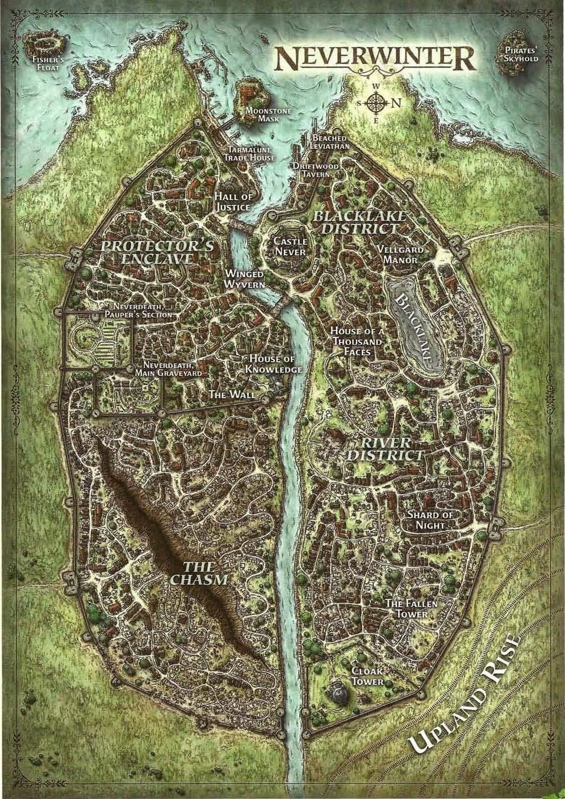
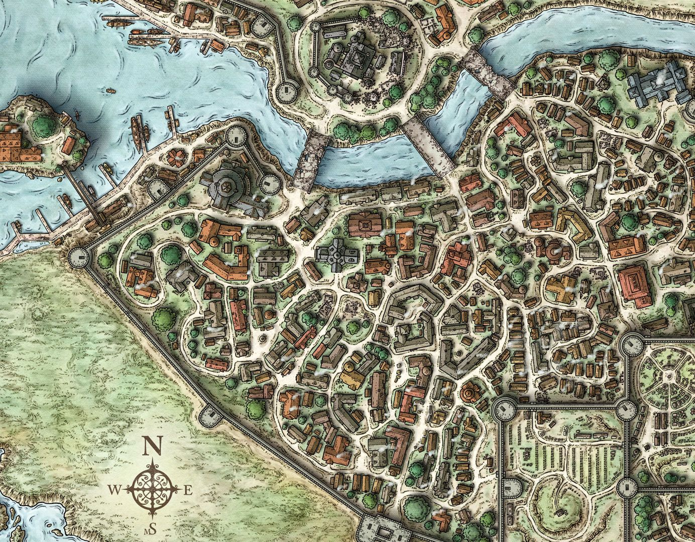
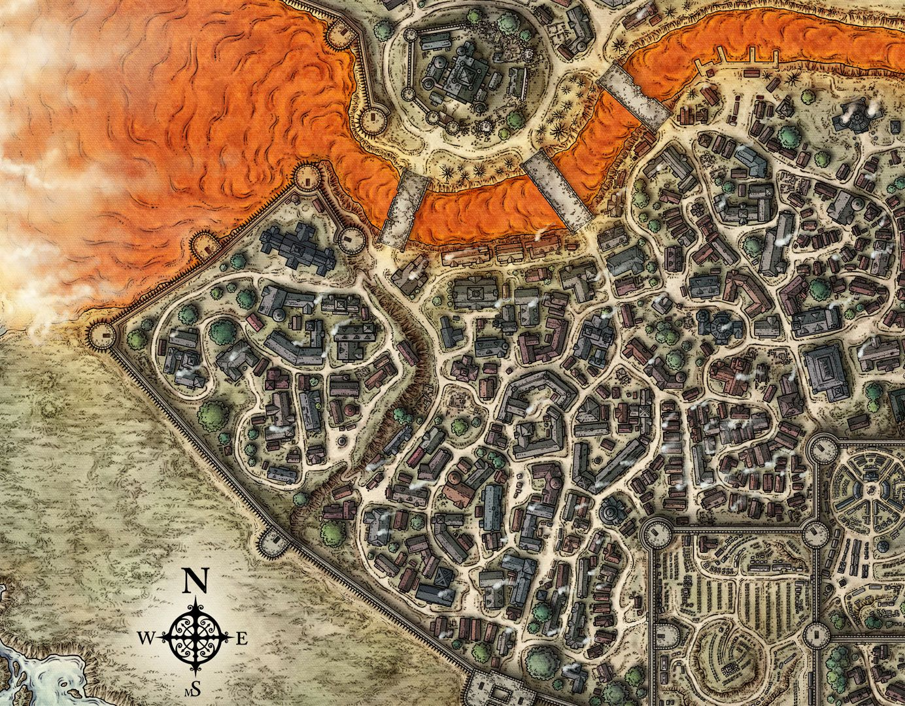

# Neverwinter v Kiaransalee
see [[kiaransalee]] + [[irae]].
re-read session omega
Using "Battlefield Design" terminology from[[dungeons]]

## music
### Hollow Knight • Relaxing Music with Ambiance (Rain, Fire, Night, Snow)
https://www.youtube.com/watch?v=mYEA5A0Bjyo - setup 2h
### Epic Battle Themes from Evangelion (Rebuild Edition)
https://www.youtube.com/watch?v=KepiAite1hY - stage 1 22min !queue it a few times
### Demon's Souls Remake OST - Flamelurker Boss Theme
https://www.youtube.com/watch?v=XTja6y_cfRc - extended, good stage 2

### Orchestral Battle Music from Fullmetal Alchemist: Brotherhood
https://www.youtube.com/watch?v=VnTDYqbgxL0 - sounds good, stage 3

fallback s3: bland
https://www.youtube.com/watch?v=dh7nTM6D-GU ds3 alonne (used for demogorgon)

### Potential Innocent Start
See darkness form on the horizon. If they scry they can see her out on the farmlands:
slow, but large strides beneath sees a little curious girl on the outskirt farms.
"how would you like to live forever?"
**flesh tearing off in space of 10s**
small skeleton child, blue glowing eyes
porting in undead? into timestop buff them?

#### Speech?
Neverwinter. Some of you have seen our work, we can make you live forever.
yet some among you have seen this
seen how we free society from the oppression of finality
and yet these people; you; continue to protect these weak people.

you have stood against our forces for long enough that there is no need to be under any illusions here; you will pay for all you have killed along the way.
you will be a footnote in history books; what happens to those who oppose progress. perhaps we'll open an attraction at thanatos with you in it. you would serve as quite the deterrent for other aspiring rebels.
anyway, enough talk. it's time to destroy this trecherous city, and disperse the contents of your entrails across its ruins.
initiative: 15+10

## Stage 1: Arrogant Arrival
initial attack through **choke point**
let them get some hits in, but it can be Larloch's shape (immune to physical)

teleport within castle walls while skeletons attack
acid breath down a whole wall
-> **killing fields** fight
as she teleports inside she can run a DC20 CON save vs 50 necro dmg in area (if dead from this -> raise -> 10 graycloaks)
they can hide behind buildings in this stage, use the terrain

Mobs:
- 1x Nerfed Devkarin Lich as a Undead Matron Mother
- 1x Skeletal Owlbear
- 2x Undead Drow archer/swordsman (drider base)
- 30x snow maiden (ghostly drow)

Friendlies:
- Galeron (Champion)
- Diana/Ursula
NB: all of these have to doge K due to her gaze.

## Stage 2: Transformation
She blurs the line between the shadowfell and the prime material.
NB: This is using a lot of energy, so if she takes a lot of HP here it breaks.
Everything darkens, yellow soft glow becoming visible, soft moving sound of the neverwinter river fades, and your ears start picking up deeper rumbling sound instead.

Terrible creatures come in from the graveyard/tower in a way that overwhelms the graycloaks.
Adds a **fog of war** (reduces sight around her 100ft) to increase tension (faey struggles vs valindra anyway)

Stage happens from  and tears into 

Mobs:
- If they hide too much here; intorduce "The Lonely" - add a soft desperate cry
- 1x sword wraith commander (drow favoured consort)

## Stage 3: Desperation
Link between shadowfell breaks. Arrogance fades.
Final desperate gambit / boom or bust choice (that might kill people?) -> last chance to win.
Plot & BBEG merge
=> Irae tries to be the main face of Kiaransalee and speak as one
=> White face stuck (cannot switch, but has health?)
=> However, heavy penalties to her if plot subversion as even she cannot control a god
subversion: angering other 2 / or something else plot related? / sunset warrior attacks?

COULD have this be a cataclysmic event and they would have to battle through the city
recover allies, final inspirations
find mages at the bottom of halls of justice as they finish off undead allies
quick potions delivered (heroism to improve to hit, 3 potions of superior heal)

## Terrain
Vertical terrain: castle walls; smaller houses
Lava river in stage 2... can be diverted

## Denouement
Emotional Releases. [[epilogue]] lead ins.

## Raised Undead battle Graycloaks

## Reinforcements
At stage 1; Bless from Diana/Ursula?
At stage 3; potions of heroism (add d4 on chance to hit). Healing potions.

### Diana
- Counterspell needs 60ft range (but she can fly in for a costly deus ex machina)
- Mordenkainen's Sanctum
- Sunbeam to start stage3?
### Ursula
- Haste
- Cure Wounds / 7th Mass Cure Wounds (all of staff, 5d8+5)
- +3 Arrows (Heirloom)
### Sucy
- Bless -> Mordai
- 6th level Life Transference (7d8 from her pool)
- 5th level Prayer of Hearling (5d8+4 to all)
- Raise Dead
### Moradin Clerics
- Holy Weapon on Faey
Thurdan Smughammer

## Kiaransalee Stage 2 Math
- Mordai with NecroRes/CircleOfPower/AcidRes/Overcharge(c)
- Faey with Speed/Invis/AcidRes (no necrores)
- GW with 27Strength/NecroRes/AcidRes/SpiritShroud(c)
- CoP: party has adv on saves within 30ft of mordai (and dmg voided on save)

### Simulation of Expected DMG in 2 rounds
#### Goatweaver (AC23)
3 attacks per round if he gets reaction/opportunity/crit
+16 => 45% chance to hit vs Valindra, 70% vs others
so with advantage (undead / vengeance target) should do well
1d6+11+2d12 (+d8) =~ 33 per hit (probably 4 hits in 2 rounds with the extra one, 3 vs valindra)
vs valindra: double physical => extra 15 per hit
smite = 3d8 (book base) up to 6d8 for 4th, say 6d8 per round => 27
radiant component => 3d8 avg smite per hit, d8 for improved => 18 radiant per hit
necro component => 9 per hit
wild cards: time stop / dbf / tensers / banish / staff role play last word

=> E(DMG_larloch) = 4x(33 + 18) = 204
=> E(DMG_irae) = 4x(9/2 + 18*2 + 15) = 222 (doubling radiant component, halving necro)
=> E(DMG_valindra) = 3*(15*2 + 15) = 135 (doubling physical component, radiant immunity but less hits)

#### Faey (AC23 hasted)
+15 to hit => 40% chance to hit vs Valindra, 65% vs others
faey can deal huge damage to irae (easily >100 with radiant, crits easily)
dragonwood: 2d8+10+d4 radiant => 21.5 per hit (with good crit chance tho)
likely 50 dmg per round vs non-valindra
vs valindra; slaying arrow can do 6d10 piercing => 33
wildcards: dragonstrike => half dmg of 10d8 force (kiaransalee fails on a nat1 only) / deflect spell (unlikely vs her dc) / stun (unlikely) / arrow of slaying

=> E(DMG_larloch) = 50*2=100
=> E(DMG_irae) = 2xE(DMG) = 200 (weakness radiant)
=> E(DMG_valindra) = 2x33 (if he gets in one slaying arrow... very hard for him)

give him advantage of the roll if she's triggered

#### Mordai (AC18)
chronomancy => irae trigger
+14 to hit => 35% chance to hit vs valindra => 60% vs others
(adv => 57% vs valindra, 84% others)
2 beams => 2x ((+5 agnonizing) + 1d10+5) => 31 per pair
OC with 60% hit chance => 60dmg
OC with adv with sahaquiel buff => 100dmg
sahaquiel: give him adv vs triggered kiaransalee (white EBx4)
2x empowered fireballs => 2x 42 fire dmg
circle of power => evasive on saves (no dmg on saves)

=> E(DMG) = 60+42 = 102
=> E(DMG_hi) => 100+60 = 160

#### Kiaransale
##### Larloch
2x beams per and one extra special action.
- E(DMG) = 2x2x95/2 = 190 (4 rays with resistance)
##### Valindra
round == 1 cone + door/bite + claws
Bite: 2d10+8 + (2d8 acid) => 19pier 9 acid => 23
Claws: 2x(2d6+8) => 30 (do nails in distance)
Cone: 18*d8 Acid => 81 / 2 = 40 (all acid res)

=> E(DMG) = (40+30+23)*2 = 186

##### Irae
action: 2 scythe actions per round + 1 special
scythe: 4d8necro +1d8+15 slashing => 18necro + 20 slash => 29 vs res, 38 vs faey
special dmg: blight 8d8 necro (say) => 36

=> E(DMG) = 2*4*29 + 36/2 = 250
=> E(DMG_faey) = 2*4*38 + 36=376

### Battle notes to self
- harsh to beam on mordai (cricle of power buff very good)
- harsh to beam on faey (no necro res)
- AC largely inconsequential when kiaransalee has +19 (but can miss on a 1/2/3 sometimes 4)

[//begin]: # "Autogenerated link references for markdown compatibility"
[kiaransalee]: ../deities/kiaransalee "Kiaransalee"
[irae]: ../npcs/irae "Irae T'sarran"
[dungeons]: ../rules/dungeons "Dungeons"
[epilogue]: ../rules/epilogue "Epilogue"
[//end]: # "Autogenerated link references"
