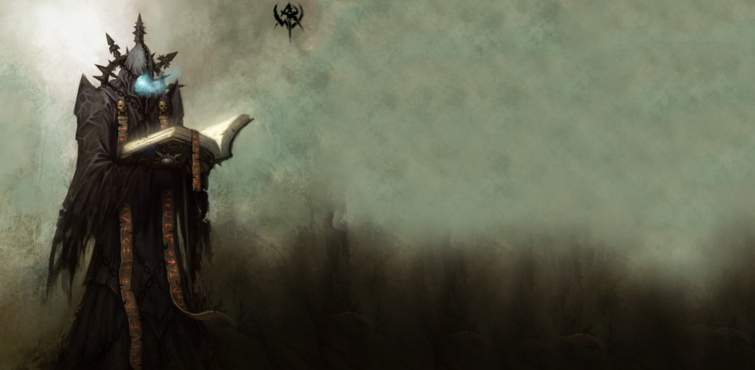

# Arklem Greeth
Grand archmage of [[arcane-brotherhood]] + Grand Extender of [[undying-soul]].

A 750 year old wizard turned lich, that just keeps Modify Memory / Glibness at super high level at people to make them feel like he's not that old / telling the truth.

Been harnessing the power of the Eternal Star (Irae), and growing increasingly careless over the years as his power has been unchecked.

Arklem Greeth would have wanted to appeal to their evil sides:
- What do you want out of this situation?
- What can you do for us? We can teach you any magic you like.

But now he has all the power he needs with the Egg and Liches in allegiance(?)
Arklem doesn't want to be found - anti-scry ritual.

## Development
- Made a deal with Mephisto to help summon demon lords
- Got his son Malexis to guard and help with demon summoning
- Took out [[orcus]]' ship, killed Orcus with a hit squad, got his Wand, crashed ship?
- Teleported to Irae's phylactery from the ship (and with heavy buffs, attuned to the wand)
- Stole the Egg of Galadaeros during Yeenoghu's assault on Luskan
- Was spotted by Celerom
- Had his phylactery destroyed in [[112-tesserect]] -> he is mortal

## Mephisto Deal
Alleviate pressure in blood war. Get runes for summoning (must not be traced back to them), tempt some drow with it (Irae helped with this / did this). Gave [[malexis]] a job as well (condition).

## Irithyll Setup
Knows that the sentience enjoyed by the undead is a cursed one. Inevitably they will go mad, and at a rate much faster than liches (as they don't feed on souls).
He was stonewalling [[celerom]] from making his case in [[irithyll]] for as long as possible through the vampire council.
Continued confusion (geas) on the vampire council there.
Wants plan to progress quickly now that demon lords are weakened and have started to fall plus Orcus lost.

He wants adventurers dead, and taken by koth or zug, so the shadowfell army can rise unimpeded and Irae can activate the powers of [[kiaransalee]] in [[velddrinnsshar]]

### Plans
Doesn't know they are there due to Nondetection, but has plans for eventualities.
Alarmed once party started combat.

### Ambush Summon Party
Koth' summoned high end adventurers; undead arch druids et al. See [[path-of-suffering]].
This will happen if they traverse out of there manually (which they have to unless they luck on Arcana due to the Ward).

## Stats
Lich-like. But god items and chronomancy. Drop normal lich abilities.
Can cast two spells each round.
Lair actions tether to low hp party member to split damage.
Deters paladin. If you can't tether, use the spirits.

- AC22 (27 shield)
- DC25
- DEX18(+4),INT20+5
- 3x Leg Res
- Dimension Door / Counterspell
- Mirror Image during Timestop or before entrance (3 free hits)

Cannot be restrained/paralyzed with Freedom of Movement.
Reaction; Absorb Elements (resistance to triggering type)

## Items
Something that give a sorcerer wizard capabilities. Cross reference with tasha.

- Arcane Grimoire +3 Spell DC
- (Black) Robe of the Archmagi +2 Spell DC/SAVE (AC==15+DEX)
- Wand of Orcus, https://5e.tools/items/wand-of-orcus-dmg.html (call undead) + AC+3

## Tactics
Extremely high initial damage, then bail out after he's done. If he didn't kill them with it, he'll prioritize his own safety, knows their power.
Dimension doors to his chambers (if he's outside), grabs what he can and ports to [[velddrinnsshar]].
If he's cornered, he dimension doors away first, leaving stuf, then to [[velddrinnsshar]].
In their best interest to corner him.
- Reaction Absorb Elements (Radiant/Bludgeoning)
- Potion of Invulnerability / Golem shield
- Dimension Door out of range with Bifurcate

### Spells
- Time Stop; DBF + Heal/SelfBuffs (Protection vs Radiant potion, Armor of Agathys8th (40tmphp), Freedom of Movement, Fire Shield)
- Overcharge -> Existential Paradox + Harm (20d10 + 14d6) + Unstable Singularity (pulls away) / Destructive Wave (push / prone+ thunder/necro)
- Bifurcate -> Bestow Curse (WIS) / Dominate Person / Hold Person + Earthquake / Sight of Kiaransalee (reskinned sunbeam, no blind, but 8d8 necro, fear if twice)
- Bifurcate -> Bigby's Interposing hand (melee defense: 24/29AC), Overcharge?
- Reactions: Counterspell or Shield (depending on party)
- Cantrip Ray of Frost 4d8 (+14 hit (2 from robes))

If fighting heavy spellcasters: Globe of Invulnerability
- Paralyzing touch if at DC25 if fighting alone, and move out of reach from fighter
- Shield Guardian if alone

if fighting alone; max damage sometimes.

### Victory Contingency
If he wins, have them locked up for [[koth]].
Mage hand works, Lockpicking too tight. DC30 Slight / DC30 Athletics. Need to cooperate. They have 1h?
Faey step brings the shackles, slowly pulls you in. He can pull things with feet?
Well, they get out, they are still have limited time to plan.

### Combos
- Globe of invuln vs counterspell
- Save counterspell against mages (dont bother for forcecage)
- Debate shield vs counterspell

Boosts: bump hp to 200 (max range). Potion of invulnerability.
Bind hitpoints to golem (shield guardian).

~~Ioun stone of absorption~~
Switch spells around. Meteor Swarm over PWK. Prismatic spray.
Prismatic Wall over PWK. Circle of Death 6th level.
Maximize cantrip damage.

dio style lines; "Oh you're approaching me? Instead of running away, you are coming right at me?" -> "Then come as close as you like X."

## Phylactery
Situated within the [[tesseract]].
If he's killed he'll spawn therein.

## History
Netherese wizard. Served Larloch the Shadow King. He was the one who helped Irae become a lich.

## Alliances
Lich in bed with Valindra Shadowmantle.
Husband of the former Valindra Shadowmantle. Went to Thay with several items, to reunite with Valindra. He has a deal with Irae. He'll get Neverwinter? They share phylactery?
https://neverwinter.fandom.com/wiki/Arklem_Greeth

(Have seen them steal gold from an entire city, summon arch devils in capitals,
Badass; https://www.google.com/search?q=arklem+greeth&sxsrf=ACYBGNQtCBImUsOr3mv1tDK3CvaTTD8seQ:1579020727744&source=lnms&tbm=isch&sa=X&ved=2ahUKEwiDvcfMxoPnAhULKMAKHTiTAxAQ_AUoAXoECAwQAw&biw=1920&bih=952#imgrc=5iOp6WH1IVgOZM:

## Tower Arcane
Holds the top area at the tower. Given control over Yeenoghu for Eternal Star.

> Let me tell you a story. Illusk was once the peal of the north, the major trading outpost that everyone saught towards when designing their ports. Now, we are a pack of pirate crews and "ships" that have to do our business under shady guises because of the regulations imposed on us via the new "trading capital of Amn". The ships of their mercanary company "the flaming fist" roam the seas, and their cannons massively outnumber the power output of our fleets. Even if we put some of our most powerful mages in charge on the ship.

We would like to restore the city to its former position as the prime trading outpost on the sword coast. So.. Now you know what I want. What can you do for us?

[//begin]: # "Autogenerated link references for markdown compatibility"
[arcane-brotherhood]: ../factions/arcane-brotherhood "Arcane Brotherhood"
[undying-soul]: ../factions/undying-soul "Undying Soul"
[orcus]: ../deities/orcus "Orcus"
[112-tesserect]: ../recaps/112-tesserect "112-tesserect"
[malexis]: malexis "Malexis"
[celerom]: celerom "Celerum"
[irithyll]: ../east/irithyll "Irithyll"
[kiaransalee]: ../deities/kiaransalee "Kiaransalee"
[velddrinnsshar]: ../east/velddrinnsshar "V'elddrinnsshar"
[path-of-suffering]: ../east/path-of-suffering "Path of Suffering"
[koth]: koth "Koth M'gog"
[tesseract]: ../planar/tesseract "Tesseract"
[//end]: # "Autogenerated link references"
