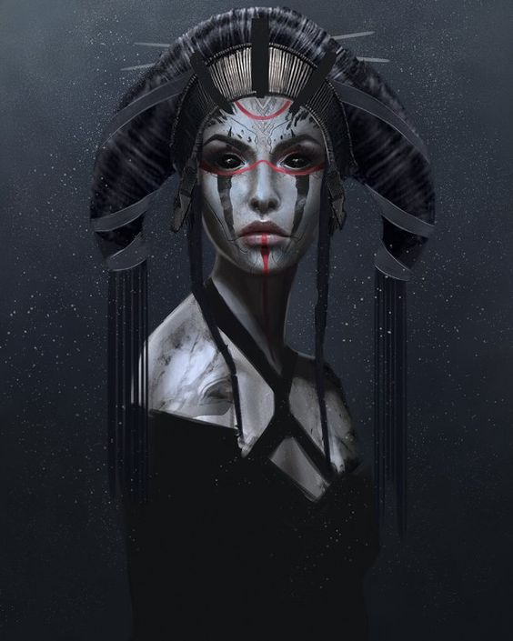

# Berctha

Seer in the [[feywild]]. Watches strands of fate from her spinning wheel.
CC 153. CR16.

## Encounters
- Lotus Golem; CC202
- Plus Ijiraq's (CC225) + Kappa CC234 on the way.
- Maybe also Razorleaf CC317.
- Undine from Moray island (CC362) (pretended to have dragon pets).

### Lines
"come back in a decade"

## Location
Seer at the top of a crystal topped mountain.
Gave 3 answers to GW. 2 to Hanir.

Equivalent in prime material: Skodking's Tomb. (They get sucked into a stone in the middle of a pool with open air view). Then they hear a rumbling voice "Ask!" And get to ask 3 questions.

[//begin]: # "Autogenerated link references for markdown compatibility"
[feywild]: ../planar/feywild "Feywild"
[//end]: # "Autogenerated link references"
