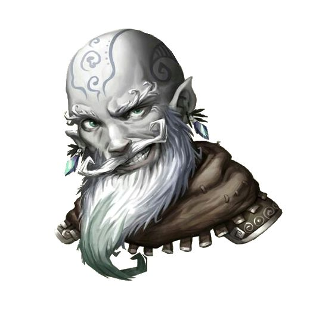

# Dorbo

area 14 - p106 in [[blindgenstone]].

## Quests
- Wants to learn about what they’ve seen. Agrees to provide them safe haven, but won’t have Senni give out maps / explain too much without a lot of help. Wants them to help explore uncharted reaches. Aggressive and serious, but also loving husband. Wants city rebuilt.
- Want to figure out why there are so many oozes. Direct them towards the “area”. Spellgem for ooze quest perhaps.
- Wants more space from were rats.

## Lines
- Who sent you? Do’urden? Mizzrym? Baenrae?
- Are you in any way associated with the Drow?

## Status
Sent them to investigate the Goldwhiskers. Didn't offer them anything except hospitality.

## Goldwhisker negotiation
- Dorbo: Chipgrin. You’ve got some nerve coming here after infected too many of our good people.
- Chip: We’ve got no choice the way you keep us all quarantined off like we’re animals.
- Dorbo: you are animals, look at you. You’ve got hair on your nose.
- Dorbo: ASK ADVENTURER, did he put you up to this?
- Dorbo: You think you can fit into our society like this? You are abominations.
- Chip: What do you want us to do, keep hiding away in these cursed caverns while we could help out?
- Dorbo: You couldn’t help if you tried. You’d just convert all our children. You’re better off gone.
- Chip: We can get in an out as we want. We’re not disturbing you any more than we have to.
- Dorbo: So why are you even here?
- Chip: I thought maybe we could broker a truce, but I can see I was mistaken.
- Dorbo: Maybe you should leave while you have the chance. Before we send our newfound forces at you.
- Dorbo: ASK ADVENTURERS, you’ve all promoted to Blingdenston Pest Control. What do you say.
- Chip: So this is how it is huh. I guess you can all rot with the oozes.
- Chip: TELL ADVENTURES: should’ve known you’re not to be trusted (AND AFTER DOING X WITH YOU)
- Chip: I know how to get to the pudding king.
- Dorbo: Adventurers, what do you proposes we do?

If they are clever they can get it back on track by talking about oozes.
Maybe they’ll backstab one party and get the intel, or maybe they can broker an uneasy truce.

Give them potions to attack if all goes well.
In neg room: 6gnomes + 1 galeb duhr

### Post-battle Rumors
Routes: Two routes, one unfortunately blown out by Kazook's experiments... He's working on a way to sort it.

Second known route is through a passage in Gracklstugh. The Duergar control this.
Occasionally surfacers in Mantol-Derith.
Gracklstugh may not be the most welcoming to outsiders. They maintain a truce with us out of necessity.
What can dorbo give them?

### Post-battle Grattitude
With your help we can summon enough elementals to wipe out the oozes.

Knows they don't want to kill the rats:

You know, I've had a change of heart towards these wererats. They fought bravely for us today, when they had little reason to. I had Tappy prepare a few kegs of ale and food as thanks for their contribution. Would you mind taking a couple of healers kits, and these two kegs of celebratory ale to them, as thanks for their hard work.

Ale is poisonous. Ask if a couple of you want to bring that.

If they do, then the next morning, you see numerous gnomes exiting from that area, smoke coming from the waren.

Dorbo will admit it if pressed afterwards.

## Senni Diggermattock
Quartermaster, supports husband. Oversees trade efforts to Mithral Hall (dwarven stronghold near spine of the world), Gauntlgrym (fine to mention), Mantol-Derith (darklake black market). She also helps maintain magical infrastructure (Stoneheart quarry + Yantha/Naomi). Knows all the security countermeasures. She probably knows the way out.

She assigns homes to people. Maybe she’ll give them a ghost place, and claim she doesn’t know.

She never got super important to the plot.

[//begin]: # "Autogenerated link references for markdown compatibility"
[blindgenstone]: ../underdark/blindgenstone "Blingdenstone"
[//end]: # "Autogenerated link references"
