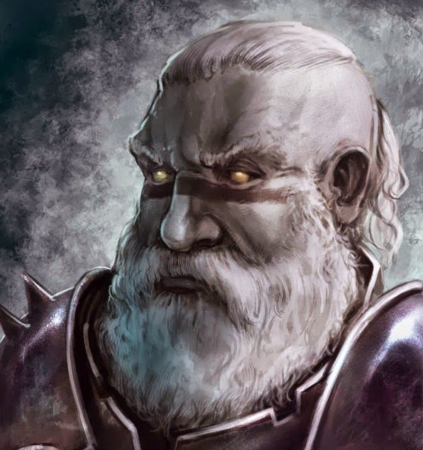

# Travok

[character sheet](https://www.dndbeyond.com/profile/sszynrae/characters/5502588)
Fighter from Stone Guards in Gracklstough.

Actually mind controlled by Gurnik. Serves to "deal justice" in the pit in [[blindgenstone]].
Has a wolf, Rudy. Will fight with him in 2v3 situation.

## Looks
No armor, barbarian. Eyes unnatural. Douche haircut. HIpster beard. Stripe.

### Mechanics
- Travok(5): w/rage: d4 + STR4 + 2(rage) for 3x attacks (bonus frenzy) => 28pr
- 15AC, 55hp. Also has resistance.. So effectively 110.
- Main stats: +7 to hit, adv on STR checks/saves
- Frenzy after stun - he'll de-frenzy.
- Exhaustion: (1) lose adv on STR, disadv. On other saves. (2) speed halved. (3) disadv attack...
- Rogue can't disengage because he has sentinel.
- Travok(4): w/rage: d4 + STR4 + 2(rage) for 2x attacks (bonus frenzy) 18pr
- -7 HP => effectively 96HP

### Lines
[How To Do A Scottish Accent In UNDER TWO MINUTES](https://www.youtube.com/watch?v=UUyY8QbMuOo)

- If yer come fer a feight, ye've com to the reit dvarrf.
- Eye was one of the meighty steun guarrds in Gracklstough. We ruuled that cety.
- if yer here, ya must be a treacherous gang.
- Yer aff yer hed.

- That's spraff.

- Tongue ma fart-box, ya fuckin' walloper.
- Yer lavvy-heided wankstain. (toilet headed)
- You jobby-flavoured fart lozenge. (turd flavoured suppository)
- Shut ye geggie (mouth).

- Either skeedaddle off, or get in the pit ya fucking muppet.
- I'd rather guide my father into my mother.

Good:
- Tidy (beautify)
- Aye right (disbelief)
- Yon's a right chancer (you're cheeky)
- Braw (brilliant – a sound)

[//begin]: # "Autogenerated link references for markdown compatibility"
[blindgenstone]: ../underdark/blindgenstone "Blingdenstone"
[//end]: # "Autogenerated link references"
