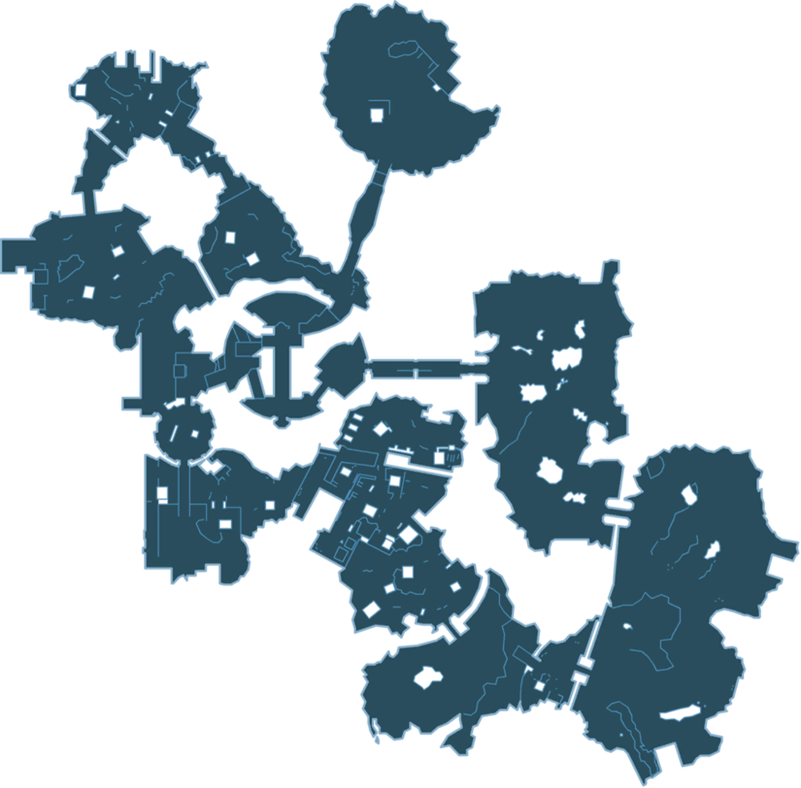

# Arentil Peak

Raid map one-shot based on Digistruct Peak from BL2.
For 3-5 adventurers at 15th level.

Music:
- https://www.youtube.com/watch?v=J-xqQX0rXpA (30min digistruct)
- https://www.youtube.com/watch?v=ptBdbcvJPV4 (30min boss bunker)
- https://www.youtube.com/watch?v=ET4a1I5lIEs (30min bandit slaughter)

## Combat Design
- Infantry
- Glass cannons
- Brute (low mobility high dmg)
- Artillery (behind infantry, hard to get to)
- Boss (multiple of these)

## Rules
- enemies deal more dmg
- enemies have less HP
- 1 minute turns
- no consumables that do not auto-refresh (lightning staff ok, potions not ok)
- exception: drops found within (keep a handwritten note, divide on find)
- drops must be used within attempt
- resets with unused items: you regain the ones you found before last checkpoint
- short rest auto between big doors
- long rest pods after roughly every other aree (Theatre, Station, Colosseum, Canyon)
- Narrative Initiative; everyone rolls 10d20 at the beginning (note their bonus)

## Intro
You arrive on a teleport circle in a serene, but small fortification, nestled atop, and around a gleaming white mountain.
You are at the top of it, there's path that seems to pass right through it.
Behing you, there's a glimmering wall of force through which you can see below a whole facility on the lower parts of the mountain. 100ft down you see empty battle areas.

White marble masonry of impeccable quality and

### Selune
Welcome to the Gauntlet! Please follow the smell of vomit and tears so we may talk face-to-face. As the vomit was mine, I recommend facing away from me.
- What do you need, an invitation? Come here!
- Using a mixture of Diamonds, follower magic, and Kavaki's salami-stained fingers- try not to read into that, I've put the together the combat trials you see before you. If you succeed, you'll be ready for a new Toril. A Toril of overpowered enemies, better loot and an abundance of nacho cheese! It's been an eventful year, anyway, off with you!
- With Kavaki and Annam being too consumed by their cushy celestial roles to decide who gets the next seats in Ysgard, I created this training gauntlet for the high level adventurers. You will help me test it's relative lethality, so that I may not inadvertently turn half of the Sword Coasts's fighting force into a gaggle of whimpering, triple amputees.

- In the interest of fairness: rules (above). Mention small reward at end.

- Should you die in this gauntlet, I will take it as implicit feedback that I should consider making this easier. I will ignore this of course, mass-murder can often be a form of quality control.

## Deprivation Depot
Short entrance hall.
- 2x Androsphinx guarding. AC17 HP100. Both 3xROAR until in combat. Then legendary teleport away.
- 2x Deva. AC17 HP70. Fast fliers. Double dmg, half HP. Glass cannons.

Initial encounter is disadvantageous. If they can punch through then it's easier to fight outside.

> Devas. The linchpin of any good celestial battle. I remember these a former colleage being brutally murdered by one of these after his foray into necromancy. I replay the memories in my mind whilst eating popcorn and staring absently into the distance.

> Remember that sphinxes are notorious attention seekers. If you don't listen to them, they grow very angry.

Drops:
- Potion of Flying
- Potion of Frost Giant Strength
- Potion of Supreme Healing

## Theatre of Martyrdom
3x Oaken Bolters around edges.

> An Oaken Bolter is made with a mixture of Gnomish cunning and brazen plagiarism.

6 **Yetis** (Infantry, half hp)
2 **Abominable Yetis** (Brutes, double dmg, only 100 hp)

> Should your moral compass begin to twitch, remember that Yetis are generally regarded as monstrosities and not people.

**Ally**: Gold-Forged Sentinel (Servant of Kavaki); watches for worthy patrons of Kavaki
> This gold plated construct was a donation by a certain lesser deity. Desperate to retain his relevance, he donated this moderately respetable ram. Why is it here? Well, I didn't want it in my living room.
Could either fight for them or bless them. D6 for blessing (Haste one / Heroism all / +2 AC all / Res DMG)

Uphill;
- 1 **Ironscale Hydra** (Boss: Brute/Glass Cannon double dmg, half HP, 11th level firebolt (3x))
- 12 **Centaurs** charging (Infantry / Glass Cannons; half hp double dmg, dangerous charge)
(6 of them jump over the fence behind them in a pincer)

> Ah the hydra. So last season. What would we get if we cross-bread them with dragons? A veritable mini-Tiamat; thicker scales and a variety of breaths. I suppose, this demands a certain amount of era-appropriate cultists as well. Here.

Drops:
- Potion of Heroism
- Potion of Resistance (Fire)

## Butcher's Base
Long rest save point before jumping down.

500 Kobolds flood in after a line. Swarm. 1000HP swarm.
20 attacks +4 to hit. 1d4+2 dmg dagger.
20 attacks +4 to hit 1d4+2 sling.

> Kobolds are proud descendants of dragons, despite their diminutive nature. They are also instinctive pack animals, and the easiest group to persuade to be part of this test in these numbers. Enjoy.
> Say what you will about the Kobolds, their recklessness helped them survive! In the same way that you

Put a Gargantuan Rug of Smothering on top of 20ft hill. "Please wipe your feet."
If they don't, it attacks the first who doesn't wipe.
Otherwise, it stays dormant and slides away at the end of combat to reveal a drop:
- Potion of Invulnerability

## Headshot Headquarters
- **Huge Stone Golem** (Boss; Brutes, slowed movement, double dmg, 150HP, slam can stun DC17 WIS)

> Behold, my Huge Stone Golem! Perhaps not the most imaginatively named of our constructs! But as is so often the case in life, my advice is to aim big and for the stones.

- 2x **Chimeras**; Fire breath on recharge. Double DMG/Half HP. Otherwise Drive-by claws. Artillery.

- 3x **Unicorns**. Modified (healing ranged, but only stays in the back lower area)

> Fun fact: Unicorns are the most common celestial steed. How much this fact is worth is debatable, because most celestial creatures are technically are their own steed.
> Fun fact: Unicorns healing magic originates from their horn.

Drop:
- Potion of Speed
- Scroll; Tasha's Otherworldly Guise

## Decimation Station
- 2x **Archmage**; (Boss: Artillery/Glass Cannons)
Spell DC17. 9: Meteor Swarm, Blade of Disaster. 8: Abi-Dalzim. 7: FingerDeath, Rev Gravity(c).

- 4 **Winged Lions**. Infantry. Double DMG / Half HP.
- 2x **Minotaur Living Crystal Statue** Brute (half movement, 100HP, double dmg), guards mages. Sentinel.

> These mages have a degree in ass-kicking. This is not a joke. Ysgard U is not well respected in the world of academia.
> When we are all inevitably hunted down in a maze like filthy animals, it will be these creatures who pick the corpses clean.

Drops:
- Mental Prison
- Potion of Supreme Healing

## Collosseum of Laceration
1 **Archmage** (Glass/Infantry: 9 Prismatic Wall, 8c Incendiary Cloud)
1 Barbarian **Iron Golem** (Brute/Glass: 150 HP, double DMG - Use Rage Mechanic + Brutal Crit + 1HP revive)
1 Ceric  **Deathpact Angel** (Brute/Artillery: Holy Aura - blind attacked when CON save failures, EarthQuake (if not attacked))

## End Part 1
Save point || Continue to Arena.
Maybe bail here if it's boring, or it's getting late. Leave the second half for another time.

LOOT. 1 Wish stone for the Ring of Wishes.

## Arena of Anguish
Kite-fest if they continue.

- 2x **Planetars** drop down (insect plague if overly kited)
- 8x **Couatl** constrict attacking infantry

> Now here's something new! These Planetars were twins of one of Annam's mistresses. They celestials behemoths embody my two biggest fears that don't involve kissing.
> Trying to run away from a good spanking has never been good form.

## Cannibal Canyon
Mirage Arcane (illusion) in this area. Difficult terrain.

- 5x **Spring Eladrin** Longbow artillery. Otto's Dance. Tasha's Laugthers. Fey Step.
- 1x **Archdruid** Boss/Brute (sunbeam + animal shape **Brontosaurus**, then Feeblemind / Hold Person)
- 1x **Korred** Half HP/Double DMG glass cannon. Sunbeam.

## Tower of Torment
Child of Annam (Reskinned **Empyrean**)
