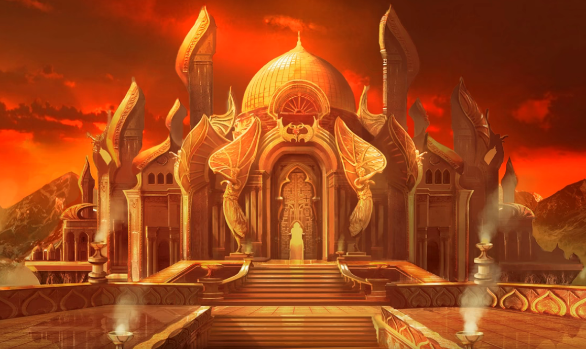
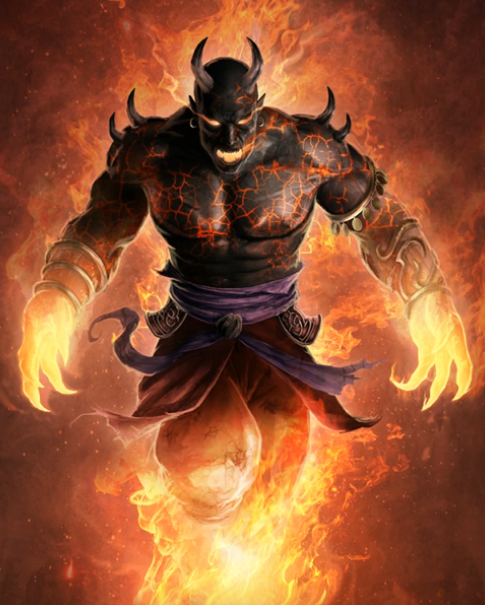
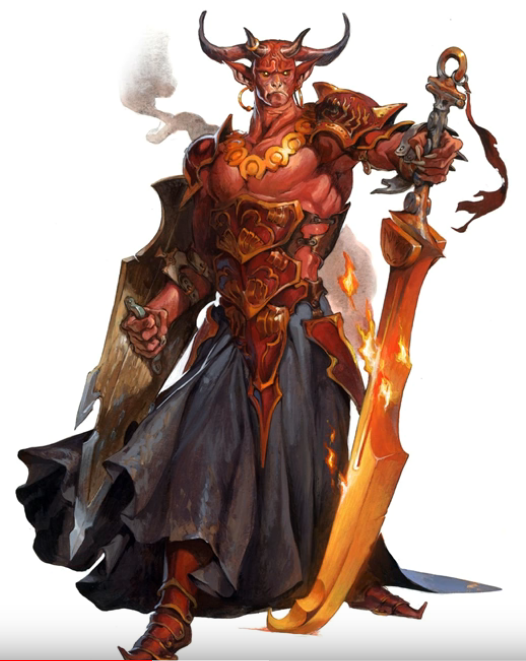
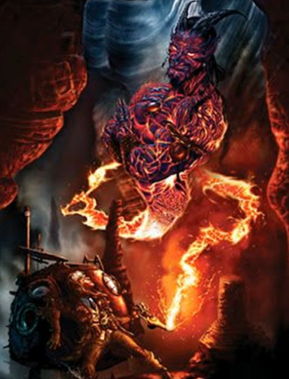
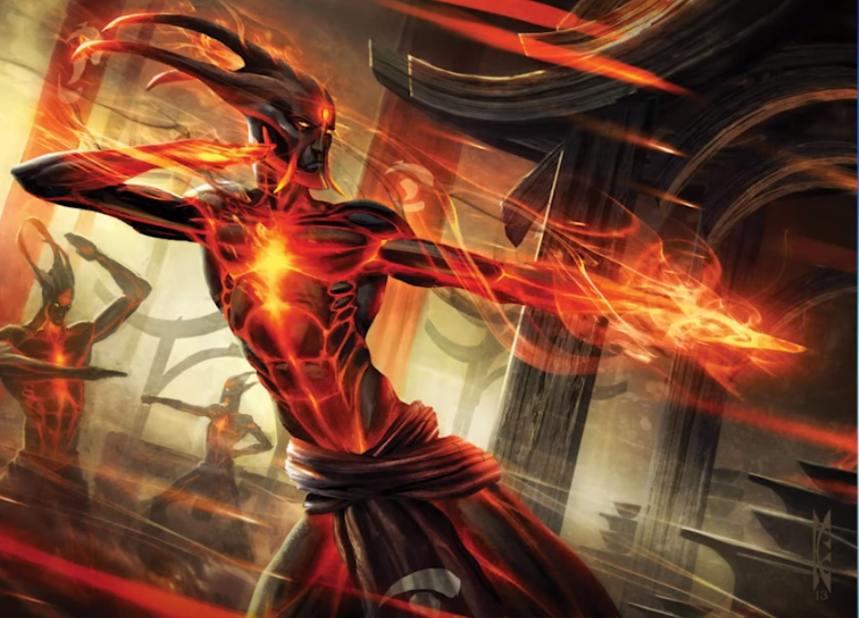

# City of Brass
Cradled in a brass hemisphere 40miles across forming a protective shell.
Spectacular place. Lava Brass buildingsrivers.
Huge towers, skyscrapers of artistic brass or rock, big arches and bulbous domes characteristic of ancient arabian architecture, clustertered in one area of the city.
Everything is bright, and covered in a these clouds of steam that rise up out of these reverse fountains. Water is pouring out of these lamp like brass constructions (100ft long), and as the water hits this part of the ground it evaporates.

Floor; brass, but unpaved areas of cracked obsidian, with magma clearly roaming beneath.

Millions living here.
efreet but also salamanders, archons, genasi, fire giants, elementals. 2/3rd slaves.

Curfew every night, the illuminated come out with gongs and bells to signal.
(First offence is arrest and fine, second loss of hand, third is death)

City floats frequently. Not at the moment, so navy is there.
When city hovers, there is oil in the canals (which are occasionally lit).

## Teleportation circle
Outside the huge brass gate leading to the city.

## Laws
1. efreet laws
2. laws for everybody else (posted everywhere)

infractions => slavery with length ~ severity of crime

## Gates
Shimmering Gate + Diamond Gate + Gate of Ashes
Golden Gate + Prism Gate + Gate of the Simoom
Gate of Eternal Sun + Magma Gate

## Names
Mozaffareddin / Mozaffar
Marrake
Jahaan
Amaimon King of the Azer
Imix Prince of Fire
## Titles
The Smoldering
Firey Heart
Most Puissant of the X
The Temperate and Eternal

## Onyx Octagon: Arena
Twin sisters fight in one night (weekly practice, good betting setup)
Odds: 5/1 on Morromoth, 1/5 on Zisters
Zor'oxoz + Zoglazath
- Marilith (7 attacks with multiarms + tail grapple) parry reaction +5 ac, teleport
- Marilith (ditto, but can summon Nalfeshnee)
In fight they are taking on a Goristro Morromoth (charge attack against one of them)

Champion in 2 nights vs Solar Heinlen (teleports out to forfeit)

They need to beat the champion for the Artifact.
Fights USUALLY to the death, but teleport forfeits/disqualifies. Mention as they enter.

Champion: [[rak-tulkhesh]]

Rak Tulkhesh (Previous guard of Asmodeus himself, fought in blood war, devil)
4x attacks, 28 force dmg (spawned star hits)
Dispel Legendary (2), Provoke Rage (3)

### After Rak
Ticketing office, several tickets on the ground. Several elite guards around during payout, big money. Line outside the checkout line, but not very big this time, not many had bet on you.

As you step forward in the line, the efreet 4m in front of you completes and one elite guard waves you forward (there are several).
RP
Financiers, spend extra time going over certificate to double check.
- You put 50k against Rak Tulkhesh? You are either the luckiest motherfuckers in the plane.
(Dont want to be fired over this, nonon, the gold is there, I even messaged the Obsidian).

The efreeti, who was interviewing you earlier comes over. Shouting insults!
 - frogs, fucking frogs? there are outright lies, i demand that these creatures be jailed!
eventually, several elite guard  in; so let me get this straight, you are meant to run extensive background checks on the contestants, and you use their own input as a significant determiner in their odds?

## Finance district Marlgate

### Grand Obsidian Bank/Exchange
[[banks]]
Can set up an account.
Can withdraw from branches in BG/Avernus/Brass for free.
Can withdraw from anywhere with 2000gp yearly subscription
Can deposit from anywhere with a 500gp yearly subscription (bought)
(Via a ring that works 3x times per day on an area the size of at most 3x3ft each, 9k gold per deposit max without a bag of holding)

### Investment
`EFR100` index or invest in particular businesses:
`Exchange Fire Returns 100`

- `Obsidian Irradiance` (retails expensive weaponry)
- `Shahzadeh's Fantasma` (retails expensive magic items)
- `Qajar Quorum` (conglomerate that runs the market)
- `Mozzafar Water` (bad water investment)
https://www.fantasynamegenerators.com/magic-shop-names.php

## Charcoal Palace

Sultan rules there.
Government. Nobles. Djinni?
Titles everywhere.

## Long Castle
A temenigru like spire owned by [[dhaikhezzish]].
Where the scrying occurs.

### Arklem scry
Scried to find Arklem in Irithyll [[100-backstage-octagon]]

### Irae Scry
Finds Irae in Shar. Shar entrace reveal
Green river image. Green flame light.
Seed necrotic tempest.
Pass through a city beyond the gates. Black marble temple.
Multiple clerical creatures. Black tattered robes, robes glowing green.
Small, powerful looking creatures, dwarvish. Ethereal.
Hard to make out faces, but blue light from their eyes.
Follow through to the Acropolis.
Seed Guards and Wards spell. Fog/strange shifting passageways.
?Doors locking as you pass through?
End up in green flame chamber with crystal and Banshee Summoning.
Show Irae with an extra egg + her full scythe.
Arc lightnings the very outlines of a large ethereal figure.
One path behind leading to her portal to maerimydra.

## Heist Palace

Lock: Huge metal beam through center. Hand-print on the beam.
Open: Has to be melted with your hand to open. Then reshaded from other side.

## Trade
Gold and precious metals not a worth that much to them. Gaudy.
Wealth of renown, artifacts.

## Gambling
Higher stakes the better.
The cruel the outcomes to a member the better.
They won't let you get away with winning a bet at all.
But they will try to weasel out of any lost bet themselves (looses honor).

## Efreeti
Outside consequences of gods. Bind with elemental forces. Fire + Will.
Avarice, greed, cruelty. Often mistaken for devils. LE.
Burning. Huge 1 TON. Adamantine pantaloons.
Turn into a puff of smoke if killed.
Soul bound conduit of an elemental force.
Ostentatious titles to go with their ego.

Hulking pieces of basaltic rock / metal. Blood is solidified fire. Magma churning through vein. Sustained by heat.

AC17 200HP. Fly 60ft. Body becomes a plume of fire and embers.
High all around stats! Live until they are destroyed by combat.

Want to dominate you. Want things from you. Want debts that you will have to repay. Slight them => they will hunt you down.

## Combat
Pyrotechnics.
Creative fire walls.
Melt metal, blowtorch from fingers, heat rays from eyes.
Teleportation.

## Honor Kimzar
Honor is alien to you. (NO it's just a flex.)
When one of our kind decides to grant one of you a wish, it is our way of amassing honor for our race.

When we grant a human a wish it shows that you desire most, is what we can most freely discard. => Our race have gained honor.
What else would an efreeti need?

Wishing is not a service. Want to have their renown elevated.
Acquiring and trading helps that status.

=> Loosing honor is terrible.
=> Hugely vengeful.

Also they won't see any of this as them being evil.
Will shrug off persuasion attempts.
Unless they succeed, and they will lash out (someone is spreading malicious rumors about them).

## Slavery
Bracelets to show servitute.

Guard: Badass efreeti with hit distributed in such a way that areas on his muscular arm has cooled, creating this solidified basalt rock, in patterns on his arm.

## Crafting
Fire weapons
Artifacts == trinkets to them
Close to quasi-planes of smoke/magma/radiance.
=> Radiant dmg can be crafted there.

Turban + gaseous beard.

## Blacksmiths in Keffinspires
Are all Azers living in golden hills of Keffinspires. Don't really venture outside the golden gates.

## Pleasure Gardens in Rookery
Also a very lawless area.

## Military
100k soldiers of eternal crimson (efreeti general, not well equipped nor well trained)
25k archers/lancers the sorrowful
35k Angel of Death (elite efreeti archers), composite bows, riding nightmares
10k firenewt light cavalry
smaller battalions:
- Black Darts, 2k manscorpion slaves with javelins (kind of dridery)
- Bronze Phalanx 1,2k Azer Engineers
- Order of the Fiery Heart, 500 Max Level Efreeti (Griffin mounted shock troops)
- The Unquenchables (palace guards) 3000
- The Branded, 150 efreet mamluks (slaves) eunuchs (guarding the hareem of 150 wives)
- The Illuminated; 50k guards/constables, patrol the city (police).
- The Watchfire Legions, 40k secret police

fiery heart: beef up by 50%, +2 weaponry (huge ass firey scimitars), +2 armors, 20AC, 300HP
Elite archers:  ranged attack +13 hit, 3d6+8 piercing + 2d6 fire, otherwise same stats

## Navy + Sultan's Fleet
18k sailors who can man the sultan's fleet.
Fleet == 130 Brass ships that can sail through magma, 13 of them enchanted to fly

## Gods
The Sultan. Mostly illegal to worship other gods. However;
- Kossuth (Lord of Flames), primordial. Worship discouraged, not criminalized.
- Imix; (Lord of Hellfire, The Eternal Flame)
- Surtr (Fire giant God). Allowed for fire giants. Muspelheim

Shrine to Kossuth was built at the creation of the city, no sultan has dared to anger him.

## Items
- Mantle of Spell Resistance (adv saves on spells, attuned)
- Staff of Healing (charge based healing)
- Winged Boots
- +3 Short Sword of Life Stealing

### Mauls
- Oathkeeper +4 Radiant Maul. Crits against Evil aligned creatures must make a DC18 CON save or take 50 points of fire damage.
- Remorseless +4 Flaming Maul. 50% chance to haste self on crit.

### Swords
Dawnbringer +3. Sheds 30ft bright light. +1d8 dmg. Fiends or Undead must save on crits vs DC20 WIS or take 100 psychic damage. Sunburst as an action (one round).

### Books
Book of Exalted Deeds (buffs spell levels, good alignment only, wis boost, halo, adv vs intimidation vs evil, persuasion vs good, advt to hit vs fiends/undead within halo. 40,000 GP?

## Armor
- Elven Chain (14BaseAC) - no attunement
- Bracers of Defense +2 AC (attunement)

## Fist Weapon
+4 Fist of Az'Turrasq (from a tarrasque),cannot use stunning strike, Damage converted to lightning damage.

### Rods/Crystals
- Rod: The Undertaker: +3 spell attack / save dc to any of your spells (any class). 30k

- Ramiel: +2 spell attack / save dc to any of your spells (any class), AC buff of 1. Twice per day, lift a spells level by two. 35k

- Staff of Power 50k

## Plan to sell
Mordai:
- Staff of Power -50k
- Rod of pact keeper (+2) +16k
- Ilvara's Rod  +10k
- Cloak of protection +3.5k
= 36.5k

janslow: Faey: Winged Boots (8k), Stormbow Upgrade (15k), Wraps Upgrade (8k), Sell Daibo (-13k), Cloak of Protection (-3.5k) = 14.5k
Goatweaver: SELL Radiant Justifier -16k, Fate's Vow -8k, Wand of Fireballs -16k, Pearl of Power -6k, Dragon Lance -20k, Golden Scourge -16k, BUY book (80k) => -2k
janslow: Additional Selling: Aegis Fang (-10k), Cleaver (-8k), Flail (-2k), Scythe (-2k) = -22k
janslow: Totals: Faey (14.5k), Mordai (36.5k), GW (-2k), spares (-22k), cash (-48.5k) = -21k
clux: Need: Make Oathkeeper, tweak Stormbow (LG, +3), Tweak Book to remove attunement (he uses it)

## Future items
Boots of the Lightning Path
Wondrous item, very rare (requires attunement) 8000gp

While you wear these soft, calf-high boots, your walking speed increases by 10 feet. The boots have 9 charges, and regain all expended charges at dawn. When you use the Dash action and expend a charge, your steps crackle with lightning, and you deal an additional 1d6 lightning damage with your next successful weapon attack within the next minute. You can have up to 3d6 extra damage from these boots at a time.

## EBA: Heist
Powerful items in shady areas. only for sale if they can get something better. rob the charcoal palace.
choices: rob artifact / replace artifact / take both / kill guards / kill vendor gang
(i made it too easy for them to get everything..)

[//begin]: # "Autogenerated link references for markdown compatibility"
[rak-tulkhesh]: ../npcs/rak-tulkhesh "Rak Tulkhesh"
[banks]: ../questideas/banks "banks"
[dhaikhezzish]: ../npcs/dhaikhezzish "Dhaikhezzish"
[100-backstage-octagon]: ../recaps/100-backstage-octagon "100-backstage-octagon"
[//end]: # "Autogenerated link references"
