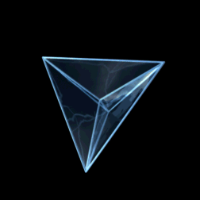

# Penthacoron
A dimensionally-stable folded pyramid (looks like a 5-cell / hypertetrahedron projection) mechanism that unfolds into a demi-plane.

A desert-style goblim realm of money loot goblins.
Goblin queen.

## Developments
Pentachoron identified as a planar teleporter.
Goblin came out of it earlier trying to move it. But he escaped into it.
We think it contains a rather large plane, demi-plane, pocket-plane hard to tell.

## Underlying Mechanic
Tetrahedral interconnection. Each face is a tetrahedron that has a path to every other. 10 triangular walls – everyone maps to another. Solve every room and unlock the center room.

gnome master who has a crossbow machinegun

(a weapon to move monk to less stun and more single target damage)

## Rejected
### New party members
where Queen Neri / new player has been imprisoned within (9th level hedged prison - imprisonment) - labyrinth.

### Irae's prison
An instrument where a creature trapped by Irae resides?
Someone who inadvertedly helped her re-animate the banshee.

### Sunwuko relics?
Put Monkey King relics in here? Monks and goblins both like golden shit, right?
