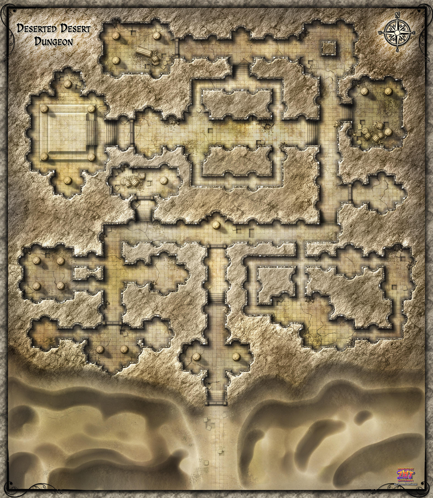

# Tesseract
Was a dimensionally-stable cubic prism (looks like an 8-cell / tetracube projection) mechanism that unfolds into a demi-plane.

Contained an ashen wasteland with a pyramid as its center piece, containing [[arklem]]'s phylactery.
It was destroyed in [[112-tesserect]] after the contingency was triggered without recourse.

## Burning Man Wastelands
Ringed city like wastelands with Gael.
Portal outside the city. They have to walk through the wastelands.
Lights everywhere, spirits everywhere, mostly ignoring them.

Every time someone enters a Nightwalker summons and draws towards them at a rate of 15ft until within sight range, then it finger of dooms them (300ft range).
https://5e.tools/bestiary/nightwalker-mtf.html
music:
- https://www.youtube.com/watch?v=017yCQMfbzE cryo chamber: cthulu
- https://www.youtube.com/watch?v=ZZLV1fpMHNQ cryo chamber: songs for the swamp

## Prismatic Pyramid
Actually looks like a fucking vegas pyramid. Lit like a it's a just a searingly white glow block, but upon closer inspection, the light is pulsing, and shifting, as it's lit by multicolored light in all levels of the rainbow. You catch on between cycles that the outermost light provides a blue glow.

Step up to it. See something sticking up under the sand. Leather welcome mat.
Sinners on door inside.
Put Sin color rooms anywhere.

Lore room:
- capital vices book, ragey demons; https://en.wikipedia.org/wiki/Seven_deadly_sins
- color wheel association of sins to colors if they start to figure it out:
- something to rotate the prismatic wheel if they fail

### Sins
- Red = Wrath - Fire DMG (Being so angry you turn a firey red and lash out) - COLD - anger can only be cured by taking a chill pill
- Orange = Gluttony - Acid DMG (eating beyond necessity; even if corrodes insides) - STRONG WIND - let it corrode, either it ruptures the glutton as the excess continues, or it alienates everyone they know
- Yellow = Greed - Lightning DMG (taking so much for youself that it's shocking to everyone) - FORCE - plutocracies cling to their power, must be overthrown by force
- Green = Envy - Poison DMG (resentful longing that poisons your mind) - PASSWALL - giving is the first step
- Blue = Sloth - Cold DMG (not preparing for winter in the good times) - FIRE - colder times are always ahead, prepare food, prepare lumber for warmth, and work
- Indigo = Lust - Petrify (wanting something so hard it leaves you unable to act) - DAYLIGHT - when all you have is one option, paralysis is natural, but when you desire nothing, or you have two options, you'll find your mind has been shown the light
- Violet = Pride - Blind (reverse envy, by smuggly sharing your accomplishments, you can become blind to what others think of you) - DISPEL

Spell is a netherese variant Prismatic Wall, with built in Contingency.
Originally bestowed by Shar / Raven Queen. Heavy magic.
More detail can be found in the lore book, if they take an hour to study.

### Phylactery
Protected by a ~~5th Element style puzzle~~ permanent Prismatic Sphere around the vase in the center.
Modified Prismatic Sphere;
- items/magic cannot pass through more than one layer
- can cycle the layers by casting SOMETHING???

Within, vase with green glowing essence within. Smash it / holy water it.
He would normally appear at that point, but can't.

If someone smashes:
- it triggers the destruction of the pocket plane, gorgons rise, nightwalker awaits
- they have to get out (skill challenge)
- ~~while Arklem is around; he will insta Power Word Kill before trying to get out~~ he cant get in now

On penultimate layer: Sense extra magic in last layer. Arcana 20 (contingency)
#### Contingency
On last layer removal: Contingency triggers. Activates a trap on the vase, plus summons enemies.
Contingency also triggers if someone pokes through the last layer.

##### Summoning
- 2x Mariliths
- Tsunami; portal to plane of water

Demi plane will detonate unless it's dispelled.
If the pyramid starts to loose structural integrity as a result of the plane of water tsunami, then whatever is in the center of the pedestal gets teleported to irithyll oubliette as a last ditch failsafe. This never happened because they already took it.

##### Trap
Power Word Pain to the person touching it (Enchantment) - DC25 CON (every turn)
> While the target is affected by crippling pain, any speed it has can be no higher than 10 feet. The target also has disadvantage on attack rolls, ability checks, and saving throws, other than Constitution saving throws. Finally, if the target tries to cast a spell, it must first succeed on a Constitution saving throw, or the casting fails and the spell is wasted.
10d8 necrotic damage.

### 1. Red room - Wrath
Room filled with fire. 2d6 fire damage every round.
White Irae standing there, dodges all ranged attacks / spells
They can:
- freeze themselves
- freeze the room
- forgive her / cold hug

### 2. Orange room - Gluttony
Right next to it. Acid.
Rancid meats everywhere.
You have to eat a lot, succeed on con save (GW auto), and fart to win.
Skeletal corpse here (goliath); carved on the wall; FOOD NOT GREAT.
CON save fail => poisoned

### 3. Yellow Room - Greed
Bottom next to it. Lightning.
Beaten by Force.

1 diamond in a room connecting with chain lightning, but hovering over a chasm in the ground.
Clearly a source of power for the crackling electricity in this room.
Sitting on a pedestal in the room. They have to crush it with force.
- One energy sword (mordenkainen sword) hovering in the air around it

If they take it out of the chamber, diamond shatters; 10d8 force damage. (Loss)
- Eldritch blast / Banishing Smite / Magic Missle / Bigby's Hand works
- Cutting the diamond on the sword works

### 4. Green room; NPC: Gorgon Greaser (right top) Envy
Netherese Construct Artificer: Armorer. 8ft tall mithril golem. Verdelite gauntlets.
Green gas exhaust extrudes from a slit in its face. Two perfectly horizontal slits in his face glow with a faint green light.
Does not speak, but can write. (Doty).
If attacked, he will grappling hook (instead of move), lightning punch the instigator into the ground.
If grappling hook, can reaction extra attack it.
Two attacks per turn normally.
2d8 poison damage per hit. Bonus action regain 15 temp hp.
Fixing mechanical Gorgons in right room. Mini workshop.

He can undo Green layer with Passwall spell.
He is amenable to persuasion via Envy. He wants something green.
He has a book? Castles & Cultists

### 5. (Light) Blue Room Sloth
Room filled with a blanket of snow. Beds on the ground.
They can sleep here, but will wake up having taken 2d6 cold damage (ice falls on them afresh), no long rest.
If they burn the room, the beds will burn, and water will incessantly drip irregularly from the ceiling. No long rest here.
But the challenge is technically done.

### 6. Indigo (blueish purple) Lust
Restraint. Movement speed halved. Dark. Beaten by daylight / Healing wave from Ioun Stone.
Humanoid with a monkey face.
Standing at a 45deg angle with feet wrapped around an almost straight stick, wrapped in between tiles in the ground.
Arms together, in a look of complete tranquility, eyes closed. Aura of light blue energy around him. High level monk.
As he's standing there almost motionless, slightly calibrating his feet back and forwards, you notice he's wearing tunic made out of autumn leaves woven together almost like a wreath, and as you focus on it, you see a rune on it, one that you would just think of as gibberish, or scratchings, if it hadn't been for that you have one exactly like it on your `Ioun Stone`.

Trying to take it, will engage a 1v1 battle. He cannot be stunned, but Faey will deal damage. He needs to do repeated wisdom saves. If he ever fails, he has lost.
Narrate like he's fightning jet-li, make it clear he's achieded transcendence, and there's this inner light in the way he's fighting.
With each attack 3rd, he'll stunning strike back.

Successfully copying him will summon the inner light. Flooding the cave with light. Maybe he can also light up.
Successfully stunning him (CON+10), will dampen his light.
If he gets petrified from it, then light floods the cavern, and the trial is over; he lost (but they can maybe infer the light association).

### 7. Violet Pride
Blind when going inside. But can find loot here:
- potion of invulnerability (can be used to insanity pass the sphere // combat) lasts 1hr.
- dispel magic scroll

blindness; pride puzzle. he needs to realize that he's becoming blind to people's perception of him. PERC disadvantage.
if no time, just limit to Mordai... If he kills her, he gets the potion. If he walks to far around, he notices the illusion.

ALL START WITH DARKNESS. They are actually blind. They cannot touch anything. Taking the thing they want, makes them feel good. But "don't know what effect this has".

Mordai: Small room full of books, you feel older. In your hand you hold a fading scroll with chronomancy runes. Most natural thing in the world, you know how to do this. Vision is kind of hazy. In the room; history of Waterdeep, childrens tales, you've not seen these in decades. There's a small crash of a glass from another room, as the familiar smell of fresh apple cider streams from the room. Woman; standing over a small purple skinned child. If you want the teachers to treat you well, you cannot go around breaking things. You instinctively find yourself uttering the words "Sorry mum". The kid leaves. She turns around. Sees you. Smiles and sighs. "I guess I always knew you had something like this in you.". "I knew you'd turn out to be important in this world."

They can talk for a while. Improv.
Looks at you from the side in the chair she sits in.
So tell, me, what's the most significant information you've come across this year?
(you can tell me, you know i'm not real)
(if he doesn't indulge, well, let me see, you found the roots of an ancient civilization in the shadowfell, and lived to tell the tale, that could not have been easy)

If he fails, all(nails spell, hugs her, shares a story) he is blinded. Maybe Persuasion rolls to do it? Good = bad for him. "You remember; Your vision into this place cannot last forever"
Point: he has to see that her shielding and pride for him, made her blind to what society thought of him. And she paid the price for that. notes on the table, attempted cover up, of how the school nearby required 5 extra GP for tuition race fee. side of her face is bruised, like from an impact.
If he figures out how her PRIDE hurt her, and continues to hurt him, he'll break the spell. Otherwise he'll go blind. Hopefully that's enough..

Breaking the spell; she'll cry. Knowing the world is horrible, can be a strength. Don't blind yourself to the feelings of others.

## Ideas
Mummies roam the tomb. Mummy lord and Iron Golems in final room.
If inner doors is breached, one of many permanent alarms are triggered.
Then they get to fight both Arklem and a mummy lord.
~~Revamped tomb of horrors? That one young youtuber had a revamp idea of it.~~ Hard.. Not enough time.

### Traps
Traps: cold + electricity + polymorph (immune for lich)
Mirage Arcane?
Other: gas filled room with a zombie who lights a match
Black Fire: wall of greenish/black fire; 4d6 COLD dmg to cross

Permanent spells are the least of its defences. Protection from good, Detect Magic and detect Invisibility, unseen Servant, to name a few. Inner sanctum surrounded by a permanent Prismatic sphere spell. Possibly forbiddance.

Inside the pyramid behind several locked doors.
Arcane locks that require through manipulation (Arcana 20) / Knock.

Telegraph some traps:

- Skeletal archer statues. All firing at same time when crossing something..

one of:
- 3 gorgons Gorgon CR5 MM171
- 2x Eidolon MTF194 CR12 temple protectors
should have put statues to re-use when using Eidolons :(

### Top Right Pillar
Swarm of Gorgon CR5 MM171 (5x bulls) charges towards them from both ends if touched

### Pride GW/Faey
GW: Extreme Kavaki Temple. In front, status of GW. Wings out. Spectral dwarves. Chanting Kavaki + GWs name. Did he imagine
Faey: Titania sneaks up on. Darkness. Then suddenly a of purple light.  Faey to become a permanent member of the Seelie Court.
MAYBE stepping in coins, about 500 on the floor. 4 big chests, one pillar in the center
maybe pillar disappears if taking gold?

[//begin]: # "Autogenerated link references for markdown compatibility"
[arklem]: ../npcs/arklem "Arklem Greeth"
[112-tesserect]: ../recaps/112-tesserect "112-tesserect"
[//end]: # "Autogenerated link references"
