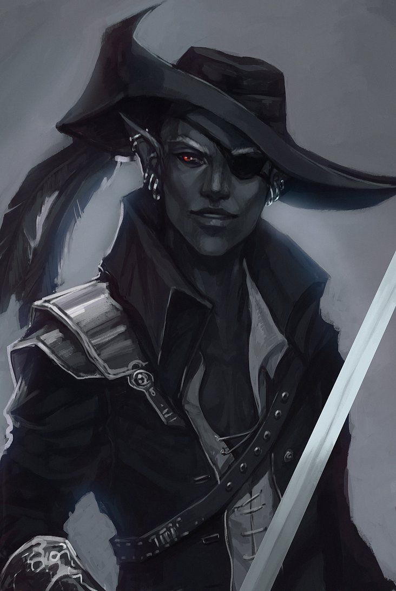

Tue 2018-06-26
Left Sunken Citadel. Saw a fungal creature chasing them around, huge, demonic.

Swallowed up the entire town.

They grabbed a wagon and hitched a ride home.
Gael gave you many potions as reward for the red fruit (though you treated it with great suspion).
Met `Sszynrae` (drow with a pirate hat [[jarlaxle]]) gave them a ring to meet Vizeran deVir in Araj. (captain of the guards sent him).

They traveled up for days, met some squirrels along the way, camped out in abandoned houses near the Evermoor. At that point, your conciousness started to fade, and found yourselves awake in Velkynvelve; captured by drow.

Players:
- Verity
- Paul
- Spike
- Guy

[//begin]: # "Autogenerated link references for markdown compatibility"
[jarlaxle]: ../npcs/jarlaxle "Jarlaxle"
[//end]: # "Autogenerated link references"
