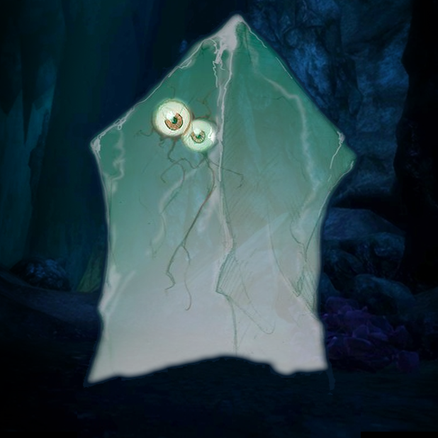

Those of you who survived the initial prison break from the drow encampment ran for their lives through various cave complexes in an attempt to ditch the tailing drow.

Led by `Shooshar`, a zen kua-toa with a vague sense of how to get to the village of his people, you travelled along with `Stool` a child-like myconoid who wants to return to his grove, and `Derendil` a subterranean bear like creature (quaggoth) with an unhealthy appetite for violence.

Eventually, `Mordai`, `Bron`, and `Pendleblip` managed to quench their hunger on various shrooms, and find a potential void filler for that emotional hole left by your murdered cleric `Dhoznak`; you met `WindSorrow`, a gloomy monk searching the underdark for reasons best explained in riddles. He also joined with a distinct lack of sacrificial family members.

After various forks in the road and cave-ins, you ended up in a cavern inhabited by oozes. Diplomatic options were left at the door, and whatever lurking creatures or weirdly sentient gelatinous cubes spotted were quickly dismantled by favour of violence, even if you had to sacrifice `Derendil` to the engulfing acids of gelatinous `Glabbagol`.

A new damage record (>30 dmg) in a single round was set by `Mordai`, while `WindSorrow` brought a superb dodge action to the mix that nullified three gray oozes for most of one battle.

Reaching the final chamber with limited resources, you found faerzress energy sustaining a magical fire. Burning with spectral red, but cold flames, an enchanted longbow contained within was quickly looted, before a protecting Black Pudding burst forth from the central fountain. With water pouring into the cavern and several members going down in response to its vicious acid attacks, you eventually found a tactic that worked, and slowly kited the pudding around the room, with only occasional bursts of magic induced madness.

As the entire cavern flooded with water, you desperately swam to a cylindrical chamber with a bit of headroom, riding the rising tide to unknown heights...

Players:
- Richard
- Paul
- Spike
- Guy
