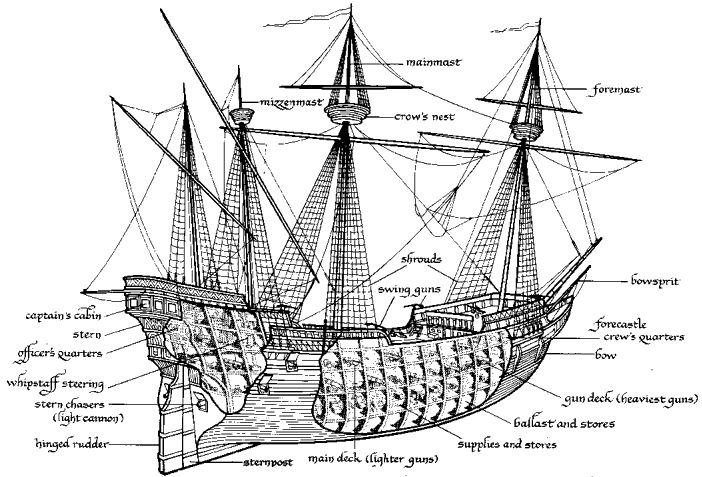

# Artemis

Artemis : Sailing ship – 10kGP buy – or rent 20crew == 40 + captain Mordecai + rations – 100gp day

## Cannons

supplied by [[kenny]] during [[piracy]]

## Sailing routes
- Waterdeep docks
- Misc piracy in [[31-story-of-kenny]]
- Crossed the Trackless Sea towards Moonshae
- On last day hit strong weather and got [[32-stranded-on-moray]]
- Taking some time to repair on [[moray]]
- Sailed to [[grundsgryn]] in [[36-grundsgryn]]
- into eye of the storm in [[38-iz-ship]]
- [[firewatch-island]] in [[40-lighthouse-penetration]]
- [[trench-of-darkness]] in [[44-under-pressure]]
- Neverwinter in [[46-neverwinter-redshirt]]
- Baldur's Gate to collect bounty from Emperor of the Waves

## Captain - Mordecai
Grey beard, red brimmed hat.

### Lines
What the hell's wrong with you? GET UP!
Well shit, look at that.
Time for a nice relaxing voyage.
Sonofabitch! Reload the cannons!

### Goals
Feels ignored by his crew, but he's bringing them booze and a ship so they've so far tolerated him. But it's an uneasy truce. He's distraught about the loss of his raven (bloodwing). He compensates by getting drunk.
Mordecai will double down even harder and try to show players the nicest quarters to get them on his side.

## Quartermaster – Gedesto
Actual charisma. Apologetic 4 mordecai.
Representative for crew. Looks like the fat pirate in MI3.

## Master gunner - Eddie (MISSING)

## Surgeon – Zed
Eventually becomes the PC [[zed]].
Medicine kit. White coat. Bone saw. Also does carpentry on board the ship.

## Bosun – Mal
technical advice on how to repair. What to prioritize. Etc high WIS.
If they lose a mast can get them to an island with a tree to

## Jackques Bordain – ex head chef
I ave prreepaerd a delicacy. (SEE FOOD PAGE)
https://localcuisine.github.io/

Accent: french:
- "brring theese red cars"
- "th -> z/s" - "zank you so much for zis"
- Silent H. "ow do I get do the ospital"
Small vowels.

## Misc sailors
- Faher
- Berlek
- Fai (f)

## EBA: Sails
Mordecai! Sails!
Spyglass. Banners of the flaming fist (LN)

They are also looking for the Empress of the Waves. Aubreck Drallion.

Captain of the ship. Jade deGrey.
Long wavy grey hair, golden eyes. Rough, sunburned skin. Oval faced, slightly attractive.
Empathetic, but looks for loopholes, no worship.

Doesn't want to reveal why they are here. They're really meant to deploy troops to Waterdeep after a sign for help (what they say). But they are further out than that.
Actually just looking for the Empress.

Member of Order of Unseen Lovers.
Raises white flag when near.

### EBA: Searching
http://dndspeak.com/2017/12/100-sea-travel-events/
Remains of a ship destroyed.
Planks at first. Barells.

### EBA: Mordecai depression
Interaction quest with Hjarka and her alter self [[hergatha]]. Never happened.
He'll want to go sight-seeing around, and show her the quarters. In an obvious way that's likely to waste time... (Have some empty islands around that they'll chill out on. Digging for treasure. Not really finding anything.)
"Here we are in our award-winning quarters! I'll stand back and allow you to soak in the majesty. It can be a lot to handle."

If she fails to impress him he'll break down. If she wants to get out of there he'll be visibly distressed. (You dummy, you're losing her.)
- "Oh, and you get to stay in our finest quarters all by yourself."

If she says anything that can be misconstrued as bad. She'll appear in the mirrors, then break out of the mirror, and insult him.
- Hergatha: "Hjarka, please, forget about this loser."
- Him: "Loser?"
- Hergatha: "You're in denial, old man. This ship is a dump. NO ONE WOULD EVER WANT TO STAY HERE UNLESS THEY HAD TO. Someone had to say it."
- He'll break down: "Please leave, Miss"
- Hergatha: "You heard the man. Hjarka, where would you be without me." (Breaks door to get out).
- Him (to himself): "Why would she talk about my ship like that.
- Darker tone: "How dares she insult me like that..."
- Self-doubting tone: "What if she's right?"
- Darker tone: "Of course she's right. You couldn't even clean up without her help.
- Self-doubting tone: "I'm doing my best. Hjarka only wanted to help. But why was she so cruel?"
Loop:
- Darker tone: "How dares she insult you like that?"
- Self-doubting tone: "What if she's right?"
After leaving:
- Hergatha: "I thought we'd never get rid of him. You owe me one. Add it to the list."
- Hergatha: "I thought you were sooooo determined to get to the island..."
- Hergatha: "Now all of of a sudden you're some weirdo's therapist?"
- Mordecai: "Hjarka, before you go. I need to ask you one question. Why would you be so nice to me, only to run away? What did I do wrong?"
- Hergatha: "Oh, give it a break. You still don't get it? She only helps people to get what she wants or serve her own twisted ego. She never cared about you."
If objections:
- Hergatha: "You're both pathetic."
- Mordecai: "Pathetic?" *starts burning with rage* You only came here to humiliate me... I won't tolerate this any longer.

TURNS INTO MONSTER FIGHT: on ship. Turn him into Shadow Beast 345 ToB.
Insta enlarge.
Casts Skywrite while invis (anxiety) Tidal wave, Edvard's Black tentacles on ship.
Control Water whirlpool around the ship (anxiety).

Persuasion can make him stop: he'll lightning bolt himself and you  and he'll transform back.

At which point, he'll turn normal and say.
"I've decided to resign as captain. The ship is unclean, the crew dislike me. Not to mention the hole below deck. Please, just leave me alone."
They're the captain now...

### EBA: Drugs
Devil encounter selling drugs if nothing interesting. During watch.

### EBA: Drinking games
Joy potion sold by one sailor for 100gp.
Shark serum sold by one for 200gp.

### EBA: Shitty islands
One in the moonlight with a few trees. In the middle of it is a pond with a rusalka. Rusalka minions are tons of skeletons rising from the water. She'll try to be seductive, and ask for a kiss. Then try to drown the rest while skeletons spawn arounnd th edges. 331 TOB.
https://open5e.com/monsters/tome-of-beasts/r/rusalka
Treasure: cat ear headband.

### EBA: Events at sea
Small island with a single palm tree. One XXX on there. Abandoned criminal. Dehydrated. Might try to steal a rowboat in the middle of night if treated badly.
Mounted merfolk on top of dolphins at night. Underwater city? Nah.
One ship of pirates who'll try their luck against a small ship, not expecting wizards. They'll charge and hold you at gunpoint, but they're just tons of weak dudes CR1 with rifles +5 hit d8 dmg, 14leather.

In water
Dorreq - https://www.5esrd.com/gamemastering/monsters-foes/monsters-by-type/aberrations/dorreq-3pp/

##### Alternative
Harpy/siren island in reefs on west side of island (better to go other way). But why? What's in it for them? Maybe there's someone there not yet eaten. Someone who knows about one island if they rescue him. Two banshees. Revealed to be dead upon moonlight.
ToB has a Lorelei (siren variant) CR5 - p279

### EBA: Weather
Weather
Theullai- Tob379 – CR10 wind elemental!
ELemental Storm Lord – CC 139 (CR13) also useable.
Beef it up. Can't charm/paralyze it. Fire works well. Cannon explosions might work.
They have ability to get help.

### EBA: Whirlpool
Into astral sea.
Deep eye in pool.
Nautilus ship.
Xial hook..
~~Swallowed by a kraken as an entrance to umberlee's temple -> if they buy cheap boat.~~

### EBA: Ship encounter
Accursed crew : https://homebrewery.naturalcrit.com/share/SkS82zTWV
In stormy weather if they keep going arrogantly.

- Large waves / downpour?
- Reefs near islands
- Visibility (foggy? Raining?)
- Positioning of boat!
- Reloading cannons take time 2 rounds! (3 cannons => 1pr)

They'll definitely want to enter under fog cloud and gust of wind. Call lightning mid battle.
This is probably better as an exit encounter.

Kraken in the water. Deep sea turtle?
Nidhogg serpent? https://norse-mythology.org/gods-and-creatures/giants/nidhogg/
Could be a Water dragon from CC.

Accursed crew? https://homebrewery.naturalcrit.com/share/SkS82zTWV
(davy jones style hijack)

Dragonprince style Captain:
> Captain Villads (d is silent). One with two eye-patches. Left eye plucked out by a flock of mutinous seagulls. Right eye? Don't know. Came at me from me left.
Ship: Ruthless. Named after my dear wife Ruth who sadly, don't enjoy sailing.

### EBA: Abandoned flayer ship
Clairvoyant priest on the ship? Half-god.
Initiate like in MCDM if nothing else works.
Attack scenario, tentacles arriving, wrapping around ship.
http://themonstersknow.com/mind-flayer-tactics/

#### NB: Undead vs Flayers
The undead are not seen favourably by the flayers. But they allow Orcus to roam the seas and make space for the flayers. Abandoned spots can cause new hotspots for flayers. If Orcus wastes his forces prematurely on the sword coast, then they are going to lie undefended for the flayers.

3 emmisary ulitharids will converge on NW, WD, BG. The cities will slowly become consumed after their forces are withered fighting the Demon Lords (who should ultimately be pushed back).
#### NB: Gith vs Flayers
Gith control the astral sea and want to hunt the Flayers to extinction. If they go to the astral sea they can find artifacts to help them against the flayers. Also Gith in Arcanoloth place.

### EBA: MI3 piracy
See [[piracy]].

[//begin]: # "Autogenerated link references for markdown compatibility"
[kenny]: ../npcs/kenny "Kenny"
[piracy]: piracy "piracy"
[31-story-of-kenny]: ../recaps/31-story-of-kenny "31-story-of-kenny"
[32-stranded-on-moray]: ../recaps/32-stranded-on-moray "32-stranded-on-moray"
[moray]: moray "Moray"
[grundsgryn]: grundsgryn "Grundsgryn"
[36-grundsgryn]: ../recaps/36-grundsgryn "36-grundsgryn"
[38-iz-ship]: ../recaps/38-iz-ship "38-iz-ship"
[firewatch-island]: firewatch-island "Firewatch island"
[40-lighthouse-penetration]: ../recaps/40-lighthouse-penetration "40-lighthouse-penetration"
[trench-of-darkness]: trench-of-darkness "Trench of Darkness"
[44-under-pressure]: ../recaps/44-under-pressure "44-under-pressure"
[46-neverwinter-redshirt]: ../recaps/46-neverwinter-redshirt "46-neverwinter-redshirt"
[zed]: ../pcs/zed "Zed"
[hergatha]: ../npcs/hergatha "Hergatha"
[//end]: # "Autogenerated link references"
