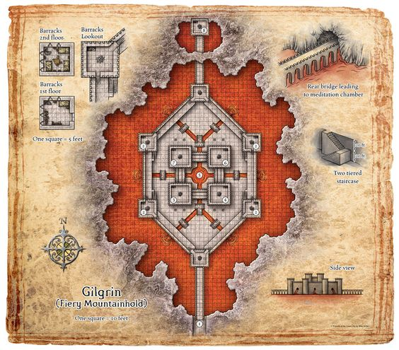
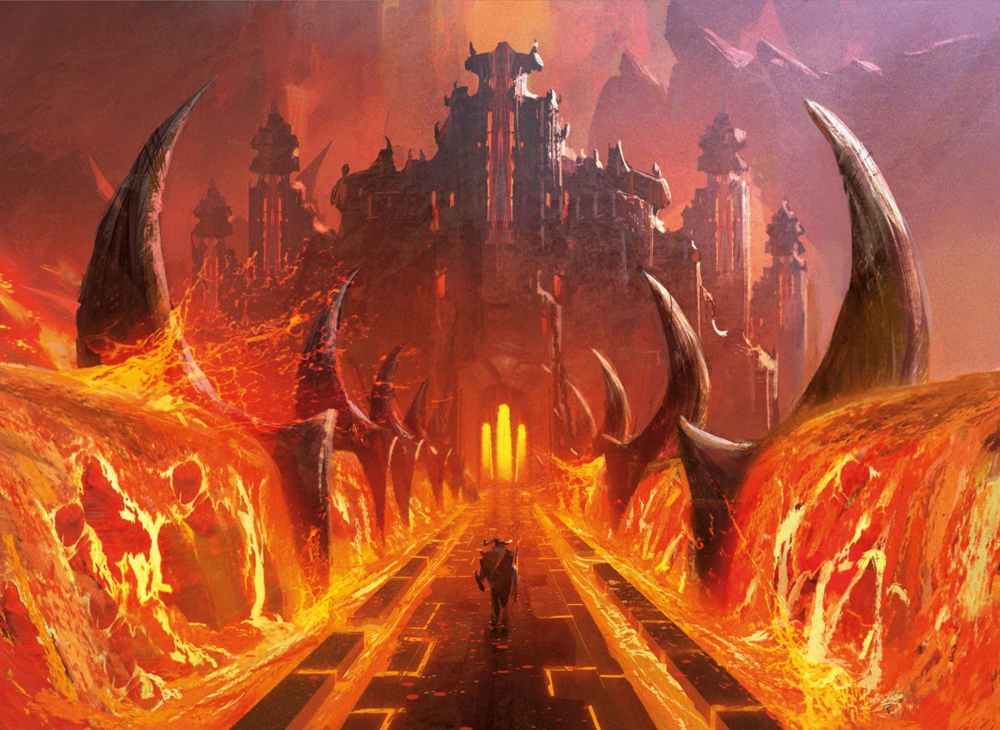

# Gilgrin
Fire giants main fortress. They are awesome blacksmiths and make the best weaponry, plus are rune magic masters of supreme enchantments. Fire buffs, flaming swords, armor. They have hellhound/salamander/chimera pets.

Path across is below lava, pouring over the walls into little flow drains on each side. Face meltingly hot. See the fortress in the distance.

Giant tactics: step into lava, splash it onto others. Smash shields or boulders. 3x normal weapon dmg. Can lift 800 kg or so easily.

Wall of metal and scorched fabric woven of flameproof materials. Swords hot like they just came out of forge (+1 greatswords that deal +d6 fire dmg while hot (24h)). Asbestos, brass dragon scales. Burning beards.

## Giant Motivations
A couple of generals that want to live the beach life by the lava. They get food from breeding hell hounds. Arena for fighting each others.

Normally there's at most 1-2 rounds to explain themselves once they are inside if busted.

Aucmalog, Xewsog, Babgant, Klefur, Dusal, Fezlor (hard piratey R accent)

Xewsog greets:
- You're ahead of schedule. How's Iron Slag.
- Where's the Steel? We were expecting steel?

Babgant:
- You, warrior, relieve me! I gotta take a leak.

Fezlor (leader with bronze hair, braided – huge glowing greatsword):
- You came from Iron Slag, with Iron?

## Inside
Huge amount of hobgoblins  / goliaths pushing a flywheel. Overseen by 6 fire giants + 4 on bridge + 2 bosses upstairs.
If they stop the wheel, giants hostile. Or reinforcements come.
Feeds much of the crystal energy. Stopping the wheel
Hell hound pits in two of the corners.

## Encounters
3x Fire Giants + hell hounds (deadly for 3)
Modified: fire dmg on the weapons.
Tactics: fling lava 6d10 fire dmg to be in lava. Perhaps less to be flung at, but sticky. So maybe just one tick?

Siege weapon ballistas on fortress: https://preview.redd.it/unenvfdy5wi41.png?width=1920&format=png&auto=webp&s=9b00f27739f84fafbebc8dca1eef0a0aa068272c
Could just be Oaken bolters MTOF on each tower, or something more slow firing and sinister like out of grit and glory.

## Fortress upwards
Toilet wall inside
Pass through assembly hall
Huge assembly hall. Hell hound

## 5/4 Fortress top
5/4 is actually a tower bit like D&D BL2 fight with Handsome Sorcerer. That's where the crystal and Zoltan experiments.

Zoltan + Dreadnaught + Blue Crystal
Has the spells – otherwise fire giant stats. + 2 hell hounds.
https://5e.tools/bestiary/duke-zalto-skt.html <- ish
https://old.reddit.com/r/UnearthedArcana/comments/f2ps43/molten_upheaval_wall_of_lava_new_molten_lava/ - wall of lava + molten upheaval spells!

Zoltan: Reports to Irae
Dreadnaught has the titan knuckles + two pairs of +2 shields.

Crystal is main power source (pre-powered). It powers the energy field upstairs.
Upstairs is a similar one that harnesses the energy, plus one that is dedicated (black) to maintaining demon lord portals.

Arcs: isolate them so they can be taken on similarly. Solo battle is going to be tough.
If they destroy it, they better fucking high-tail it. They might persuade him to check on the vault.

Zoltan normally in charge against weaponry selection and mobilising defenses against drow incursions.

## Vault
Meditation chamber is vault. Steel door in front.
Big steel door and 4 fire giants patrolling it. Won't let anyone in. Magic barrier on door as well (prevent dragon leaving).
[[gilgrin-vault]].

[//begin]: # "Autogenerated link references for markdown compatibility"
[gilgrin-vault]: gilgrin-vault "Gilgrin Vault"
[//end]: # "Autogenerated link references"
