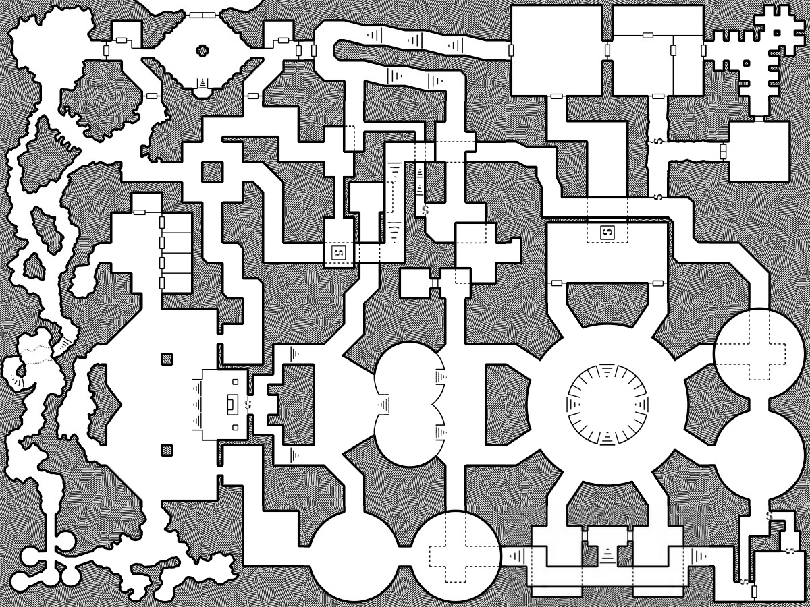

# Telnarquel

Illithid colony in lowerdark. Unlabelled map found on corpse of [[ilvara]].
Secret colony. Explorers refused to believe it actually existed. Can be found by crashing supporting stalag causes floodwave that propels them into underground tunnel.

If they don't know where it is, they can go by WindSorrow's monastery to question master for clues. They can also find an Alhoon with Umber hulk friends outskirts.

## Motivation
Illithids are secretive, but they see store vast knowledge from ages past. Much can be learned from the elder brain if they can make it talk.
Giants true involvement? Irae? Kiaransalee?

Illithids don't pray on species that can kill them easily.
Dueragar + Svirf will know paths down, but hesitant to go themselves.
Careless to expand. Small colony. 80 flayers. Stay hidden. Maintain knowledge.
Ultimately want to hide from the Gith for now. Wait for bigger colony to succeed. Ulitharid sending out new expedition.
Limited by feeding. Need one brain per illithid per month: 12*80=< 1k brains a year. Detectable, but prays on weak races.

## Map

Outer caverns contain thralls: mind witnesses, half-converted duergar, svirvneblin (hybrids), wererats, umber hulks, chuuls.

- Cranium rats spies
- Mind flayers p171 volos
- Elder brain + Beholder boss
- General CR8 -> CR14. This should be level 10

## Rooms
Brain room in center. Mucous walls. Grated. Large metal circle. 4 flayers stand guard.
Control room left of it. Big control panel with holographic displays
Secret room above brain: ulitharid + 2 flayers. Just about to feast on three prisoners. Two disappear immediately. Place is a toolshop
Circle rooms: feel like large organs. Tadpole pool. Transformation chambers (ceromorphs).
Square room below: library dissection chamber
Not shown: escape shafts through small circular outcrops in corner (guarded).
Library: bottom right
Quarters: top right
Market middle. Busy.
Treasury: above control room.
Engine room: between brain + control

## Misc + Features
Roomba gelatinous cube.
Touch based language and holographic displays (indecipherable)
Rooms made out of organ like insides. Organic and futuristic. Holograms.

## Locks
All circles: Bionic locks (tentacle insertion locks). Scanned.
Psionic locks leading to elder brain (unless you are in a circle room those open).

## Brain Interrogation
Using truth serum + mind protectors they can interrogate the brain.
If they can reach it.
Brine potions or something else to ward off psionic attacks. Resistance?
Finding extra exits for a bail in case they are detected and detained.
Find location of reliqs (they raided the giants vaults, but others exist).

## Features
Electrical experiments on creatures.
Fluid being pumpend into the veins of unconcious ones.
Mind controlling circlets?
Githyanki? Enemies captured.
Birthing Pods -> Yielding Brine Potions (temorary immunity vs psionics)
Elder brain (reeks of chemicals and fermented brain) (need brine potions to avoid psionic whip) Brain controls all the doors.

## Alhoon remainder
Was not captured. Wants books back in library.
Friends captured. Will be revealed to be them to have done the incantation on their half.

##

## EBA: Werewhisker tie-in
Demon Lord Chittrk'k'k - CC 76 – CR13
Along with converted wererats?

## EBA: Aboleth
See ToA version? But not silly. Disguises as trapped creature. Lures them in.
How can they realize? Many large bones – dragon size (not broken, but frail (old)).
Covered in mucous.
Will invite them over telepathically. Once they are close enough. 2 will be enslaved (to scare them into doing it). Then dropped once they agree to do what it wants.
Wants the Ulitharid brought to him alive.
Otherwise his enslaved pet dragon will block the way back.

[//begin]: # "Autogenerated link references for markdown compatibility"
[ilvara]: ../npcs/ilvara "Ilvara"
[//end]: # "Autogenerated link references"
