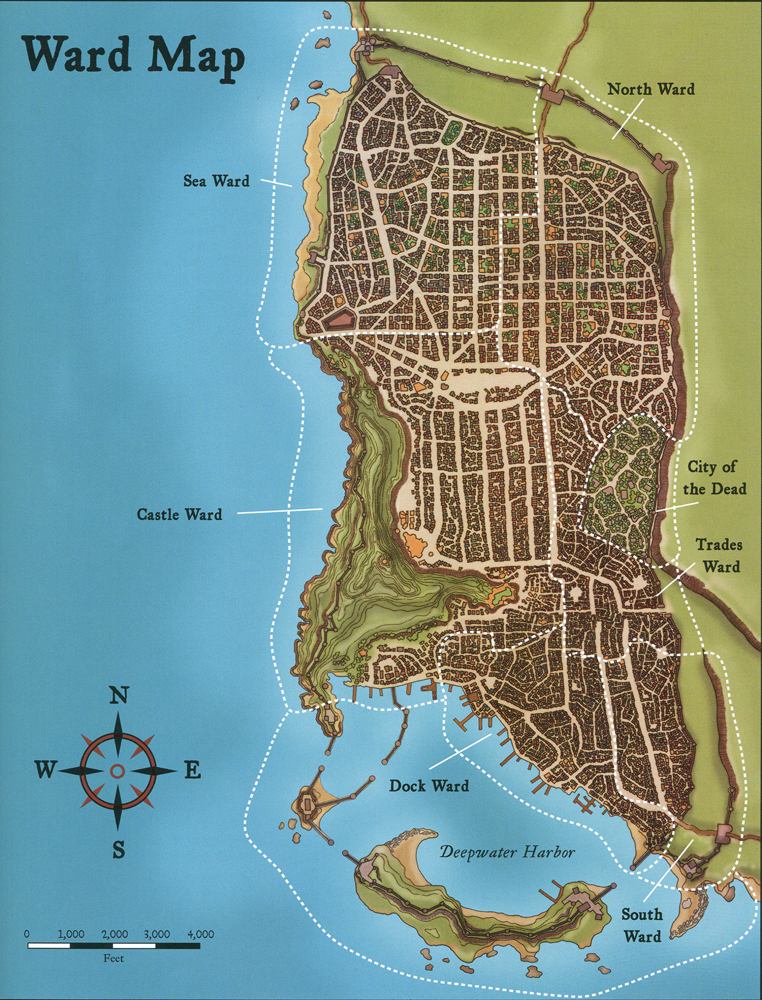

# Waterdeep

Waterdeep used to be the “Savage north” inhabited by dwarves, goblinkind and elves.Only some humans lived there, fishing and hunting. Sword coast merchants began logging near natural deep water harbours. After years of logging from there, an area naturally opened up and people began to stay there, farming the cleared land.

Struggle for resources (timber) and conflict as a consequence. Eventually Nimoar managed to claim a settlement and stave off pirates near the deep water in the harbor. Hence the name.

**modifications:**
Missing river cutting off castle ward a little more north than actual southern end of CW
Actually there's a river gate - follow that!
Yawning portal NW

## Locations
- [[docks]]
- [[magesguild]] (luna nova, blackstaff tower == archmage residence)
- [[yawning-portal]]
- [[jarlaxle]]'s mansion
- [[bregan]] thieves guild
- Barracks (Iron Fist, Deepwater harbour w/ cannons)
- Sewers: Elven ruins of Aelinthaldar
- Temple to Mystra in Sea Ward; [House of Wonder](https://forgottenrealms.fandom.com/wiki/House_of_Wonder )
- Temple of Selune
- Temple of Moradin
- Secret Temples of Umberlee and Shar
- Castle Waterdeep / Ageiron Dragonward
- Caravan Court (more expensive shops, most shop in trades' ward)
- Graveyard not actually overrun with undead. That's neverwinter.
- Underwater; mermen patrolling and paid in food/medical supplies

## Shops
### Gael's Magical Emporium
+1 stuff generally. Generalist magic shop.
Potions < 1000gp
http://www.giantitp.com/forums/showthread.php?424243-Sane-Magic-Item-Prices
Just read up a bunch <1000 (probably <500)
https://i.redd.it/ta0vxp8iawa31.png

Specials:
- Bag of Tricks – 1500 (Rusty) (bought)
- Armor of Resistance – 4000 (Psychic)
- Ring of Jumping – 2500
- Periapt of Wound Closure (5000)
- Ring of protection +1 (3500) (bought)
- +1 armor/shield (1500) (3k for full plate tbh. +1 splint for 1k)
- +2 armor (10000 – has to be comissioned)

### Grugnar's Gems
Grugnar overcharges everywhere, but supplies thieves guild. Thieves guild provide protection to the mercenaries that go out and extort / pay local miners.
Grugnar gets rich, thieves guild get cheap gems, mercenaries get protection (scariness), but everyone else gets ripped off.
He has two people in the gem cutters in his family. Two other dwarves named Kuthras and Lonus.

### Furious Gemstones
Super nicely cut ones available for nobles in market district. Overpriced. Fair. Follows regulations.
Run by well of Elf `Elyon Rody`

Some come in from Thornhold. Small faeroe island community of miners. Sells uncut gems from the docks. Normally guildcutters have a representative with sufficient cash. Erland is waiting at the docks for next shipment (scheduled today).

## Guilds
- Alchemists + Apothecaries
- Cartographers (snobs in dock ward)
- Bakers guild
- Gemcutters (near moradin temple)
- Shipwrights (builders – dock ward)
- (42 guilds in total) https://dnd5e.fandom.com/wiki/Guild_Artisan
- https://donjon.bin.sh/fantasy/demographics/ - but account for tons more fishers/shipwrights/loggers/guardsmen

### Gemcutters Guild
Guildhall: ornate stone-walled building in castle district. Deals with where to send mercenaries for investigation. How much to charge for sellers. It's led by Gideon.
### Gem supply
Zhentarim fetches from many mines. Main suppliers. Direct connection with mages guild.
Many considerable champions in there (<10th level in general)
Minor Gem Traders
Some sold to temples directly via people in main provideders. Human named Deleer is trusted to sell to them on their behalf (small scale operations).
But some people do run their own sale from nearby mines

## Nobles
Noble houses use ToA princes template. Upstairs libraries, guards.
Lords form ruling council. Most masked (unknown identity), one Open.

Noble 1 - Gideon Rotchild – Leader of Gemcutters + Masked Lord
Motivations: preserve fair supply, (funnelling enough for himself)

Noble 2 [[diana]] - Masked Lord (mage)
Noble 3 Carril Byndraeth – Masked Lord (rogue)
Motivations: keep crime down by any means necessary. Goes as far as allowing all the thieves guilds actions.

Noble 4 Madeiron Sunderstone – high ranking member of military
He's pretty dumb and huge. But fairly loyal. Portraits on walls. Must be blackmailed

Piergeiron - open lord.
Note: played him as a pretty faceless aristocrat who's neither popular, nor has a personality :|

## Lord history
Orc tribes from the north came down, lots of conflict. Elven enclaves held out, but many northerners were pushed southwards. The everlasting ones came down from the trollmoors (special breed of orcs from the Evermoors i think). Conflict between orcs for ages. Magic turned the tide. Ageron, became a powerful wizard. Lived for ages. Castle builds on top of the slopes of mount waterdeep after struggle. Protected farmers from troll attacks.

Became the Free City of Waterdeep ruled by warlords. Power shifted to merchants eventually, but they couldn’t agree how to rule the city. Eventually decided the masters should rule together in a council.; an unpopular move by the inhabitants and lesser nobles (no consent or right). Guild masters brushed it away by claiming no lords left (no rightful heirs), but they were actually murdered by the guild masters in preparation for a coup. (Only two lords left alive, hiding).

Guild wars 6y after this new rule. Only guild masters to survive; Lohar + Elemzoar. Both’s respective private armies battled in the streets against each other. Eventually decided to rule together, via two castles despite not agreeing much. Lords magisters was meant to help out, but too hard to settle things in this political setup.

Beron + Chilam (only surviving lords of waterdeep) appeared masked in great hall and commanded lords magister to leave the city. Lords vanquished them with magic, and threatened remaining nobles to come to them by nightfall or leave forever. Reluctantly agreed to. Eventually they revealed (Beron only) and ruled together and banished the two houses of the guild masters. => Peace. Waterdavians went back to work.

Beron selected men of character and appointed them magisters under the lords. Chosen to apply laws of waterdeep. Paid handsomely to avoid temptation. Beron encouraged people to speak freely in courts without fear of chastisement and reproach.  They would be heard.

Waterdeep has grown and become more varied, flourishing with good trade, and under the tolerance and protection of strong defenders and good governance.

Many problems later, the Gods wars. A green dragon assailed the fields of triumph. The giants ravaged the north. City and her people have survived and grown stronger.

Lords alliance provides safety for all the settlements of the northern sword coast and those inland. Unparallelled city in terms of variety of life, tastes, and experiences found.

## Aghairon’s Dragonward
Magical spell that protects the city.
Propped up by magical crystals in the sewers. Can be stolen and used to restore spell slots (highest level they can cast). But they'll get focus pretty quickly.

### Punishments
Lord’s court. Piergeiron chars it.  26 black robed magisters conduct the court. Each magister has 6 guards. 2 day appeal, although most fail. No bail. Duels are legal.

### Palace
https://forgottenrealms.fandom.com/wiki/Piergeiron_the_Paladinson
Guarded by beefy https://forgottenrealms.fandom.com/wiki/Madeiron_Sunderstone

### Guards
CR3 guards? 50 hp in plate -> 18AC.
Multi attack swords with +8hit , 1d6+2 dmg.
Guilt trip letter if killed.

## Umberlee Shrine
Abandoned in sewers beyond gates
In old elven ruins.
Shrine guarded by two bulettes that will swarm them.
[[cameron]] and [[almah]] there
Shrine to [[umberlee]]:
Took a piece of the mirror.
Found lady's house, and it was a sham (no one inside).
Both of them got after.
Pendle's bag o tricks destroyed camcams painting.

### Entrance
Main temple tunnel
Blue teleportation balls lead further down into the depths.
Transportation. You can see a scenery around you going down. Can see outside. Large ruins.

> To Hjarka: You feel slightly strange going down this chamber.
> You've always had a bit of an inner monologue going in your head, but as you descend you sure are having a lot of ideas. Multiple streams of thought all at once.

## EBA: Wedding Crash
Wedding house from Divinity2.

They'll have to persuade themselves in.
Path downstairs that leads to pendlers.

Failed wedding (dwarven).. She's marrying for money. He's a bit of a entitled dick.
She's crying because she's having regrets.

## EBA ideas
map out a few more things
Need a couple of houses.
- Out of houses house: Run down house with kitchen downstairs, much cutlery.
- Really out: 8 hay mattresses, one stufed teddy bear, shoddy shortsword with malachite gem in hilt (-1)
Need encounter if they sneak into yawning.
- Drow deep inside
- Outside guards?
Need some power structure. Lords setup? Needed if they start going into yawning path
- Steal ideas from https://criticalrole.fandom.com/wiki/Tal%27Dorei_(kingdom)
- https://forgottenrealms.fandom.com/wiki/Lords_of_Waterdeep
Need encounter if they start a fight in thieves guild.
- Rogues and light wizards. Many lowbies.
- If they kill them all they can steal everything
- If they get overwhelmed they'll all their shit gets taken for sale
- Stolen items go to leader in mansion (maybe heist to reclaim)
Need encounter if they start a fight in docks.
- Mostly just some weak guards initially
- But many many guards arrive if they activate anything therein or get caught
- Reinforcements: 10 guards (lowbies)

## History

[//begin]: # "Autogenerated link references for markdown compatibility"
[docks]: docks "Waterdeep Docks"
[magesguild]: magesguild "Mages Guild"
[yawning-portal]: yawning-portal "Yawning Portal"
[jarlaxle]: ../npcs/jarlaxle "Jarlaxle"
[bregan]: bregan "Bregan D'aerthe"
[diana]: ../npcs/diana "Diana"
[cameron]: ../npcs/cameron "Cameron"
[almah]: ../npcs/almah "Almah"
[umberlee]: ../deities/umberlee "Umberlee"
[//end]: # "Autogenerated link references"
